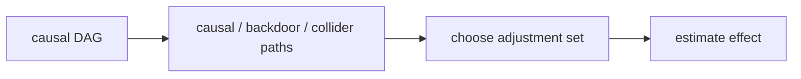

# 인과 DAG와 d-분리 (Causal DAG and d-separation)

- Level: Advanced
- Prerequisites: [AI/PGMs/d-Separation.md](../PGMs/d-Separation.md), [AI/Causal-Inference/SCM.md](SCM.md)
- Status: Draft
- Reviewed-by: -
- Depth: Deep-dive (자기완결)

---

## 개념 (Concept)

인과 DAG는 변수 간 직접 인과 관계를 방향 있는 비순환 그래프로 표현한다. d-분리는 그래프에서 조건부 독립성을 읽어 조정 가능성, 교란, collider bias를 판단하게 해 준다.

## 직관 (Intuition)

DAG는 "정보가 어디로 흐르는가"보다 "개입했을 때 어떤 변수의 생성 과정이 바뀌는가"를 그린 지도다. 길이 열려 있으면 연관성이 흐를 수 있고, 조건화는 어떤 길은 막고 어떤 길은 연다.

## 이론 (Theory)

대표 구조는 세 가지다.

- Chain: $X\to Z\to Y$. $Z$를 조건화하면 경로가 막힌다.
- Fork: $X\leftarrow Z\to Y$. $Z$는 confounder이며 조건화하면 backdoor가 막힌다.
- Collider: $X\to Z\leftarrow Y$. 기본적으로 막혀 있지만 $Z$나 descendant를 조건화하면 열린다.

인과 효과 식별에서는 treatment에서 outcome으로 가는 causal path는 남기고, treatment로 들어오는 backdoor path는 막는 조정 집합을 찾는다.



### 조정하면 안 되는 변수

mediator를 조정하면 총효과가 아니라 직접효과에 가까운 다른 estimand가 된다. collider나 collider의 descendant를 조정하면 없던 bias를 만들 수 있다. treatment 이후에 생긴 변수는 대개 baseline confounder가 아니므로 시간 순서를 확인해야 한다.

### DAG 작성 절차

결과를 보고 간선을 그리기보다 domain knowledge로 treatment 이전 변수, outcome 원인, treatment 배정 원인, selection mechanism을 먼저 적는다. 측정되지 않은 변수도 존재하면 latent node로 표시해 식별 불가능성을 드러내는 편이 낫다.

### Markov equivalence와 한계

관측 조건부 독립성만으로는 방향을 모두 정할 수 없다. 같은 d-separation 관계를 공유하는 DAG가 여러 개 있을 수 있으므로, 방향에는 시간, 실험, 물리적 제약 같은 외부 지식이 필요하다.

## 구현 (Implementation)

```python
dag = {
    "Z": ["X", "Y"],
    "X": ["Y"],
    "Y": [],
}
```

이 작은 그래프에서는 $Z$가 $X$와 $Y$의 공통 원인이므로 backdoor 조정 후보가 된다.

```python
def is_baseline(variable, treatment_time, timestamps):
    return timestamps[variable] < treatment_time
```

## 복잡도 (Complexity)

작은 DAG는 사람이 판정할 수 있지만, 큰 그래프에서는 d-separation query와 adjustment set 탐색 알고리즘이 필요하다. 더 어려운 부분은 그래프 자체를 정당화하는 도메인 지식이다.

## 응용 (Applications)

- 조정 변수 선택
- 실험 설계 전 bias 경로 점검
- causal discovery 결과 해석
- 데이터 수집 우선순위 결정

## 흔한 오해 (Common Misunderstandings)

- DAG의 빠진 간선은 강한 독립성/무효과 가정이다.
- Collider를 조정하면 bias를 줄이는 것이 아니라 만들 수 있다.
- 통계적으로 유의한 상관만 간선으로 그리는 것은 인과 DAG가 아니다.
- 순환 피드백은 DAG로 바로 표현하기 어렵고 시간 전개가 필요할 수 있다.

## TMI

- Markov equivalence 때문에 같은 조건부 독립성을 갖는 여러 DAG가 존재할 수 있다.
- Selection bias는 selection node를 조건화한 collider 문제로 볼 수 있다.
- SWIG는 potential outcome과 graph를 연결하는 표현 방식이다.

## 연습 / 확인 문제 (Exercises)

- Chain, fork, collider에서 조건화가 경로를 어떻게 바꾸는지 설명하라.
- Treatment와 outcome 사이 backdoor path를 찾아라.
- 조정하면 안 되는 변수를 DAG에서 표시하라.

## 이어서 읽기 (Reading Path)

- 이전: [SCM](SCM.md), [교란 변수](Confounding.md)
- 다음: [do-calculus](Do-Calculus.md), [식별가능성](Identifiability.md)

## 참조 (References)

- [AI/PGMs/d-Separation.md](../PGMs/d-Separation.md)
- [AI/Causal-Inference/SCM.md](SCM.md)
- [Reference/Books.md](../../Reference/Books.md)
