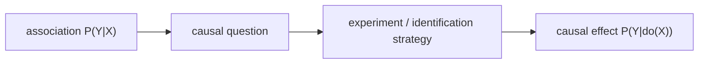

# 상관 vs 인과 (Correlation vs Causation)

- Level: Intermediate
- Prerequisites: [Math/Probability-Statistics/Probability-Basics.md](../../Math/Probability-Statistics/Probability-Basics.md)
- Status: Draft
- Reviewed-by: -
- Depth: Deep-dive (자기완결)

---

## 개념 (Concept)

상관은 두 변수가 함께 변하는 통계적 관계이고, 인과는 한 변수를 개입으로 바꾸면 다른 변수가 변한다는 구조적 관계다. 인과 추론은 관측된 연관성에서 개입 효과를 말하기 위해 필요한 가정과 설계를 다룬다.

## 직관 (Intuition)

아이스크림 판매량과 익사 사고가 함께 늘어도 아이스크림이 익사를 일으킨다고 말할 수 없다. 더운 날씨라는 공통 원인이 둘을 동시에 움직일 수 있기 때문이다.

## 이론 (Theory)

관측 조건화 $P(Y\mid X=x)$는 $X=x$인 집단의 결과 분포다. 개입분포 $P(Y\mid do(X=x))$는 $X$를 강제로 $x$로 만들었을 때의 결과 분포다. Confounding, selection bias, collider adjustment 때문에 두 값은 다를 수 있다.

Randomization은 처리 배정을 잠재 결과와 독립적으로 만들어 관측 비교를 인과 비교에 가깝게 만든다. 관측 연구에서는 그래프, 자연 실험, 조정 변수, 도구 변수 같은 가정이 필요하다.



### 인과 질문 먼저 쓰기

인과 분석은 "X와 Y가 관련 있는가"가 아니라 "어떤 population에서 어떤 intervention을 바꾸면 어떤 outcome이 얼마나 변하는가"를 묻는다. treatment, outcome, time horizon, target population, estimand(ATE/ATT/CATE)를 먼저 고정해야 한다.

### 상관이 생기는 대표 이유

| 이유 | 구조 | 대응 |
| --- | --- | --- |
| 직접 인과 | $X\to Y$ | 효과 추정 |
| 역인과 | $Y\to X$ | 시간 설계, instrument |
| 공통 원인 | $X\leftarrow Z\to Y$ | confounder 조정 |
| Collider selection | $X\to S\leftarrow Y$ | 조건화 회피 |
| Measurement artifact | 측정/로그 오류 | 데이터 검증 |

### 예측과 정책 효과

예측 모델은 $Y$를 잘 맞히는 변수를 좋아하지만, 정책은 바꿀 수 있는 변수의 효과를 묻는다. 바꿀 수 없는 proxy나 collider를 예측에 쓰는 것은 가능해도, 그것을 개입 대상으로 해석하면 안 된다.

## 구현 (Implementation)

```python
observed_difference = mean(outcome[treatment == 1]) - mean(outcome[treatment == 0])
```

이 값은 단순 연관성이다. 인과 효과로 해석하려면 treatment assignment가 어떤 방식으로 만들어졌는지 설명해야 한다.

```python
estimand = {
    "treatment": "discount",
    "outcome": "purchase_7d",
    "population": "eligible_users",
    "effect": "ATE",
}
```

## 복잡도 (Complexity)

계산은 평균 차이처럼 쉬울 수 있지만, 어려운 부분은 식별이다. 어떤 변수를 관측했고 어떤 경로가 열려 있는지 판단해야 한다.

## 응용 (Applications)

- 제품 실험과 정책 평가
- 의료 처치 효과 추정
- 교육·경제 정책 분석
- 추천 시스템 개입 효과 분석

## 흔한 오해 (Common Misunderstandings)

- 예측력이 높다고 인과 효과를 알 수 있는 것은 아니다.
- 시간상 먼저 일어났다는 사실만으로 충분하지 않다.
- 모든 공변량을 넣으면 인과 추정이 좋아지는 것은 아니다.
- 상관이 없다고 모든 인과 효과가 없다는 뜻도 아니다.

## TMI

- "Correlation does not imply causation"은 시작일 뿐, 어떤 설계가 causation을 정당화하는지가 진짜 문제다.
- Simpson's paradox는 집단별 관계와 전체 관계가 달라질 수 있음을 보여 준다.
- 인과 질문은 항상 target intervention을 먼저 정의해야 선명해진다.

## 연습 / 확인 문제 (Exercises)

- 상관은 있지만 인과가 아닌 예시를 3개 들어라.
- $P(Y\mid X=x)$와 $P(Y\mid do(X=x))$의 차이를 말로 설명하라.
- 어떤 관측 비교를 인과 효과로 해석하기 위한 가정을 써라.

## 이어서 읽기 (Reading Path)

- 이전: [확률 기초](../../Math/Probability-Statistics/Probability-Basics.md)
- 다음: [교란 변수](Confounding.md), [잠재 결과](Potential-Outcomes.md)

## 참조 (References)

- [Math/Probability-Statistics/Probability-Basics.md](../../Math/Probability-Statistics/Probability-Basics.md)
- [Reference/Books.md](../../Reference/Books.md)
