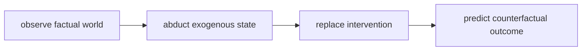

# 반사실 (Counterfactual)

- Level: Advanced
- Prerequisites: [AI/Causal-Inference/SCM.md](SCM.md), [AI/Causal-Inference/Intervention.md](Intervention.md)
- Status: Draft
- Reviewed-by: -
- Depth: Deep-dive (자기완결)

---

## 개념 (Concept)

반사실은 실제로 일어난 사실과 다른 개입을 했더라면 어떤 결과가 나왔을지를 묻는 인과 질문이다. 예: "이 사용자가 쿠폰을 받지 않았다면 구매했을까?"

## 직관 (Intuition)

관측은 실제 영화 한 편이고, 반사실은 같은 주인공과 배경에서 한 장면의 선택지만 바꾼 대체 편집본이다. 같은 개인의 보이지 않는 다른 세계를 추론한다.

## 이론 (Theory)

SCM에서는 반사실 추론을 세 단계로 설명한다.

1. Abduction: 관측 사실로 외생 변수 $U$에 대한 정보를 갱신한다.
2. Action: 가정할 개입 $do(X=x')$으로 구조 방정식을 수정한다.
3. Prediction: 수정된 모델에서 결과 $Y_{x'}$를 계산한다.

잠재 결과 $Y(1), Y(0)$도 반사실 표현이다. 관측 데이터만으로 개인 수준 반사실을 정확히 알기는 어렵고, 강한 모델 가정이 필요하다.



### 개별 반사실과 평균 효과

ATE는 population 평균 효과라 관측 연구에서도 특정 가정 아래 추정 가능할 수 있다. 반면 "이 한 사람에게 쿠폰을 주지 않았다면"은 그 사람의 외생 요인을 모델링해야 하므로 더 강한 SCM 가정이 필요하다.

### 검증의 어려움

반사실은 관측되지 않으므로 직접 검증하기 어렵다. 대신 factual prediction, randomized experiment의 aggregate effect, sensitivity analysis, domain expert review로 모델을 간접 점검한다.

### XAI와의 구분

입력을 조금 바꿔 모델 prediction이 어떻게 바뀌는지 보는 counterfactual explanation은 인과적 반사실과 다를 수 있다. 모델 내부 decision boundary 설명과 실제 세계 개입 효과를 구분해야 한다.

## 구현 (Implementation)

```python
def counterfactual_y(observed_u, do_x):
    return 2 * do_x + observed_u["u_y"]
```

핵심은 관측된 개인에 맞는 외생 요인을 어떻게 추론할지다.

```python
def factual_residual(y, x, coef):
    return y - coef * x
```

## 복잡도 (Complexity)

선형 SCM은 계산이 단순할 수 있지만, 비선형 고차원 모델에서는 posterior inference와 simulation 비용이 커진다. 식별 가능성과 모델 검증이 더 큰 난점이다.

## 응용 (Applications)

- 처치가 특정 환자에게 도움이 되었는지 평가
- 추천·광고 incremental effect 분석
- 공정성의 counterfactual fairness
- 설명 가능한 AI와 what-if 분석

## 흔한 오해 (Common Misunderstandings)

- 반사실은 관측되지 않은 세계라서 모델 가정 없이 검증하기 어렵다.
- 개인별 효과와 평균 효과는 다른 질문이다.
- 예측 모델의 alternative prediction이 곧 반사실은 아니다.
- 같은 관측분포를 가진 모델들이 다른 반사실을 줄 수 있다.

## TMI

- Necessary/sufficient cause 분석은 반사실 질문으로 표현된다.
- Counterfactual fairness는 민감 속성을 바꾼 대체 세계에서 예측이 유지되는지를 본다.
- Digital twin은 반사실 시뮬레이션을 직관적으로 표현하는 용어로 쓰이기도 한다.

## 연습 / 확인 문제 (Exercises)

- 관측 질문, 개입 질문, 반사실 질문을 각각 예시로 써라.
- Abduction-action-prediction 절차를 작은 SCM에 적용하라.
- 개인별 반사실 추론이 평균 효과보다 어려운 이유를 설명하라.

## 이어서 읽기 (Reading Path)

- 이전: [SCM](SCM.md), [개입과 ATE](Intervention.md)
- 다음: [매개 분석](Mediation.md), [인과적 머신러닝](Causal-ML.md)

## 참조 (References)

- [AI/Causal-Inference/SCM.md](SCM.md)
- [Reference/Books.md](../../Reference/Books.md)
