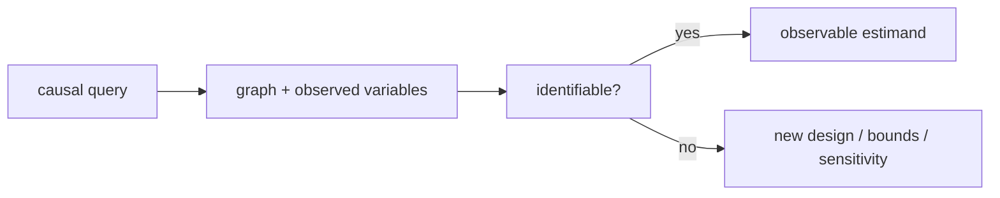

# 식별가능성 (Identifiability)

- Level: Advanced
- Prerequisites: [Do-Calculus.md](Do-Calculus.md), [SCM.md](SCM.md), [Potential-Outcomes.md](Potential-Outcomes.md)
- Status: Draft
- Reviewed-by: -
- Depth: Deep-dive (자기완결)

---

## 개념 (Concept)

식별가능성은 관심 있는 인과 효과가 관측 가능한 분포만으로 유일하게 결정되는지를 묻는 성질이다. 같은 관측분포를 만드는 여러 인과 모델이 모두 같은 $P(Y\mid do(X=x))$를 주면 그 효과는 식별 가능하다.

## 직관 (Intuition)

관측 데이터는 그림자의 모양과 같다. 서로 다른 입체가 같은 그림자를 만들 수 있다면 그림자만 보고 원래 입체를 알 수 없다. 인과 효과도 마찬가지다. 관측분포가 같아도 개입 결과가 달라질 수 있으면 데이터만으로는 그 효과를 식별할 수 없다.

## 이론 (Theory)

인과 효과

$$
P(Y\mid do(X=x))
$$

가 식별 가능하다는 말은, 그래프와 가정이 주어졌을 때 이를 관측분포 $P(V)$의 함수로 표현할 수 있다는 뜻이다.

대표적인 식별 패턴은 backdoor adjustment다. 조정 집합 $Z$가 $X$에서 $Y$로 가는 backdoor path를 막고 $X$의 후손을 포함하지 않으면

$$
P(Y\mid do(X=x))=\sum_z P(Y\mid X=x,Z=z)P(Z=z)
$$

로 식별된다.

반대로 관측되지 않은 공통 원인 $U$가 $X$와 $Y$를 동시에 만들고, 이를 막을 관측 변수가 없다면 단순 관측분포만으로는 효과가 식별되지 않을 수 있다. 이때는 도구 변수, frontdoor 구조, 추가 실험, 민감도 분석 같은 보조 전략이 필요하다.



### 식별 불가능할 때의 선택지

식별이 안 되면 분석을 포기하는 것이 아니라 질문을 바꾸거나 설계를 바꾼다. 추가 confounder를 수집하거나, instrument/natural experiment를 찾거나, RCT를 설계하거나, bounds와 sensitivity analysis로 가능한 효과 범위를 제시한다.

### Positivity와 실질 식별

그래프상 식별 가능해도 특정 strata에서 treatment variation이 없으면 실질적으로 추정이 어렵다. 이것은 수학적 식별과 finite-sample estimability의 간극이다.

### 보고 방식

식별 결과는 estimand, 필요한 가정, 관측 변수, 금지된 조정 변수, 추정 방법과 분리해 보고한다. "회귀를 돌렸다"는 식별 논증이 아니다.

## 구현 (Implementation)

식별된 estimand가 있으면 추정은 별도 문제다. 아래는 backdoor 식별 이후 plug-in 방식으로 계산하는 예다.

```python
def identified_effect(p_z, p_y_given_xz, x):
    # p_y_given_xz[(x, z)]는 E[Y | X=x, Z=z]라고 가정
    return sum(p_y_given_xz[(x, z)] * p for z, p in p_z.items())


p_z = {0: 0.7, 1: 0.3}
p_y_given_xz = {
    (0, 0): 0.10,
    (1, 0): 0.25,
    (0, 1): 0.40,
    (1, 1): 0.55,
}

print(identified_effect(p_z, p_y_given_xz, 1))
```

이 계산은 식별 가정이 맞다는 전제에서만 인과 효과 추정으로 해석된다.

```python
def identifiable(has_open_backdoor, observed_adjustment):
    return (not has_open_backdoor) or observed_adjustment
```

## 복잡도 (Complexity)

식별 판정은 그래프와 관측 변수 집합에 의존한다. 작은 그래프에서는 사람이 직접 backdoor/frontdoor를 확인할 수 있지만, 큰 그래프에서는 알고리즘적 식별 절차가 필요하다. 식별된 공식의 추정 비용은 포함된 합산, 적분, 회귀 모델의 복잡도에 좌우된다.

## 응용 (Applications)

- 관측 연구에서 추정 가능한 인과 질문 선별
- 실험이 필요한 질문과 관측 데이터로 충분한 질문 구분
- 인과 그래프 기반 변수 수집 계획
- 정책 평가의 가정 명시와 민감도 분석

## 흔한 오해 (Common Misunderstandings)

- 식별 가능하다는 말은 추정이 쉽거나 표본이 충분하다는 뜻이 아니다.
- 식별 불가능하다고 해서 아무 분석도 못 한다는 뜻은 아니다. bounds나 민감도 분석을 할 수 있다.
- 조정 변수를 많이 넣으면 식별성이 자동으로 생기지 않는다.
- 식별은 통계적 유의성과 다른 문제다.

## TMI

- 식별은 “infinite data가 있어도 알 수 있는가”에 가깝고, 추정은 “finite data로 얼마나 정확히 맞히는가”에 가깝다.
- positivity가 약하면 식별 공식이 있어도 실제 추정 분산이 폭발할 수 있다.
- 인과 질문을 먼저 정하고 식별성을 확인한 뒤 추정 모델을 고르는 순서가 안전하다.

## 연습 / 확인 문제 (Exercises)

- 식별 가능성과 추정 가능성의 차이를 예시로 설명하라.
- 관측되지 않은 confounder가 있는 $X\leftarrow U\to Y$, $X\to Y$ 그래프에서 왜 효과가 식별되지 않을 수 있는지 설명하라.
- backdoor 조정 집합이 식별성을 보장하는 이유를 d-분리 관점에서 말하라.

## 이어서 읽기 (Reading Path)

- 이전: [do-calculus](Do-Calculus.md)
- 다음: [개입과 ATE](Intervention.md), [반사실](Counterfactual.md)

## 참조 (References)

- [Do-Calculus.md](Do-Calculus.md)
- [SCM.md](SCM.md)
- [Potential-Outcomes.md](Potential-Outcomes.md)
- [Reference/Books.md](../../Reference/Books.md)
