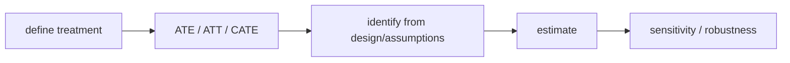

# 개입과 ATE (Intervention and Average Treatment Effect)

- Level: Intermediate
- Prerequisites: [AI/Causal-Inference/Potential-Outcomes.md](Potential-Outcomes.md), [AI/Causal-Inference/Confounding.md](Confounding.md)
- Status: Draft
- Reviewed-by: -
- Depth: Deep-dive (자기완결)

---

## 개념 (Concept)

개입은 treatment를 관측하는 것이 아니라 강제로 설정하는 행위다. ATE(Average Treatment Effect)는 전체 대상 집단에서 treatment를 했을 때와 하지 않았을 때의 평균 결과 차이다.

## 직관 (Intuition)

"약을 먹은 사람과 안 먹은 사람의 차이"는 선택 효과가 섞일 수 있다. ATE는 같은 대상들에게 약을 먹인 세계와 먹이지 않은 세계를 비교하려는 개념이다.

## 이론 (Theory)

잠재 결과 표기에서 ATE는 다음과 같다.

$$ATE=E[Y(1)-Y(0)]$$

그러나 한 개인에게서 $Y(1)$과 $Y(0)$을 동시에 관측할 수 없으므로 fundamental problem of causal inference가 생긴다. Randomization이나 ignorability 가정이 있으면 관측 데이터로 평균 효과를 추정할 수 있다.

ATE 외에 ATT, ATC, CATE처럼 대상 집단이나 조건을 바꾼 효과도 중요하다.



### Treatment를 잘 정의하기

처치는 "광고를 봤다"처럼 애매하면 안 된다. 노출 위치, 시간, 강도, 대상, compliance, competing treatment를 정의해야 한다. 처치 버전이 여러 개이면 같은 $T=1$ 안에서도 다른 효과가 섞여 SUTVA가 흔들린다.

### 효과의 scale

연속 outcome이면 평균 차이가 자연스럽지만, binary outcome에서는 risk difference, risk ratio, odds ratio가 모두 가능하다. scale을 바꾸면 효과 해석과 aggregation이 달라진다. 제품 실험에서는 절대 효과와 상대 효과를 함께 보는 편이 좋다.

### Heterogeneity

ATE가 작아도 subgroup에는 큰 양/음 효과가 있을 수 있다. CATE 분석은 유용하지만 subgroup을 많이 탐색하면 false discovery가 늘어나므로 사전 정의와 holdout 검증이 필요하다.

## 구현 (Implementation)

```python
def ate(mean_y_treated, mean_y_control):
    return mean_y_treated - mean_y_control
```

이 단순 차이는 무작위 배정이거나 적절한 조정이 끝난 뒤에야 인과 효과로 해석할 수 있다.

```python
def risk_ratio(p_treated, p_control):
    return p_treated / p_control
```

## 복잡도 (Complexity)

단순 RCT에서는 평균 차이 계산이 쉽다. 관측 데이터에서는 조정, weighting, matching, outcome modeling이 필요하고 표준오차 추정도 설계에 맞춰야 한다.

## 응용 (Applications)

- 제품 기능 출시 효과
- 의료 처치 평균 효과
- 가격·쿠폰 정책 효과
- 교육 개입 평가

## 흔한 오해 (Common Misunderstandings)

- ATE가 0이어도 subgroup 효과가 없다는 뜻은 아니다.
- Individual treatment effect는 보통 직접 관측되지 않는다.
- Observed treated-control difference는 자동으로 ATE가 아니다.
- Treatment 정의가 모호하면 ATE도 모호해진다.

## TMI

- SUTVA는 한 사람의 treatment가 다른 사람의 outcome에 영향을 주지 않는다는 가정 등을 포함한다.
- Positivity는 각 공변량 strata에서 모든 treatment가 가능해야 한다는 조건이다.
- Target population이 바뀌면 같은 추정량도 다른 causal estimand가 된다.

## 연습 / 확인 문제 (Exercises)

- ATE, ATT, CATE의 차이를 설명하라.
- 한 개인에게 두 잠재 결과를 동시에 관측할 수 없는 이유를 말하라.
- Treatment를 명확히 정의하지 않은 연구 질문을 고쳐 써라.

## 이어서 읽기 (Reading Path)

- 이전: [잠재 결과](Potential-Outcomes.md)
- 다음: [반사실](Counterfactual.md), [RCT](RCT.md)

## 참조 (References)

- [AI/Causal-Inference/Potential-Outcomes.md](Potential-Outcomes.md)
- [Reference/Books.md](../../Reference/Books.md)
