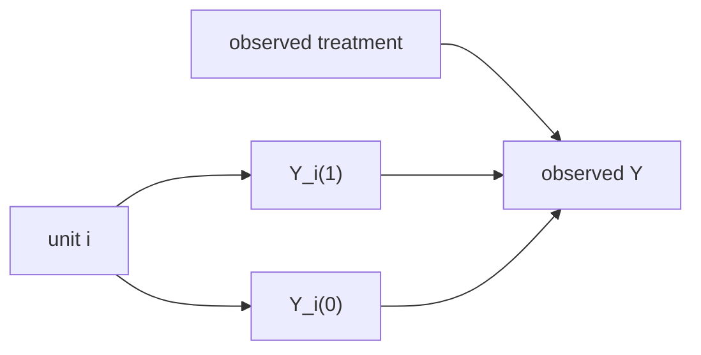

# 잠재 결과 프레임워크 (Potential Outcomes)

- Level: Intermediate
- Prerequisites: [Math/Probability-Statistics/Probability-Basics.md](../../Math/Probability-Statistics/Probability-Basics.md), [Math/Probability-Statistics/Expectation.md](../../Math/Probability-Statistics/Expectation.md), [AI/MLOps/AB-Testing.md](../MLOps/AB-Testing.md)
- Status: Draft
- Reviewed-by: -
- Depth: Deep-dive (자기완결)

---

## 개념 (Concept)

잠재 결과 프레임워크는 각 단위가 처치 $T=1$을 받았을 때의 결과 $Y(1)$과 처치 $T=0$을 받았을 때의 결과 $Y(0)$를 동시에 가진다고 모델링한다. 한 단위에 대해서는 둘 중 하나만 관측되므로, 인과 추론의 핵심은 관측되지 않은 counterfactual 결과를 어떻게 추정할 것인가다.

## 직관 (Intuition)

같은 사람에게 약을 먹인 세계와 먹이지 않은 세계를 동시에 볼 수 있다면 약의 효과는 두 결과의 차이다. 현실에서는 한 세계만 관측된다. 그래서 무작위 실험, 매칭, 회귀 조정 같은 방법으로 “비슷한 다른 사람” 또는 “조건부로 교환 가능한 집단”을 사용해 보이지 않는 세계를 추정한다.

## 이론 (Theory)

개별 처치 효과는

$$
\tau_i=Y_i(1)-Y_i(0)
$$

이고 평균 처치 효과(ATE)는

$$
ATE=E[Y(1)-Y(0)]
$$

이다. 관측 결과는 일관성(consistency) 가정 아래

$$
Y = TY(1) + (1-T)Y(0)
$$

로 쓸 수 있다.

무작위 실험에서는 $T\perp (Y(1),Y(0))$가 성립하므로

$$
ATE=E[Y\mid T=1]-E[Y\mid T=0]
$$

로 추정할 수 있다. 관측 연구에서는 보통 공변량 $X$에 대해 조건부 독립성

$$
(Y(1),Y(0))\perp T\mid X
$$

와 positivity $0<P(T=1\mid X=x)<1$를 가정한다.



### Fundamental problem

한 단위에서 $Y(1)$과 $Y(0)$을 동시에 볼 수 없다는 것이 인과추론의 근본 문제다. 모든 방법은 관측되지 않은 potential outcome을 어떤 가정으로 대체할지에 대한 답이다.

### 주요 estimand

| Estimand | 정의 | 질문 |
| --- | --- | --- |
| ATE | $E[Y(1)-Y(0)]$ | 전체 population 평균 효과 |
| ATT | $E[Y(1)-Y(0)\mid T=1]$ | 처치받은 집단 효과 |
| ATC | $E[Y(1)-Y(0)\mid T=0]$ | control 집단에 처치했다면 |
| CATE | $E[Y(1)-Y(0)\mid X=x]$ | subgroup/개인화 효과 |

estimand를 바꾸면 필요한 가정, weighting, 해석이 달라진다.

### SUTVA와 interference

SUTVA는 한 단위의 처치가 다른 단위의 결과에 영향을 주지 않고, 처치 버전이 하나로 잘 정의된다는 가정이다. 네트워크 효과, marketplace, vaccination, 추천 시스템에서는 interference가 쉽게 생긴다.

## 구현 (Implementation)

무작위 실험 데이터라면 두 그룹 평균 차이가 ATE의 자연스러운 추정량이다.

```python
def difference_in_means(rows):
    treated = [r["y"] for r in rows if r["t"] == 1]
    control = [r["y"] for r in rows if r["t"] == 0]
    return sum(treated) / len(treated) - sum(control) / len(control)


rows = [
    {"t": 1, "y": 12.0},
    {"t": 1, "y": 11.0},
    {"t": 0, "y": 8.0},
    {"t": 0, "y": 9.0},
]

print(difference_in_means(rows))
```

관측 연구에서는 이 코드만으로 인과 효과를 말할 수 없고, 처치 배정 메커니즘에 대한 가정과 조정이 필요하다.

```python
def individual_effect(y1, y0):
    return y1 - y0
```

## 복잡도 (Complexity)

잠재 결과 자체는 개념 프레임워크라 계산 복잡도가 정해져 있지 않다. 단순 평균 차이는 $O(n)$이지만, 매칭, propensity score, doubly robust estimation, causal forest 같은 방법은 모델 학습 비용이 추가된다.

## 응용 (Applications)

- A/B 테스트와 RCT 분석
- 의료 처치 효과 추정
- 정책 평가와 경제학 실증 연구
- 개인화 처치 효과(CATE) 추정

## 흔한 오해 (Common Misunderstandings)

- 상관된 두 그룹 평균 차이가 자동으로 ATE는 아니다.
- 한 개인의 $Y(1)$과 $Y(0)$을 동시에 관측할 수 없다는 점이 근본 문제다.
- 공변량을 많이 넣으면 항상 편향이 줄어드는 것은 아니다. collider를 조정하면 편향이 생길 수 있다.
- SUTVA는 한 사람의 처치가 다른 사람의 결과에 영향을 주지 않는다는 강한 가정을 포함한다.

## TMI

- Rubin causal model은 잠재 결과 관점의 대표적 정식화다.
- ATT는 처치받은 집단에 대한 평균 처치 효과 $E[Y(1)-Y(0)\mid T=1]$이다.
- 그래프 기반 SCM과 잠재 결과 프레임워크는 표현 방식은 다르지만 많은 인과 질문에서 서로 번역될 수 있다.

## 연습 / 확인 문제 (Exercises)

- ATE와 ATT의 차이를 예시로 설명하라.
- 무작위 배정이 왜 잠재 결과와 처치의 독립성을 보장하는지 설명하라.
- positivity가 깨지는 예를 하나 만들어라.

## 이어서 읽기 (Reading Path)

- 이전: [교란 변수](Confounding.md)
- 다음: [구조적 인과 모델](SCM.md)

## 참조 (References)

- [Math/Probability-Statistics/Expectation.md](../../Math/Probability-Statistics/Expectation.md)
- [AI/MLOps/AB-Testing.md](../MLOps/AB-Testing.md)
- [Reference/Books.md](../../Reference/Books.md)
- [Reference/Courses.md](../../Reference/Courses.md)
