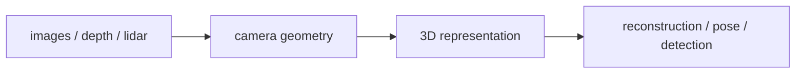

# 3D 비전 (3D Vision)

- Level: Advanced
- Prerequisites: [Math/Linear-Algebra/Matrices.md](../../Math/Linear-Algebra/Matrices.md), [AI/Computer-Vision/Classical-Vision.md](Classical-Vision.md)
- Status: Draft
- Reviewed-by: -
- Depth: Deep-dive (자기완결)

---

## 개념 (Concept)

3D 비전은 2D 이미지, depth, point cloud, multi-view 관측에서 장면의 3차원 구조와 카메라·객체의 기하를 추정하는 분야다. Reconstruction, pose, depth estimation, NeRF, point cloud understanding 등이 포함된다.

## 직관 (Intuition)

사진은 3D 세계가 평면에 투영된 그림자다. 3D 비전은 여러 시점, 움직임, 깊이 센서, 기하 제약을 이용해 그림자 뒤의 공간 구조를 되살린다.

## 이론 (Theory)

Pinhole camera model은 3D 점을 camera intrinsic·extrinsic matrix로 2D image plane에 투영한다. Stereo vision은 두 카메라의 disparity로 depth를 추정한다. Structure from Motion은 여러 이미지의 feature correspondence로 camera pose와 sparse 3D point를 함께 복원한다.

3D representation은 point cloud, voxel, mesh, signed distance field, neural radiance field처럼 다양하다. Point cloud는 sparse하고 순서가 없으며, voxel은 regular grid지만 resolution 비용이 크다. NeRF류는 위치와 시점 방향에서 색과 density를 예측해 novel view를 합성한다.



### 좌표계와 scale

3D 비전은 coordinate convention이 특히 중요하다. camera/world/object 좌표계, 오른손/왼손 좌표계, 단위, 축 방향을 명확히 해야 한다. monocular reconstruction은 절대 scale이 모호하고, stereo나 depth sensor는 calibration 품질에 민감하다.

### 표현 방식 선택

| 표현 | 장점 | 단점 |
| --- | --- | --- |
| Point cloud | sparse하고 sensor와 잘 맞음 | topology 없음 |
| Voxel | CNN 적용 쉬움 | 해상도 비용 큼 |
| Mesh | 표면과 렌더링에 적합 | topology 추정 어려움 |
| SDF/implicit | 매끄러운 surface | 학습/추론 비용 |
| NeRF | novel view 품질 | 느린 최적화와 mesh 추출 필요 |

### 평가

reconstruction은 Chamfer distance, F-score, normal consistency, photometric error를 볼 수 있다. pose는 rotation/translation error, depth는 scale-aware/scale-invariant metric을 쓴다. 시각적으로 좋아 보여도 metric과 실제 downstream 성능이 다를 수 있다.

## 구현 (Implementation)

```python
point3d = [x, y, z, 1.0]
pixel_homogeneous = camera_matrix @ point3d
pixel = pixel_homogeneous[:2] / pixel_homogeneous[2]
```

실제 구현은 calibration, distortion, coordinate convention, scale ambiguity를 명확히 관리해야 한다.

```python
def homogeneous(point3d):
    return [point3d[0], point3d[1], point3d[2], 1.0]
```

## 복잡도 (Complexity)

Multi-view matching은 image 수와 feature 수가 늘수록 비용이 커진다. Voxel은 해상도를 두 배 올리면 3D grid cell이 대략 8배 증가한다. NeRF 학습·렌더링은 ray sample 수와 network 평가 횟수에 민감하다.

## 응용 (Applications)

- AR/VR 공간 인식
- 로봇 navigation·grasping
- 자율주행 perception
- 3D reconstruction·digital twin

## 흔한 오해 (Common Misunderstandings)

- 단일 2D 이미지에서 절대 scale을 항상 알 수 있는 것은 아니다.
- Depth map과 3D reconstruction은 관련 있지만 같은 결과물이 아니다.
- Point cloud는 순서가 없으므로 일반 이미지 convolution을 그대로 적용하기 어렵다.
- NeRF가 mesh를 직접 주는 것은 아니며 별도 추출 과정이 필요할 수 있다.

## TMI

- Epipolar geometry는 stereo matching의 검색 공간을 선으로 줄인다.
- SLAM은 localization과 mapping을 동시에 푸는 문제다.
- Differentiable rendering은 렌더링 오차를 통해 3D 표현을 학습하게 해 준다.

## 연습 / 확인 문제 (Exercises)

- Camera intrinsic과 extrinsic의 차이를 설명하라.
- Stereo disparity가 작아질 때 depth가 어떻게 변하는지 말하라.
- Point cloud, voxel, mesh, NeRF representation을 비교하라.

## 이어서 읽기 (Reading Path)

- 이전: [고전 비전](Classical-Vision.md), [광류](Optical-Flow.md)
- 다음: [Vision-Language Model](Vision-Language.md)

## 참조 (References)

- [Math/Linear-Algebra/Matrices.md](../../Math/Linear-Algebra/Matrices.md)
- [Reference/Books.md](../../Reference/Books.md)
