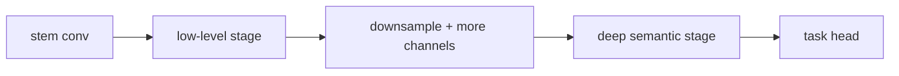

# 합성곱 신경망 심화 (CNN Deep Dive)

- Level: Intermediate
- Prerequisites: [AI/Deep-Learning/CNN.md](../Deep-Learning/CNN.md), [AI/Computer-Vision/Image-Basics.md](Image-Basics.md)
- Status: Draft
- Reviewed-by: -
- Depth: Deep-dive (자기완결)

---

## 개념 (Concept)

CNN 심화는 기본 합성곱 위에 쌓인 현대 비전 backbone의 설계 원리를 다룬다. receptive field, 다운샘플링 전략, residual·bottleneck 블록, 1×1 합성곱, depthwise separable 합성곱 등으로 정확도·효율·깊이를 조절한다.

## 직관 (Intuition)

깊은 CNN은 저수준 에지에서 고수준 객체 부위로 점점 추상화된 특징을 쌓는다. 핵심 질문은 "한 뉴런이 입력의 얼마를 보는가(receptive field)"와 "어떻게 깊어지면서도 학습이 망가지지 않는가"다. residual connection은 깊은 망의 gradient 흐름을 살리고, 1×1·depthwise 합성곱은 같은 표현력을 더 적은 연산으로 얻는다.

## 이론 (Theory)

**Receptive field.** 층을 거칠수록 한 출력 위치가 의존하는 입력 영역이 커진다. stride·pooling·dilation으로 빠르게 키운다.

**Residual block.** $y = x + F(x)$로 항등 경로를 두어, 깊어져도 $F$가 0에 가까우면 정보가 보존된다. 매우 깊은 망 학습을 가능케 했다.

**효율적 합성곱.** 표준 합성곱의 비용은 입력 채널 $C_{in}$, 출력 채널 $C_{out}$, 커널 $k$, 출력 크기 $H\times W$에서

$$\text{cost} = H\cdot W\cdot C_{in}\cdot C_{out}\cdot k^2$$

- **1×1 합성곱**: 채널 방향 선형 결합으로 차원 축소/확장(bottleneck).
- **depthwise separable**: 채널별 공간 합성곱 + 1×1 결합으로 비용을 약 $1/k^2$로 줄인다(MobileNet).

이 외에 batch normalization, global average pooling, 데이터 증강이 일반화를 돕는다.



### Effective receptive field

이론적 receptive field는 층을 쌓으면 커지지만, 실제 gradient가 강하게 기여하는 effective receptive field는 중앙에 더 집중되는 경향이 있다. 그래서 dilation, multi-scale feature, feature pyramid가 작은 객체와 큰 문맥을 함께 다루는 데 쓰인다.

### Downsampling schedule

초반에 너무 빨리 해상도를 줄이면 작은 객체 정보가 사라지고, 너무 늦게 줄이면 연산량이 커진다. 분류 backbone은 보통 점진적으로 해상도를 줄이며 channel을 늘리지만, segmentation/detection에서는 고해상도 feature를 보존하거나 FPN으로 되살린다.

### FLOPs와 실제 latency

FLOPs가 적어도 memory access, kernel launch, tensor layout, hardware 최적화가 나쁘면 느릴 수 있다. depthwise convolution은 이론상 싸지만 작은 batch나 특정 하드웨어에서는 표준 convolution만큼 효율이 나오지 않을 수 있다.

## 구현 (Implementation)

```python
def residual_block(x, conv1, conv2, norm1, norm2, relu):
    out = relu(norm1(conv1(x)))
    out = norm2(conv2(out))
    return relu(out + x)        # 항등 경로(skip connection)
```

```python
def conv2d_flops(h, w, cin, cout, kernel):
    return h * w * cin * cout * kernel * kernel
```

## 복잡도 (Complexity)

한 합성곱 층의 연산량은 위 식대로 출력 해상도와 채널 수의 곱에 비례한다. 깊은 backbone은 초반 고해상도 층이 연산을, 후반 고채널 층이 파라미터를 많이 차지한다. depthwise separable·bottleneck은 정확도를 크게 잃지 않으며 연산·파라미터를 줄인다.

## 응용 (Applications)

- 분류·탐지·세그멘테이션의 공용 backbone(ResNet, EfficientNet 등)
- 모바일·임베디드용 경량 모델(MobileNet, ShuffleNet)
- 전이 학습의 사전학습 feature extractor
- 의료·위성 영상 분석

## 흔한 오해 (Common Misunderstandings)

- 층을 무작정 깊게 쌓는다고 좋아지지 않는다. residual 같은 구조 없이는 학습이 어려워진다.
- 더 큰 커널이 항상 낫지 않다. 작은 커널을 여러 층 쌓아 같은 receptive field를 더 싸게 얻는다.
- pooling이 필수는 아니다. strided conv로 대체하기도 한다.
- 파라미터 수와 연산량(FLOPs)은 별개이며 둘 다 봐야 한다.

## TMI

- ResNet(2015)의 residual 아이디어는 1000층 규모 학습도 가능케 하며 딥러닝 깊이 경쟁을 바꿨다.
- 3×3 합성곱 두 번이 5×5 한 번과 같은 receptive field를 더 적은 연산으로 낸다는 점이 VGG 설계의 핵심이었다.
- Vision Transformer 등장 이후에도 CNN은 효율·소데이터 영역에서 여전히 강력하다.

## 연습 / 확인 문제 (Exercises)

- 3×3 stride 1 합성곱을 3층 쌓을 때의 receptive field를 계산하라.
- depthwise separable 합성곱이 표준 합성곱 대비 연산을 줄이는 비율을 유도하라.
- residual connection을 제거하면 깊은 망 학습이 왜 어려워지는지 gradient 관점에서 설명하라.

## 이어서 읽기 (Reading Path)

- 이전: [AI/Deep-Learning/CNN.md](../Deep-Learning/CNN.md)
- 다음: [객체 탐지](Object-Detection.md), [이미지 분류](Image-Classification.md)

## 참조 (References)

- [AI/Deep-Learning/CNN.md](../Deep-Learning/CNN.md)
- [AI/Computer-Vision/Image-Classification.md](Image-Classification.md)
- [Reference/Papers.md](../../Reference/Papers.md)
