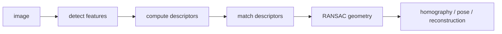

# 고전 컴퓨터 비전 (Classical Computer Vision)

- Level: Intermediate
- Prerequisites: [AI/Computer-Vision/Image-Basics.md](Image-Basics.md), [Math/Linear-Algebra/Matrices.md](../../Math/Linear-Algebra/Matrices.md)
- Status: Draft
- Reviewed-by: -
- Depth: Deep-dive (자기완결)

---

## 개념 (Concept)

고전 컴퓨터 비전은 딥러닝 이전부터 쓰인 edge, corner, descriptor, matching, geometric model fitting 기반의 이미지 분석 방법이다. 사람이 설계한 feature와 기하 제약으로 인식·추적·정합 문제를 푼다.

## 직관 (Intuition)

신경망이 데이터를 많이 보고 feature를 배우는 방식이라면, 고전 비전은 "에지는 밝기가 급변하는 곳", "코너는 방향 변화가 큰 곳"처럼 우리가 아는 시각 단서를 직접 공식으로 만든다.

## 이론 (Theory)

Edge detection은 intensity gradient가 큰 위치를 찾는다. Corner detection은 작은 이동에도 patch가 크게 달라지는 점을 찾는다. HOG는 gradient 방향 histogram으로 형태를 표현하고, SIFT류 descriptor는 scale·rotation 변화에 강한 local feature를 만든다.

Feature matching은 descriptor distance로 후보 대응점을 만들고, RANSAC은 outlier가 섞인 대응점에서 homography나 fundamental matrix 같은 기하 모델을 robust하게 추정한다.



### 고전 비전이 강한 조건

고전 비전은 데이터가 적고, 카메라 기하와 물체 구조가 명확하며, 실패 원인을 해석해야 하는 문제에서 여전히 강하다. 예를 들어 문서 스캔 보정, 파노라마 stitching, 카메라 보정, 산업 패턴 정합은 딥러닝 없이도 안정적으로 해결되는 경우가 많다.

### RANSAC 반복 수의 직관

outlier 비율이 높을수록 모든 샘플이 inlier일 확률이 낮아져 더 많은 반복이 필요하다. 성공 확률 $p$, 샘플 크기 $s$, inlier 비율 $w$라면 필요한 반복 수는 대략

$$N=\frac{\log(1-p)}{\log(1-w^s)}$$

로 볼 수 있다. threshold가 너무 작으면 inlier를 버리고, 너무 크면 나쁜 모델도 통과한다.

### 딥러닝과의 결합

딥러닝 detector가 찾은 keypoint를 PnP/RANSAC으로 pose 추정하거나, segmentation mask를 고전 morphology로 다듬는 식의 hybrid pipeline이 흔하다. 학습 모델과 기하 제약을 함께 쓰면 데이터 효율과 안정성을 높일 수 있다.

## 구현 (Implementation)

```python
def gradient_magnitude(dx, dy):
    return (dx * dx + dy * dy) ** 0.5


def is_edge(dx, dy, threshold):
    return gradient_magnitude(dx, dy) >= threshold
```

실제 edge detector는 smoothing, non-maximum suppression, hysteresis threshold 등을 함께 사용한다.

```python
def ransac_iterations(success_prob, inlier_ratio, sample_size):
    import math
    return math.log(1 - success_prob) / math.log(1 - inlier_ratio ** sample_size)
```

## 복잡도 (Complexity)

Convolution 기반 filter는 이미지 크기와 kernel 크기에 비례한다. Descriptor matching은 naive하게는 feature 수의 곱이지만, indexing 구조로 줄일 수 있다. RANSAC 반복 수는 outlier 비율과 원하는 성공 확률에 따라 증가한다.

## 응용 (Applications)

- panorama stitching
- camera calibration·3D reconstruction
- document scanning·OCR 전처리
- 딥러닝 모델 전처리·후처리

## 흔한 오해 (Common Misunderstandings)

- 고전 비전이 낡아서 쓸모없는 것은 아니다. 데이터가 적고 기하 구조가 강한 문제에서는 여전히 강력하다.
- Edge가 많다고 의미 있는 object boundary가 많다는 뜻은 아니다.
- Descriptor matching은 textureless 영역과 반복 패턴에서 쉽게 흔들린다.
- Hand-crafted feature는 조명, blur, viewpoint 변화에 한계가 있다.

## TMI

- RANSAC은 "아무 후보나 뽑고 검증한다"는 단순함으로 매우 넓게 쓰인다.
- 딥러닝 기반 비전에서도 NMS, geometry, camera model 같은 고전 요소가 자주 남아 있다.
- Hough transform은 edge point가 만든 parameter space의 투표로 선·원을 찾는다.

## 연습 / 확인 문제 (Exercises)

- 밝기 gradient와 edge의 관계를 설명하라.
- SIFT 같은 local descriptor가 scale 변화에 강해야 하는 이유를 말하라.
- RANSAC이 outlier에 강한 이유와 실패 조건을 설명하라.

## 이어서 읽기 (Reading Path)

- 이전: [이미지 표현 기초](Image-Basics.md)
- 다음: [CNN 심화](CNN-Deep-Dive.md), [3D 비전](3D-Vision.md)

## 참조 (References)

- [Math/Linear-Algebra/Matrices.md](../../Math/Linear-Algebra/Matrices.md)
- [Reference/Books.md](../../Reference/Books.md)
