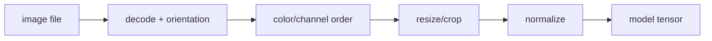

# 이미지 표현 기초 (Image Basics)

- Level: Intermediate
- Prerequisites: [Math/Linear-Algebra/Matrices.md](../../Math/Linear-Algebra/Matrices.md)
- Status: Draft
- Reviewed-by: -
- Depth: Deep-dive (자기완결)

---

## 개념 (Concept)

디지털 이미지는 높이·너비·channel 축을 가진 수 배열이다. Grayscale은 한 channel, RGB는 보통 세 channel이며 bit depth, color space, 좌표·sampling 방식이 픽셀 값의 의미를 정한다.

## 직관 (Intuition)

이미지를 작은 색 타일의 격자로 보면 각 픽셀은 위치와 색 값을 가진다. 모델은 그림 자체가 아니라 정규화된 tensor를 입력받으므로 shape와 값 범위가 바뀌면 의미도 바뀐다.

## 이론 (Theory)

RGB는 빛의 가산 혼합이고 HSV·Lab은 색을 다른 좌표로 표현한다. resizing은 nearest, bilinear 등 interpolation을 사용하며 aliasing을 줄이려면 downsampling 전에 low-pass filtering이 필요하다. 표준화는 channel별 $x'=(x-\mu)/\sigma$로 수행할 수 있다.



### 좌표계와 layout

이미지 좌표는 보통 왼쪽 위가 원점이고 $x$는 가로, $y$는 세로 방향이다. 하지만 tensor shape는 `H x W x C` 또는 `C x H x W`로 표현되어 좌표 순서와 다르다. bounding box도 `xyxy`, `xywh`, normalized coordinate 등 형식이 다양하므로 annotation과 모델 입출력 계약을 고정해야 한다.

### 색 공간과 감마

sRGB 값은 물리적 빛 세기에 선형이 아니다. 단순 평균으로 grayscale을 만들거나 색 보정을 할 때 gamma와 color profile을 무시하면 미세한 차이가 생길 수 있다. 의료·위성·산업 영상처럼 sensor 값의 물리적 의미가 중요한 영역에서는 일반 RGB 전처리 가정을 그대로 쓰면 안 된다.

### 학습/추론 전처리 일치

pretrained model은 특정 resize, crop, channel order, mean/std normalization을 기대한다. 학습 때와 추론 때 전처리가 다르면 모델은 조용히 성능이 떨어진다. 전처리 코드는 model artifact와 같은 version으로 묶어 배포한다.

## 구현 (Implementation)

```python
def normalize_pixel(rgb):
    return tuple(value / 255.0 for value in rgb)


def grayscale(rgb):
    r, g, b = rgb
    return 0.2126 * r + 0.7152 * g + 0.0722 * b
```

```python
def hwc_to_chw(image):
    return list(zip(*[iter(sum(image, []))] * len(image[0][0])))
```

## 복잡도 (Complexity)

$H\times W\times C$ 이미지의 pointwise 변환은 `O(HWC)`, 저장도 `O(HWC)`다. resize·filter 비용은 kernel 크기에 추가로 비례한다.

## 응용 (Applications)

- vision model input pipeline
- augmentation·compression·visualization
- 의료·위성영상 전처리
- CNN tensor shape 설계

## 흔한 오해 (Common Misunderstandings)

- RGB와 BGR channel 순서를 혼동하기 쉽다.
- 0~255와 0~1 범위를 바꾸면서 pretrained model 전처리를 맞춰야 한다.
- EXIF orientation과 alpha channel을 무시하면 표시와 tensor 방향이 달라질 수 있다.
- resize는 정보를 보존하는 무손실 연산이 아니다.

## TMI

- sRGB 값은 물리적 빛 세기에 선형이 아니며 gamma encoding이 적용된다.
- JPEG은 block 기반 손실 압축이라 경계 artifact를 만들 수 있다.
- 이미지 tensor layout은 HWC와 CHW가 널리 쓰인다.

## 연습 / 확인 문제 (Exercises)

- $224\times224$ RGB uint8 이미지의 메모리를 계산하라.
- nearest와 bilinear resize 결과를 비교하라.
- channel 순서를 바꾼 이미지의 색 변화를 설명하라.

## 이어서 읽기 (Reading Path)

- 이전: [행렬 연산](../../Math/Linear-Algebra/Matrices.md)
- 다음: [CNN](../Deep-Learning/CNN.md), [이미지 분류](Image-Classification.md)
- 관련: [고전 컴퓨터 비전](Classical-Vision.md), [광류](Optical-Flow.md)

## 참조 (References)

- [Math/Linear-Algebra/Matrices.md](../../Math/Linear-Algebra/Matrices.md)
- [Reference/Books.md](../../Reference/Books.md)
- [Reference/Courses.md](../../Reference/Courses.md)
