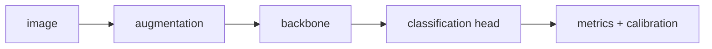

# 이미지 분류 (Image Classification)

- Level: Intermediate
- Prerequisites: [AI/Computer-Vision/Image-Basics.md](Image-Basics.md), [AI/Deep-Learning/CNN.md](../Deep-Learning/CNN.md)
- Status: Draft
- Reviewed-by: -
- Depth: Deep-dive (자기완결)

---

## 개념 (Concept)

이미지 분류는 이미지 전체에 하나 이상의 label을 예측한다. Single-label은 softmax, multi-label은 독립 sigmoid 출력이 일반적이며 backbone이 특징을 추출하고 classification head가 class score를 만든다.

## 직관 (Intuition)

앞 층이 edge·texture를, 뒤 층이 object part와 전체 형태를 조합해 class별 근거를 만든다. 학습 데이터의 label·촬영 환경이 실제 배포 환경을 대표해야 한다.

## 이론 (Theory)

logit $z_k$를 $p_k=e^{z_k}/\sum_j e^{z_j}$로 변환하고 cross-entropy를 최소화한다. top-1 accuracy 외 class imbalance에서는 precision, recall, macro F1, confusion matrix를 함께 본다. augmentation은 label을 보존하는 변환이라는 가정을 모델에 주입한다.



### Augmentation의 label-preserving 가정

random crop, flip, color jitter, blur, mixup은 모두 label이 유지된다는 가정을 둔다. 의료영상에서 좌우 반전은 해부학적 의미를 바꿀 수 있고, 상품 분류에서 crop은 class를 결정하는 로고를 잘라낼 수 있다. augmentation은 도메인 지식으로 검토해야 한다.

### Dataset split

같은 물체를 다른 각도에서 찍은 사진, 같은 환자의 이미지, 같은 생산 batch 이미지를 서로 다른 split에 넣으면 성능이 부풀 수 있다. 분류 split은 이미지 단위가 아니라 object, patient, user, time, site 기준이 필요할 수 있다.

### Calibration과 abstention

softmax confidence는 잘 보정된 확률이 아닐 수 있다. 고위험 시스템에서는 temperature scaling, confidence threshold, human review queue, out-of-distribution detector를 함께 둔다.

## 구현 (Implementation)

```python
def top1(logits):
    return max(range(len(logits)), key=logits.__getitem__)


def accuracy(targets, logits_batch):
    correct = sum(top1(logits) == y for y, logits in zip(targets, logits_batch))
    return correct / len(targets)
```

```python
def topk(logits, k=5):
    return sorted(range(len(logits)), key=logits.__getitem__, reverse=True)[:k]
```

## 복잡도 (Complexity)

비용은 backbone에 좌우된다. CNN은 spatial 크기·kernel·channel에, Vision Transformer는 patch 수의 제곱 attention에 크게 좌우된다.

## 응용 (Applications)

- 상품·문서·종 분류
- 의료영상 보조 판독
- content moderation과 quality inspection
- detection·segmentation backbone pretraining

## 흔한 오해 (Common Misunderstandings)

- 높은 전체 accuracy가 소수 class 성능을 보장하지 않는다.
- random crop이 label object를 제거할 수 있다.
- validation과 production 분포가 다르면 성능이 유지되지 않는다.
- 설명 heatmap은 인과적 근거를 증명하지 않는다.

## TMI

- transfer learning은 작은 데이터에서 scratch 학습보다 강력한 baseline이다.
- test-time augmentation은 여러 변환 예측을 평균한다.
- label noise와 shortcut feature는 모델이 의도치 않은 단서를 배우게 한다.

## 연습 / 확인 문제 (Exercises)

- 불균형 3-class confusion matrix에서 macro F1을 계산하라.
- single-label과 multi-label output/loss를 비교하라.
- 배포 환경의 distribution shift 시나리오를 작성하라.

## 이어서 읽기 (Reading Path)

- 이전: [이미지 표현 기초](Image-Basics.md), [CNN](../Deep-Learning/CNN.md)
- 다음: [객체 탐지](Object-Detection.md)

## 참조 (References)

- [AI/Deep-Learning/CNN.md](../Deep-Learning/CNN.md)
- [Reference/Papers.md](../../Reference/Papers.md)
- [Reference/Books.md](../../Reference/Books.md)
