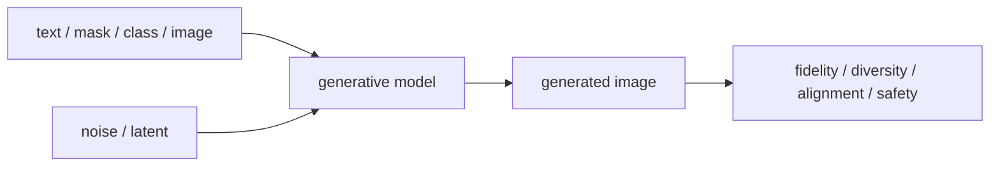

# 이미지 생성 (Image Generation)

- Level: Advanced
- Prerequisites: [AI/Generative-Models/GAN-Basics.md](../Generative-Models/GAN-Basics.md), [AI/Generative-Models/DDPM.md](../Generative-Models/DDPM.md)
- Status: Draft
- Reviewed-by: -
- Depth: Deep-dive (자기완결)

---

## 개념 (Concept)

이미지 생성은 학습 데이터 분포를 바탕으로 새로운 이미지를 샘플링하거나 조건에 맞는 이미지를 만드는 과제다. VAE, GAN, diffusion, autoregressive, flow 기반 모델이 주요 계열이다.

## 직관 (Intuition)

분류 모델이 "이 그림은 고양이인가?"를 묻는다면 생성 모델은 "고양이처럼 보이는 이미지를 새로 그려 보자"라고 한다. 목표는 단순 복사가 아니라 분포의 구조를 배워 새로운 샘플을 만드는 것이다.

## 이론 (Theory)

VAE는 latent variable과 likelihood lower bound를 사용해 부드러운 latent space를 학습한다. GAN은 generator와 discriminator의 게임으로 사실적인 샘플을 만든다. Diffusion은 noise를 점진적으로 제거하는 denoising 과정을 학습한다.

조건부 생성은 class, text, mask, depth, pose 같은 조건을 입력으로 사용한다. 평가는 fidelity, diversity, condition adherence, safety를 함께 보며 FID·precision/recall류 지표와 사람 평가가 함께 쓰인다.



### 평가 축 분리

좋은 생성 모델은 사실적으로 보이는 것만으로 충분하지 않다. fidelity는 이미지 품질, diversity는 샘플 다양성, alignment는 조건 준수, safety는 유해·저작권·개인정보 위험을 본다. FID는 편리하지만 prompt alignment나 특정 객체 수 정확도를 직접 보지 않는다.

### 조건부 생성과 제어

text-to-image는 prompt 해석에 민감하고, image-to-image는 원본 구조 보존과 변화 강도 사이의 tradeoff가 있다. inpainting은 mask 경계와 주변 맥락 일관성이 중요하며, pose/depth/control 조건은 더 강한 공간 제어를 제공한다.

### 데이터와 권리 문제

생성 모델은 학습 데이터의 편향, 워터마크, 특정 스타일, 개인정보를 재현할 수 있다. 데이터 출처, opt-out, memorization audit, safety filter, provenance metadata가 모델 품질만큼 중요하다.

## 구현 (Implementation)

```python
def denoise_step(x_t, noise_pred, alpha):
    return (x_t - (1 - alpha) * noise_pred) / (alpha ** 0.5)
```

실제 diffusion sampler는 noise schedule, guidance, scheduler, latent decoder 등을 포함한다.

```python
def guidance(uncond, cond, scale):
    return uncond + scale * (cond - uncond)
```

## 복잡도 (Complexity)

GAN은 샘플링이 빠르지만 학습 안정성이 어렵다. Diffusion은 학습이 안정적인 편이나 여러 denoising step 때문에 샘플링 비용이 크다. 고해상도 생성은 memory와 compute가 급격히 증가한다.

## 응용 (Applications)

- 이미지 합성·편집·inpainting
- 데이터 증강
- 디자인·게임 asset 생성
- text-to-image·image-to-image 변환

## 흔한 오해 (Common Misunderstandings)

- 생성 이미지가 그럴듯하다고 training distribution을 잘 대표한다는 뜻은 아니다.
- FID 하나로 모든 품질을 판단할 수 없다.
- 조건부 생성은 prompt나 조건을 항상 정확히 따르지 않는다.
- 데이터셋 편향과 저작권·개인정보 이슈는 모델 구조만으로 해결되지 않는다.

## TMI

- Latent diffusion은 pixel space 대신 압축된 latent에서 diffusion을 수행해 비용을 줄인다.
- Guidance는 조건을 더 잘 따르게 하지만 diversity를 줄일 수 있다.
- Inpainting은 mask 바깥 영역과 조화를 맞추는 조건부 생성 문제다.

## 연습 / 확인 문제 (Exercises)

- VAE, GAN, diffusion의 장단점을 비교하라.
- Text-to-image 평가 기준 4가지를 설계하라.
- 데이터 증강용 생성 모델에서 생길 수 있는 bias amplification을 설명하라.

## 이어서 읽기 (Reading Path)

- 이전: [GAN 기초](../Generative-Models/GAN-Basics.md), [DDPM](../Generative-Models/DDPM.md)
- 다음: [Vision-Language Model](Vision-Language.md), [3D 비전](3D-Vision.md)

## 참조 (References)

- [AI/Generative-Models/VAE.md](../Generative-Models/VAE.md)
- [AI/Generative-Models/GAN-Basics.md](../Generative-Models/GAN-Basics.md)
- [AI/Generative-Models/DDPM.md](../Generative-Models/DDPM.md)
