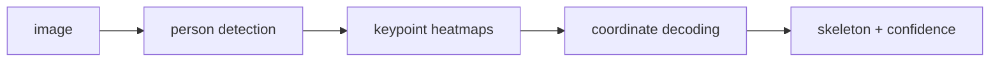

# 포즈 추정 (Pose Estimation)

- Level: Advanced
- Prerequisites: [AI/Computer-Vision/Object-Detection.md](Object-Detection.md), [AI/Computer-Vision/Semantic-Segmentation.md](Semantic-Segmentation.md)
- Status: Draft
- Reviewed-by: -
- Depth: Deep-dive (자기완결)

---

## 개념 (Concept)

포즈 추정은 사람이나 물체의 keypoint 위치와 구조를 예측하는 과제다. 사람 포즈에서는 어깨, 팔꿈치, 손목, 무릎 같은 관절 위치와 연결 관계를 찾는다.

## 직관 (Intuition)

객체 탐지가 사람의 박스를 찾는다면, 포즈 추정은 그 박스 안에서 뼈대가 어떻게 놓였는지까지 본다. 같은 사람 class라도 앉기, 뛰기, 들기처럼 자세가 다르면 keypoint 구조가 달라진다.

## 이론 (Theory)

Top-down 방식은 먼저 사람을 탐지하고 각 crop에서 keypoint를 추정한다. Bottom-up 방식은 이미지 전체의 keypoint 후보를 찾고 사람 instance별로 묶는다. Heatmap 기반 방법은 각 keypoint 위치의 확률 지도를 예측한다.

평가는 keypoint distance, PCK, OKS 기반 AP 등을 사용한다. Occlusion, truncation, motion blur, crowded scene이 주요 난점이다.



### Annotation 정책

keypoint는 visible, occluded, not-labeled 상태를 구분해야 한다. 가려졌지만 위치를 추정할 수 있는 관절과 이미지 밖으로 잘린 관절은 학습 신호가 다르다. skeleton edge 정의도 dataset마다 다르므로 모델 출력 순서와 평가 스크립트를 고정한다.

### Heatmap과 coordinate regression

heatmap 방식은 각 관절의 위치 확률 지도를 예측해 안정적이지만 출력 해상도와 decoding 방식이 정확도에 영향을 준다. coordinate regression은 직접 좌표를 내지만 multi-modal uncertainty를 표현하기 어렵다. sub-pixel refinement와 flip test가 성능을 올릴 수 있다.

### Video pose

영상에서는 프레임별 예측이 흔들리는 jitter가 문제다. temporal smoothing, tracking, optical flow, temporal transformer를 사용할 수 있지만 빠른 동작을 과도하게 부드럽게 만들지 않도록 latency와 정확도 tradeoff를 본다.

## 구현 (Implementation)

```python
keypoints = {
    "left_shoulder": (120, 80, 0.98),
    "left_elbow": (145, 130, 0.91),
    "left_wrist": (160, 180, 0.76),
}
```

좌표와 confidence를 함께 저장하고, missing·occluded keypoint의 annotation 규칙을 명확히 둔다.

```python
def visible_keypoints(keypoints, threshold=0.5):
    return {name: xy for name, (*xy, score) in keypoints.items() if score >= threshold}
```

## 복잡도 (Complexity)

Top-down 비용은 detection 수에 비례한다. 사람이 많으면 crop별 keypoint network 실행이 병목이 된다. Bottom-up은 한 번에 처리하지만 grouping 품질이 어렵다.

## 응용 (Applications)

- 스포츠 자세 분석
- AR 필터와 motion capture
- 로봇 human interaction
- 작업 안전·행동 인식

## 흔한 오해 (Common Misunderstandings)

- Keypoint confidence가 높다고 3D 위치가 정확한 것은 아니다.
- 사람 탐지가 실패하면 top-down pose도 실패한다.
- Occlusion label 정책이 불명확하면 학습이 불안정해진다.
- 2D pose만으로 실제 관절 각도를 항상 알 수 없다.

## TMI

- Part affinity field는 bottom-up keypoint grouping에 쓰이는 대표 아이디어다.
- Temporal smoothing은 video pose의 jitter를 줄이지만 빠른 동작을 흐릴 수 있다.
- Animal pose, hand pose, object pose는 skeleton 정의가 문제마다 다르다.

## 연습 / 확인 문제 (Exercises)

- Top-down과 bottom-up pose estimation의 장단점을 비교하라.
- Occluded keypoint annotation 정책을 설계하라.
- 2D pose에서 3D pose를 추정할 때 생기는 모호성을 설명하라.

## 이어서 읽기 (Reading Path)

- 이전: [객체 탐지](Object-Detection.md)
- 다음: [영상 이해](Video-Understanding.md), [3D 비전](3D-Vision.md)

## 참조 (References)

- [AI/Computer-Vision/Object-Detection.md](Object-Detection.md)
- [Reference/Papers.md](../../Reference/Papers.md)
