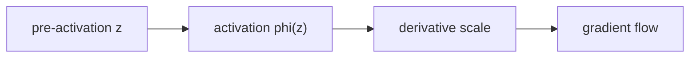

# 활성화 함수 (Activation Functions)

- Level: Intermediate
- Prerequisites: [AI/Deep-Learning/MLP.md](MLP.md), [Math/Calculus/Differentiation.md](../../Math/Calculus/Differentiation.md)
- Status: Draft
- Reviewed-by: -
- Depth: Deep-dive (자기완결)

---

## 개념 (Concept)

활성화 함수는 신경망 층의 선형 출력에 비선형성을 더한다. ReLU, sigmoid, tanh, GELU 등이 있으며 hidden layer와 output layer에서 목적이 다르다.

## 직관 (Intuition)

선형 변환만 여러 번 쌓으면 결국 한 번의 선형 변환이다. 활성화 함수가 입력 공간을 꺾고 눌러 여러 층이 복잡한 패턴을 표현하게 한다.

## 이론 (Theory)

$$\operatorname{ReLU}(x)=\max(0,x),\quad
\sigma(x)=\frac{1}{1+e^{-x}},\quad
\tanh(x)=\frac{e^x-e^{-x}}{e^x+e^{-x}}$$

ReLU는 양수에서 gradient가 일정해 학습이 쉽지만 음수 영역에서 dead unit이 생길 수 있다. sigmoid와 tanh는 큰 절댓값에서 포화되어 gradient가 작아진다. GELU는 입력 크기에 따라 부드럽게 gating하며 Transformer에서 흔하다.

출력층은 binary classification의 sigmoid, mutually exclusive multiclass의 softmax, 회귀의 identity처럼 손실과 확률모형에 맞춰 선택한다.



### 주요 함수의 학습 특성

| 함수 | 좋은 점 | 조심할 점 | 흔한 대응 |
| --- | --- | --- | --- |
| ReLU | 양수 영역 gradient가 단순하고 sparse하다 | 음수로 죽은 unit이 회복되지 않을 수 있다 | He 초기화, Leaky ReLU, learning rate 점검 |
| Sigmoid | 확률 출력과 잘 맞는다 | 큰 절댓값에서 gradient가 거의 0이다 | hidden layer에서는 제한적으로 사용 |
| Tanh | 중심이 0이라 sigmoid보다 균형 잡힌다 | 포화 구간에서는 여전히 gradient가 작다 | 적절한 초기화와 normalization |
| GELU/SiLU | 부드러운 gating으로 Transformer 계열에서 강하다 | ReLU보다 계산이 조금 무겁다 | kernel fusion이나 근사 구현 사용 |

activation은 함수값뿐 아니라 derivative 분포가 중요하다. 예를 들어 ReLU는 $x>0$에서 derivative가 1이라 깊은 층에서도 gradient가 비교적 잘 흐르지만, 입력이 계속 음수가 되면 해당 unit은 업데이트 신호를 거의 받지 못한다. 반대로 sigmoid는 출력 범위가 안정적이지만 $x$가 매우 크거나 작을 때 derivative가 작아진다.

### 은닉층과 출력층의 역할 차이

은닉층 activation은 표현 공간을 만드는 장치고, 출력층 activation은 예측의 의미를 정하는 장치다. 따라서 multiclass classification에서 softmax를 은닉층마다 넣는 것은 보통 좋은 설계가 아니다. 반대로 마지막 층에서는 손실 함수가 기대하는 입력 형태를 맞춰야 한다. 많은 프레임워크의 cross-entropy loss는 softmax가 적용되지 않은 logits를 입력으로 받아 내부에서 안정적인 log-softmax를 계산한다.

## 구현 (Implementation)

```python
import math


def relu(x):
    return max(0.0, x)


def sigmoid(x):
    if x >= 0:
        return 1 / (1 + math.exp(-x))
    e = math.exp(x)
    return e / (1 + e)
```

```python
def softmax(logits):
    shifted = [x - max(logits) for x in logits]
    exps = [math.exp(x) for x in shifted]
    total = sum(exps)
    return [x / total for x in exps]
```

## 복잡도 (Complexity)

activation 원소 수를 $N$이라 하면 forward와 backward는 `O(N)`, 출력 저장도 `O(N)`이다. 실제 비용은 주변 matrix multiplication보다 작지만 kernel fusion과 메모리 이동이 중요하다.

## 응용 (Applications)

- MLP·CNN·Transformer hidden layer
- 확률 출력과 gating
- sparse activation과 conditional computation
- 신경망 표현력 부여

## 흔한 오해 (Common Misunderstandings)

- 모든 층에 sigmoid를 쓰는 것이 확률적이라는 뜻은 아니다.
- ReLU는 0에서 미분 불가능하지만 subgradient 관례로 학습한다.
- softmax 값은 합이 1이어도 calibration된 확률을 보장하지 않는다.
- 활성화 선택만으로 vanishing gradient가 완전히 해결되지는 않는다.

## TMI

- Leaky ReLU는 음수 구간에 작은 기울기를 남긴다.
- Swish/SiLU와 GELU는 매끄럽고 비단조인 구간을 가진다.
- activation 분포는 초기화와 normalization 설계에 직접 영향을 준다.

## 연습 / 확인 문제 (Exercises)

- sigmoid derivative가 $\sigma(x)(1-\sigma(x))$임을 유도하라.
- 큰 양수·음수에서 각 activation과 derivative를 비교하라.
- ReLU dead unit이 생기는 update 예를 만들어라.

## 이어서 읽기 (Reading Path)

- 이전: [MLP](MLP.md)
- 다음: [손실 함수](Loss-Functions.md), [정규화 층](Normalization-Layers.md)

## 참조 (References)

- [Math/Calculus/Differentiation.md](../../Math/Calculus/Differentiation.md)
- [Reference/Books.md](../../Reference/Books.md)
- [Reference/Papers.md](../../Reference/Papers.md)
