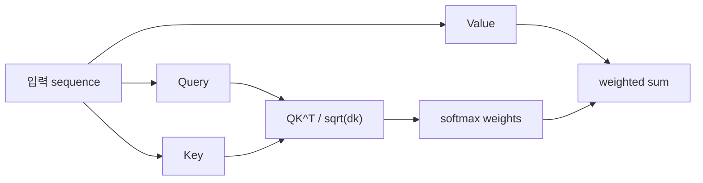

# 어텐션 메커니즘 (Attention Mechanism)

- Level: Intermediate
- Prerequisites: [Math/Linear-Algebra/Matrices.md](../../Math/Linear-Algebra/Matrices.md), [AI/Deep-Learning/MLP.md](MLP.md)
- Status: Draft
- Reviewed-by: -
- Depth: Deep-dive (자기완결)

---

## 개념 (Concept)

attention은 query와 key의 관련도를 계산해 value를 가중합하는 정보 선택 메커니즘이다. 각 위치가 필요한 다른 위치의 정보를 내용에 따라 직접 모을 수 있다.

## 직관 (Intuition)

질문(query)을 들고 색인(key)을 검색한 뒤 관련도가 높은 자료의 내용(value)을 더 많이 읽는다. 고정된 한 이웃만 보는 convolution과 달리 입력 내용에 따라 연결 강도가 달라진다.

## 이론 (Theory)

scaled dot-product attention은

$$\operatorname{Attention}(Q,K,V)=
\operatorname{softmax}\left(\frac{QK^\top}{\sqrt{d_k}}+M\right)V$$

다. $\sqrt{d_k}$는 dot product 크기가 커져 softmax가 포화되는 것을 완화한다. mask $M$은 padding이나 미래 token을 차단한다. multi-head attention은 서로 다른 projection 공간에서 여러 관계를 병렬로 학습한 뒤 결합한다.



### Shape bookkeeping

self-attention에서 입력이 $X\in\mathbb{R}^{B\times n\times d_{model}}$이면 projection 후 $Q,K,V$는 보통 $B\times h\times n\times d_k$ 형태로 나뉜다. score matrix는 $B\times h\times n\times n$이므로 sequence length $n$이 커질 때 메모리 병목이 먼저 드러난다. multi-head는 단순히 head 수를 늘리는 것이 아니라 각 head의 $d_k$를 줄여 전체 차원을 유지하는 방식이 흔하다.

### Mask의 의미

padding mask는 실제 token이 아닌 위치를 보지 않게 하고, causal mask는 현재 위치가 미래 위치를 보지 않게 한다. 둘을 동시에 써야 하는 autoregressive batch도 많다. mask는 softmax 전에 매우 작은 값을 더하는 방식으로 구현하는데, softmax 뒤에 0을 곱하면 이미 정규화에 미래 token이 참여했을 수 있어 의미가 달라진다.

### Attention weight 해석의 한계

attention weight가 높은 token은 해당 forward pass에서 value 가중합에 많이 기여했다는 뜻이다. 그러나 이것만으로 "모델이 이 token 때문에 답했다"는 인과 설명이 되지는 않는다. projection, residual path, MLP block, layer stacking이 모두 최종 출력에 영향을 주기 때문이다.

## 구현 (Implementation)

```python
import numpy as np


def softmax(x):
    e = np.exp(x - x.max(axis=-1, keepdims=True))
    return e / e.sum(axis=-1, keepdims=True)


def attention(q, k, v, mask=None):
    scores = q @ k.T / np.sqrt(q.shape[-1])
    if mask is not None:
        scores = scores + mask
    weights = softmax(scores)
    return weights @ v, weights
```

## 복잡도 (Complexity)

길이 $n$, hidden size $d$의 full self-attention은 score matrix 때문에 시간·공간 `O(n^2d)`와 `O(n^2)`가 중심이다. 긴 문맥에는 sparse, local, linear attention 등 근사를 사용한다.

autoregressive 추론에서는 새 token마다 과거 $K,V$를 다시 계산하지 않도록 KV cache를 둔다. 이때 한 step의 attention은 새 query와 누적 key/value 사이에서 계산되므로 prefill과 decode 단계의 비용 구조가 다르다.

## 응용 (Applications)

- 언어·비전 Transformer
- encoder-decoder 정렬
- multimodal 정보 결합
- set과 graph의 관계 모델링

## 흔한 오해 (Common Misunderstandings)

- attention weight가 곧 인과적 설명인 것은 아니다.
- mask 방향을 틀리면 미래 token 누출이 생긴다.
- padding mask와 causal mask는 목적이 다르다.
- multi-head가 항상 서로 완전히 다른 의미를 학습하는 것은 아니다.

## TMI

- self-attention은 query, key, value가 같은 입력에서 나온다.
- cross-attention은 query와 key/value가 서로 다른 sequence에서 온다.
- KV cache는 autoregressive 추론에서 과거 key/value 재계산을 줄인다.

## 연습 / 확인 문제 (Exercises)

- 작은 $Q,K,V$로 attention weight와 출력을 손으로 계산하라.
- scaling을 제거했을 때 큰 차원에서 softmax가 어떻게 변하는지 설명하라.
- causal mask 행렬을 작성하라.

## 이어서 읽기 (Reading Path)

- 이전: [MLP](MLP.md)
- 다음: [Transformer](Transformer.md)

## 참조 (References)

- [Math/Linear-Algebra/Matrices.md](../../Math/Linear-Algebra/Matrices.md)
- [Reference/Papers.md](../../Reference/Papers.md)
- [Reference/Books.md](../../Reference/Books.md)
