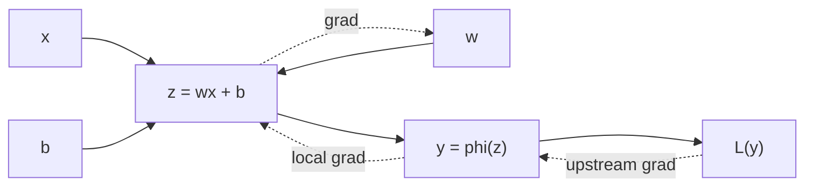

# 역전파 (Backpropagation)

- Level: Intermediate
- Prerequisites: [AI/Deep-Learning/MLP.md](MLP.md), [Math/Calculus/Chain-Rule.md](../../Math/Calculus/Chain-Rule.md)
- Status: Draft
- Reviewed-by: -
- Depth: Deep-dive (자기완결)

---

## 개념 (Concept)

역전파는 계산 그래프의 출력 손실에서 시작해 chain rule을 역방향으로 적용하며 모든 파라미터 gradient를 효율적으로 계산하는 알고리즘이다. 학습 update 자체가 아니라 gradient 계산 단계다.

## 직관 (Intuition)

최종 오차가 각 중간 계산에 얼마나 책임이 있는지 뒤에서 앞으로 나눠 전달한다. 한 중간값이 여러 경로에 쓰이면 각 경로의 영향을 합한다.



## 이론 (Theory)

$z=wx+b$, $y=\phi(z)$, 손실 $L(y)$이면

$$\frac{\partial L}{\partial w}=
\frac{\partial L}{\partial y}
\frac{\partial y}{\partial z}
\frac{\partial z}{\partial w}$$

다. forward pass에서 중간 activation을 저장하고 backward pass에서 local derivative와 upstream gradient를 곱한다. reverse-mode automatic differentiation은 출력 스칼라와 파라미터가 많은 신경망에 적합하다.

긴 곱에서 derivative가 계속 0에 가까워지거나 커지면 vanishing/exploding gradient가 생긴다. 초기화, activation, normalization, residual connection이 이를 완화한다.

### 분기된 그래프의 gradient 합

중간값 $u$가 두 경로에서 쓰이면 전체 손실은 두 경로를 모두 통해 $u$에 의존한다. 이때

$$\frac{\partial L}{\partial u}=
\sum_i \frac{\partial L}{\partial v_i}\frac{\partial v_i}{\partial u}$$

가 된다. 그래서 자동미분 엔진은 각 노드에 들어오는 upstream gradient를 누적한다. 프레임워크에서 `zero_grad()`가 필요한 이유도 이전 step의 누적값을 지우기 위해서다.

## 구현 (Implementation)

```python
def square_loss_gradient(x, w, target):
    prediction = w * x
    loss = 0.5 * (prediction - target) ** 2
    dloss_dprediction = prediction - target
    dloss_dw = dloss_dprediction * x
    return loss, dloss_dw


loss, grad = square_loss_gradient(x=3.0, w=2.0, target=5.0)
print(loss, grad)
```

워크드 예제: `x=3`, `w=2`, `target=5`이면 prediction은 6, loss는 `0.5`, `dloss/dprediction=1`, `dloss/dw=1*3=3`이다. 학습률 0.1로 gradient descent를 하면 `w`는 `2 - 0.1*3 = 1.7`로 갱신된다.

finite difference로 확인:

```python
def loss_at(w):
    pred = w * 3.0
    return 0.5 * (pred - 5.0) ** 2

eps = 1e-5
numeric = (loss_at(2.0 + eps) - loss_at(2.0 - eps)) / (2 * eps)
print(round(numeric, 4))  # 3.0
```

## 복잡도 (Complexity)

backward pass의 시간은 보통 forward pass의 작은 상수배이며, 중간값 저장 때문에 activation memory가 필요하다. gradient checkpointing은 일부 activation을 다시 계산해 메모리와 시간을 교환한다.

워크드 비용: 층이 24개이고 각 층 activation이 100MB라면 단순 저장은 activation만 약 2.4GB가 필요하다. checkpointing으로 4개 층마다만 저장하면 저장량은 줄지만, backward 때 중간 forward를 다시 계산해 시간이 늘어난다.

## 응용 (Applications)

- 모든 미분 가능한 신경망 학습
- differentiable simulation과 scientific ML
- gradient 기반 설명·입력 최적화
- meta-learning과 higher-order optimization

## 흔한 오해 (Common Misunderstandings)

- 역전파와 gradient descent는 다르다.
- numerical differentiation보다 정확하고 효율적인 chain rule 계산이다.
- `zero_grad`를 하지 않으면 프레임워크에 따라 gradient가 누적될 수 있다.
- gradient가 존재해도 수치적으로 안정적이라는 뜻은 아니다.

## TMI

- automatic differentiation은 symbolic differentiation이나 finite difference와 다르다.
- in-place operation은 backward에 필요한 중간값을 훼손할 수 있다.
- finite difference gradient check는 작은 모델의 구현 오류를 찾는 데 유용하다.

## 연습 / 확인 문제 (Exercises)

- $L=(wx+b-y)^2/2$의 $w,b$ gradient를 유도하라.
- analytical gradient와 finite difference를 비교하라.
- 분기된 계산 그래프에서 gradient가 합쳐지는 이유를 설명하라.

## 이어서 읽기 (Reading Path)

- 이전: [MLP](MLP.md), [연쇄 법칙](../../Math/Calculus/Chain-Rule.md)
- 다음: [손실 함수](Loss-Functions.md)
- 관련: [순환 신경망](RNN-LSTM-GRU.md), [오토인코더](../Generative-Models/Autoencoders.md)

## 참조 (References)

- [Math/Calculus/Chain-Rule.md](../../Math/Calculus/Chain-Rule.md)
- [Reference/Books.md](../../Reference/Books.md)
- [Reference/Courses.md](../../Reference/Courses.md)
