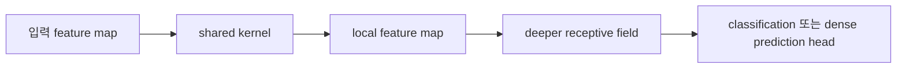

# 합성곱 신경망 (Convolutional Neural Networks)

- Level: Intermediate
- Prerequisites: [AI/Deep-Learning/Backpropagation.md](Backpropagation.md), [Math/Linear-Algebra/Matrices.md](../../Math/Linear-Algebra/Matrices.md)
- Status: Draft
- Reviewed-by: -
- Depth: Deep-dive (자기완결)

---

## 개념 (Concept)

CNN은 작은 kernel을 공간 위치마다 공유해 local pattern을 추출하는 신경망이다. locality와 weight sharing으로 이미지 같은 grid 데이터에서 MLP보다 적은 파라미터로 translation-aware feature를 학습한다.

## 직관 (Intuition)

같은 edge detector를 이미지 모든 위치에 밀어 보며 어디에 경계가 있는지 찾는다. 앞 층은 선·모서리, 뒤 층은 질감·부분·객체처럼 더 넓은 receptive field의 표현을 조합한다.

## 이론 (Theory)

2차원 cross-correlation 형태는

$$Y_{i,j,o}=\sum_{u,v,c}K_{u,v,c,o}X_{i+u,j+v,c}$$

다. kernel $K$, stride, padding, dilation이 출력 크기와 receptive field를 정한다. 입력 크기 $H$, kernel $K$, padding $P$, stride $S$이면 한 축 출력은

$$\left\lfloor\frac{H+2P-K}{S}\right\rfloor+1$$

이다. pooling이나 strided convolution은 해상도를 줄인다.



### Output shape와 receptive field

CNN 설계에서 가장 자주 나는 오류는 공간 크기와 channel 크기를 섞는 것이다. 일반적인 image tensor를 `B x C x H x W`로 두면 convolution은 주로 `C`를 섞고 `H, W` 위를 이동한다. padding을 늘리면 경계 정보를 더 보존하고, stride를 키우면 해상도를 줄이며, dilation은 kernel 원소 사이 간격을 벌려 파라미터 증가 없이 receptive field를 넓힌다.

| 설계 요소 | 주로 바꾸는 것 | 주의점 |
| --- | --- | --- |
| Kernel size | local pattern 범위 | 너무 크면 비용과 overfitting 위험 증가 |
| Stride | 출력 해상도 | 세부 위치 정보 손실 |
| Padding | 경계 처리와 shape | zero padding이 경계 artifact를 만들 수 있음 |
| Dilation | receptive field | sparse한 sampling으로 격자 artifact 가능 |

### Equivariance와 invariance

convolution은 같은 kernel을 모든 위치에 적용하므로 입력이 이동하면 feature map도 비슷하게 이동하는 translation equivariance를 갖는다. 하지만 이것이 곧 classification 결과가 완전히 불변이라는 뜻은 아니다. pooling, stride, global average pooling, data augmentation이 결합되어야 최종 예측이 위치 변화에 더 둔감해진다.

### 파라미터 절약의 본질

같은 입력 크기를 MLP로 펼치면 위치마다 다른 가중치가 필요하지만, CNN은 kernel을 공유한다. 이 가정은 "어느 위치에서든 같은 종류의 local pattern이 의미 있다"는 inductive bias다. 이미지와 spectrogram에는 강하지만, feature 순서가 임의적인 tabular 데이터에는 무리한 가정일 수 있다.

## 구현 (Implementation)

```python
def conv1d(signal, kernel):
    width = len(signal) - len(kernel) + 1
    return [sum(signal[i + j] * kernel[j] for j in range(len(kernel)))
            for i in range(width)]


print(conv1d([1, 2, 3, 4], [1, -1]))
```

실전에서는 tensor library의 검증·최적화된 convolution을 사용한다.

```python
def conv_out_size(length, kernel, padding=0, stride=1, dilation=1):
    effective_kernel = dilation * (kernel - 1) + 1
    return (length + 2 * padding - effective_kernel) // stride + 1
```

## 복잡도 (Complexity)

출력 $H_oW_o$, kernel $K_hK_w$, 입출력 channel $C_i,C_o$에 대해 직접 convolution은 `O(H_oW_oK_hK_wC_iC_o)`다. 파라미터는 `O(K_hK_wC_iC_o)`다.

depthwise separable convolution은 먼저 channel별 공간 convolution을 하고, 그다음 1x1 convolution으로 channel을 섞는다. 대략 `O(H_oW_oK_hK_wC_i + H_oW_oC_iC_o)`로 줄어 모바일 모델에서 자주 쓰인다.

## 응용 (Applications)

- 이미지 분류·검출·분할
- 음성 spectrogram과 시계열
- 의료영상·위성영상
- 다른 모델의 visual backbone

## 흔한 오해 (Common Misunderstandings)

- CNN이 완전한 translation invariance를 자동 보장하지 않는다.
- padding 방식은 경계 feature에 영향을 준다.
- channel 수와 공간 크기를 혼동하면 tensor shape 오류가 난다.
- convolution이라는 이름이지만 라이브러리는 kernel을 뒤집지 않는 cross-correlation을 자주 구현한다.

## TMI

- 1x1 convolution은 공간 이웃 대신 channel을 섞는다.
- depthwise separable convolution은 공간·channel 혼합을 분리해 계산을 줄인다.
- dilated convolution은 파라미터를 크게 늘리지 않고 receptive field를 넓힌다.

## 연습 / 확인 문제 (Exercises)

- 주어진 입력·kernel·stride의 출력 크기를 계산하라.
- edge kernel로 작은 행렬을 직접 convolution하라.
- standard와 depthwise separable convolution의 파라미터 수를 비교하라.

## 이어서 읽기 (Reading Path)

- 이전: [드롭아웃](Dropout.md)
- 다음: [어텐션](Attention.md)

## 참조 (References)

- [Math/Linear-Algebra/Matrices.md](../../Math/Linear-Algebra/Matrices.md)
- [Reference/Books.md](../../Reference/Books.md)
- [Reference/Papers.md](../../Reference/Papers.md)
