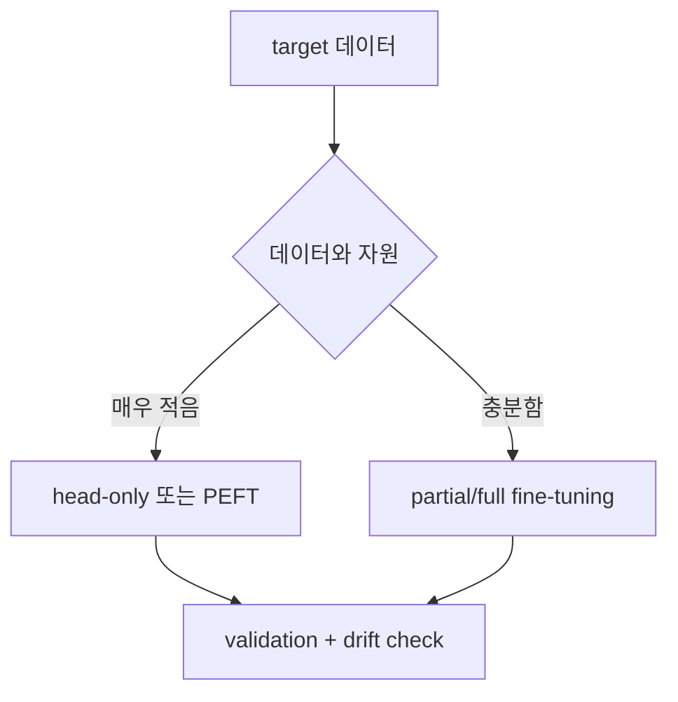

# 파인튜닝 (Fine-Tuning)

- Level: Intermediate
- Prerequisites: [AI/Deep-Learning/Transfer-Learning.md](Transfer-Learning.md), [Math/Optimization/SGD.md](../../Math/Optimization/SGD.md)
- Status: Draft
- Reviewed-by: -
- Depth: Deep-dive (자기완결)

---

## 개념 (Concept)

fine-tuning은 사전학습 모델의 가중치를 시작점으로 삼아, target 과제 데이터로 모델 파라미터를 추가로 갱신하는 것이다. 전이 학습의 핵심 실행 방식이며, 갱신 범위와 learning rate 설정이 성패를 좌우한다.

## 직관 (Intuition)

pretrained 가중치는 이미 좋은 위치에 있는 "거의 다 맞춰진" 출발점이다. 여기서 큰 learning rate로 마구 갱신하면 애써 배운 표현을 망가뜨린다(catastrophic forgetting). 그래서 작은 learning rate로 살짝, 그리고 보통 위층부터 조심스럽게 조정한다.

## 이론 (Theory)

목적 함수는 target 손실 $\mathcal{L}_{\text{target}}(\theta)$이고, 초기값을 $\theta_0$(pretrained)로 둔 최적화다. 안정적 전이를 위한 표준 기법:

- **작은 learning rate**: $\theta_0$ 근방에 머무르며 표현을 보존.
- **discriminative learning rate**: 층마다 다른 lr(아래층 작게, 위층 크게).
- **gradual unfreezing**: 위층부터 점진적으로 풀어 갱신.
- **warmup + decay** scheduler로 초기 불안정 완화.

파라미터 효율 fine-tuning(PEFT)은 원 가중치를 거의 고정하고 작은 추가 모듈만 학습한다. 예를 들어 LoRA는 가중치 갱신을 저랭크 분해 $\Delta W = BA$ ($\operatorname{rank}(BA)\ll \dim$)로 근사해 학습·저장 비용을 크게 줄인다.



### Full fine-tuning, partial fine-tuning, PEFT

| 방식 | 학습 파라미터 | 장점 | 위험 |
| --- | --- | --- | --- |
| Head-only | 새 head | 빠르고 안정적 | 표현 mismatch를 못 고침 |
| Partial fine-tuning | 상위 layer 일부 | 비용과 적응력 균형 | unfreeze 범위 선택 필요 |
| Full fine-tuning | 전체 모델 | domain shift 대응력 큼 | forgetting과 과적합 |
| LoRA/Adapter | 작은 추가 모듈 | 저장·배포 효율 | rank와 삽입 위치에 민감 |

fine-tuning은 "더 많이 풀수록 좋다"가 아니라 target 데이터가 표현을 안전하게 갱신할 만큼 충분한지의 문제다. 데이터가 적다면 작은 learning rate, early stopping, weight decay, augmentation, validation split 품질이 특히 중요하다.

### Learning rate와 forgetting 진단

pretrained backbone의 loss가 초반에 급격히 나빠지거나 validation 성능이 head-only보다 떨어지면 learning rate가 크거나 너무 많은 층을 풀었을 수 있다. layer-wise learning rate decay는 아래층을 더 작게, 위층을 더 크게 갱신해 source 표현을 보존하면서 target head에 적응하게 한다.

### 데이터 위생

LLM instruction tuning이나 domain fine-tuning에서는 중복 샘플, benchmark contamination, train/test conversation leakage가 성능을 과대평가할 수 있다. 작은 데이터셋일수록 split 기준과 deduplication 로그가 fine-tuning 결과의 신뢰도를 좌우한다.

## 구현 (Implementation)

```python
optim = AdamW([
    {"params": model.backbone.parameters(), "lr": 1e-5},  # 아래층: 작게
    {"params": model.head.parameters(),     "lr": 1e-3},  # 위층: 크게
])

for epoch in range(num_epochs):
    if epoch == 1:
        unfreeze(model.backbone.layer4)   # gradual unfreezing
    train_one_epoch(model, optim)
```

```python
def layerwise_lr(base_lr, depth, decay=0.8):
    return [base_lr * (decay ** (depth - i - 1)) for i in range(depth)]
```

## 복잡도 (Complexity)

전체 fine-tuning은 한 step당 from-scratch와 같은 forward/backward 비용이지만 수렴이 빨라 총 step이 적다. PEFT(LoRA 등)는 갱신·저장 파라미터가 전체의 1% 미만이라 메모리와 체크포인트 비용이 급감해, 한 base model에 여러 과제 어댑터를 붙이기 쉽다.

## 응용 (Applications)

- 사전학습 언어 모델을 분류·요약·QA 등 다운스트림에 적응
- LLM의 instruction tuning, domain 적응(법률·의료)
- 비전 backbone을 특정 데이터셋에 미세 조정
- 다과제 환경에서 LoRA 어댑터 스왑

## 흔한 오해 (Common Misunderstandings)

- learning rate가 크면 빨리 좋아질 것 같지만 오히려 표현을 망가뜨려 성능이 떨어진다.
- fine-tuning이 항상 feature extraction보다 낫지는 않다. 데이터가 적으면 과적합한다.
- LoRA 같은 PEFT가 전체 fine-tuning과 "항상 동등"하지는 않으나, 많은 경우 비슷하면서 훨씬 싸다.
- 데이터가 source와 매우 다르면 fine-tuning해도 이득이 작다.

## TMI

- catastrophic forgetting은 신경망이 새 과제를 배우며 이전 지식을 잃는 현상으로, continual learning의 핵심 난제다.
- LoRA는 2021년 등장 후 LLM fine-tuning의 사실상 표준 중 하나가 됐고, QLoRA는 양자화와 결합해 단일 GPU 학습을 가능케 했다.
- "fine-tuning vs prompting" 논쟁처럼, 같은 적응 목표를 가중치 갱신 없이 프롬프트로 달성하려는 흐름도 있다.

## 연습 / 확인 문제 (Exercises)

- discriminative learning rate가 catastrophic forgetting을 줄이는 이유를 설명하라.
- LoRA가 $\Delta W$를 저랭크로 두는 가정이 합리적인 경우와 깨지는 경우를 논하라.
- 같은 데이터에서 full fine-tuning과 LoRA의 체크포인트 크기 차이를 추정하라.

## 이어서 읽기 (Reading Path)

- 이전: [전이 학습](Transfer-Learning.md)
- 다음: [AI/LLMs/Instruction-Tuning.md](../LLMs/Instruction-Tuning.md), [AI/LLMs/Pretraining.md](../LLMs/Pretraining.md)

## 참조 (References)

- [AI/Deep-Learning/Transfer-Learning.md](Transfer-Learning.md)
- [AI/LLMs/Instruction-Tuning.md](../LLMs/Instruction-Tuning.md)
- [Reference/Papers.md](../../Reference/Papers.md)
- [Reference/Books.md](../../Reference/Books.md)
