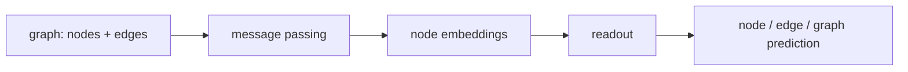

# 그래프 신경망 (Graph Neural Networks, GNN)

- Level: Advanced
- Prerequisites: [AI/Deep-Learning/MLP.md](MLP.md), [Math/Discrete/Graph-Theory.md](../../Math/Discrete/Graph-Theory.md), [Math/Linear-Algebra/Matrices.md](../../Math/Linear-Algebra/Matrices.md)
- Status: Draft
- Reviewed-by: -
- Depth: Deep-dive (자기완결)

---

## 개념 (Concept)

그래프 신경망은 노드와 간선으로 표현되는 데이터에서 학습하는 신경망이다. 각 노드는 이웃 노드의 정보를 모아 자신의 표현을 갱신하고, 이를 여러 층 반복해 그래프 구조를 반영한 embedding을 만든다.

## 직관 (Intuition)

소셜 네트워크에서 한 사람의 성향은 그 사람의 속성뿐 아니라 주변 친구들의 속성과 관계에도 영향을 받는다. GNN은 “내 이웃들이 어떤 정보를 가지고 있는가”를 반복적으로 모아 노드, 간선, 전체 그래프를 예측한다.

## 이론 (Theory)

많은 GNN은 message passing neural network 형태로 쓸 수 있다.

$$
m_v^{(k)} = \operatorname{AGG}^{(k)}(\{h_u^{(k-1)}:u\in N(v)\})
$$

$$
h_v^{(k)} = \operatorname{UPDATE}^{(k)}(h_v^{(k-1)},m_v^{(k)})
$$

AGG는 sum, mean, max, attention 등이 될 수 있다. GCN은 정규화된 adjacency matrix로 이웃 feature를 평균화하고, GAT는 attention으로 이웃별 가중치를 학습한다.

층이 깊어질수록 더 먼 이웃 정보가 들어오지만, 너무 깊으면 노드 표현이 비슷해지는 over-smoothing 문제가 생길 수 있다. 또한 message passing GNN의 표현력은 Weisfeiler-Lehman graph isomorphism test와 관련해 분석된다.



### Permutation equivariance와 invariance

그래프에는 자연스러운 노드 순서가 없다. 노드 순서를 바꿔도 node-level 출력은 같은 방식으로 순서만 바뀌어야 하고(permutation equivariance), graph-level 출력은 순서가 바뀌어도 같아야 한다(permutation invariance). 그래서 aggregation은 sum, mean, max처럼 순서에 무관한 연산이어야 한다.

### Matrix form과 self-loop

GCN 계열은 self-loop를 추가한 adjacency $\tilde A=A+I$와 degree matrix $\tilde D$를 사용해

$$H^{(k+1)}=\sigma(\tilde D^{-1/2}\tilde A\tilde D^{-1/2}H^{(k)}W^{(k)})$$

처럼 쓸 수 있다. self-loop는 노드가 자기 feature를 유지하게 해 주고, degree normalization은 degree가 큰 노드의 메시지가 지나치게 커지는 것을 막는다.

### 데이터 분할과 누출

GNN에서는 train/test split이 일반 tabular 문제보다 까다롭다. node classification에서 test node의 label은 숨겨도 graph edge를 통해 test 영역 정보가 message passing에 들어갈 수 있다. 이는 transductive 설정에서는 허용될 수 있지만 inductive 일반화를 평가하려면 graph, node, time 기준 분할을 명확히 해야 한다.

| 설정 | 학습 중 보는 것 | 평가 질문 |
| --- | --- | --- |
| Transductive | 전체 graph 구조, 일부 label | 같은 graph의 미라벨 노드를 맞히는가 |
| Inductive | train graph 또는 train node 주변 | 새 graph나 새 node에도 일반화하는가 |
| Temporal | 과거 edge와 feature | 미래 관계를 예측하는가 |

## 구현 (Implementation)

가장 단순한 mean aggregation은 이웃 feature 평균을 구해 갱신한다.

```python
def mean_aggregate(node, neighbors, features):
    vals = [features[n] for n in neighbors[node]]
    return [sum(col) / len(vals) for col in zip(*vals)]


features = {
    "A": [1.0, 0.0],
    "B": [0.0, 1.0],
    "C": [1.0, 1.0],
}
neighbors = {"A": ["B", "C"], "B": ["A"], "C": ["A"]}

print(mean_aggregate("A", neighbors, features))
```

실제 GNN은 aggregation 결과에 선형층, 비선형성, residual connection, normalization을 결합한다.

```python
def graph_mean_readout(node_embeddings):
    n = len(node_embeddings)
    return [sum(values) / n for values in zip(*node_embeddings)]
```

## 복잡도 (Complexity)

한 message passing layer의 비용은 대체로 간선 수 $|E|$와 hidden dimension에 비례한다. 큰 그래프에서는 전체 이웃을 다 보지 않고 neighbor sampling, subgraph batching, graph partitioning을 사용한다.

이웃 sampling은 계산을 줄이지만 sampling 분산을 만들고, 깊은 layer에서는 sampled neighborhood가 폭발적으로 커질 수 있다. production 추천 그래프처럼 degree가 극단적으로 큰 경우에는 feature store, offline embedding, incremental update 전략까지 함께 설계한다.

## 응용 (Applications)

- 노드 분류와 링크 예측
- 추천 시스템과 지식 그래프
- 분자 property prediction
- 프로그램, 회로, 교통망 같은 구조 데이터 분석

## 흔한 오해 (Common Misunderstandings)

- 그래프가 있으면 항상 GNN이 최선은 아니다. feature 품질과 graph construction이 중요하다.
- 간선이 많을수록 항상 좋은 정보가 되는 것은 아니다. noisy edge는 성능을 해칠 수 있다.
- 깊은 GNN이 무조건 더 먼 정보를 잘 쓰는 것은 아니다. over-smoothing과 over-squashing이 있다.
- node order에 의존하지 않는 permutation invariance/equivariance가 중요하다.

## TMI

- graph-level prediction에서는 node embedding을 readout pooling으로 합친다.
- heterophily graph에서는 이웃이 비슷하다는 homophily 가정이 약해져 일반 GNN이 어려워질 수 있다.
- over-squashing은 먼 노드의 많은 정보가 좁은 embedding으로 압축되며 손실되는 문제다.

## 연습 / 확인 문제 (Exercises)

- GCN과 GAT의 aggregation 차이를 설명하라.
- node classification과 graph classification의 readout 차이를 말하라.
- over-smoothing이 생기는 직관을 message passing 반복 관점에서 설명하라.

## 이어서 읽기 (Reading Path)

- 이전: [Transformer](Transformer.md)
- 다음: [자기 지도 학습](Self-Supervised.md)

## 참조 (References)

- [AI/Deep-Learning/MLP.md](MLP.md)
- [Math/Discrete/Graph-Theory.md](../../Math/Discrete/Graph-Theory.md)
- [Math/Linear-Algebra/Matrices.md](../../Math/Linear-Algebra/Matrices.md)
- [Reference/Books.md](../../Reference/Books.md)
