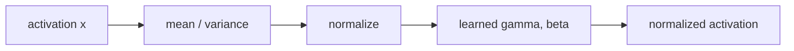

# 정규화 층 (Normalization Layers)

- Level: Intermediate
- Prerequisites: [AI/Deep-Learning/Backpropagation.md](Backpropagation.md), [Math/Probability-Statistics/Expectation.md](../../Math/Probability-Statistics/Expectation.md)
- Status: Draft
- Reviewed-by: -
- Depth: Deep-dive (자기완결)

---

## 개념 (Concept)

정규화 층은 activation의 평균과 분산을 기준으로 스케일을 조정하고 학습 가능한 scale·shift를 적용해 최적화를 안정화한다. BatchNorm은 batch 통계, LayerNorm은 각 샘플의 feature 통계를 사용한다.

## 직관 (Intuition)

층마다 값의 크기가 크게 흔들리면 다음 층이 계속 변하는 입력에 적응해야 한다. 정규화는 값의 중심과 크기를 일정 범위로 맞추되 학습 가능한 $\gamma,\beta$로 필요한 표현은 되살린다.

## 이론 (Theory)

$$\hat x=\frac{x-\mu}{\sqrt{\sigma^2+\varepsilon}},\qquad y=\gamma\hat x+\beta$$

BatchNorm은 훈련 중 mini-batch 통계를 사용하고 추론에는 running statistics를 쓴다. 작은 batch나 분포 변화에 민감할 수 있다. LayerNorm은 토큰·샘플 내부 feature 축을 정규화해 batch 크기와 독립적이며 Transformer에 적합하다. GroupNorm은 channel을 그룹으로 나눈다.



### 어떤 축을 정규화하는가

정규화 층의 차이는 수식보다 "어떤 원소끼리 평균과 분산을 공유하는가"에서 결정된다.

| 방법 | 통계 축 | 강한 사용처 | 주의점 |
| --- | --- | --- | --- |
| BatchNorm | batch와 공간 축 | CNN, 큰 batch 학습 | train/eval 차이와 작은 batch |
| LayerNorm | 샘플 내부 feature 축 | Transformer, RNN | channel별 contrast가 줄 수 있음 |
| GroupNorm | channel group과 공간 축 | detection, 작은 batch CNN | group 수 선택 필요 |
| RMSNorm | root mean square | 대규모 Transformer | 평균 중심화는 하지 않음 |

### train/eval 모드와 running statistics

BatchNorm은 훈련 중 batch 통계를 이용해 정규화하고 running mean/variance를 업데이트한다. 평가 모드에서는 이 running statistics를 사용한다. 그래서 validation이나 inference에서 train 모드가 켜져 있으면 batch 구성에 따라 예측이 흔들리고, 반대로 학습 중 eval 모드가 켜져 있으면 현재 batch 통계를 반영하지 못한다.

### Pre-norm과 post-norm

Transformer block에서 LayerNorm을 residual branch 앞에 두면 pre-norm, 뒤에 두면 post-norm이라고 부른다. pre-norm은 깊은 모델에서 gradient 흐름이 안정적인 편이고, post-norm은 원래 Transformer 구조에 가깝지만 깊이가 커질수록 학습 안정화가 더 까다로울 수 있다.

## 구현 (Implementation)

```python
import numpy as np


def layer_norm(x, gamma, beta, eps=1e-5):
    mean = x.mean(axis=-1, keepdims=True)
    var = ((x - mean) ** 2).mean(axis=-1, keepdims=True)
    return gamma * (x - mean) / np.sqrt(var + eps) + beta
```

```python
def rms_norm(x, weight, eps=1e-8):
    rms = np.sqrt((x ** 2).mean(axis=-1, keepdims=True) + eps)
    return weight * x / rms
```

## 복잡도 (Complexity)

activation 원소 수 $N$에 대해 통계·정규화는 `O(N)`이다. 분산 학습에서 BatchNorm 통계를 동기화하면 통신 비용이 추가된다.

## 응용 (Applications)

- CNN의 BatchNorm·GroupNorm
- Transformer의 LayerNorm·RMSNorm
- 깊은 네트워크의 안정적 학습
- 더 큰 학습률과 빠른 수렴 지원

## 흔한 오해 (Common Misunderstandings)

- 정규화 층과 입력 데이터 표준화는 같은 단계가 아니다.
- BatchNorm은 train/eval 모드 동작이 다르다.
- 작은 batch의 BatchNorm 통계는 noisy할 수 있다.
- normalization이 모든 initialization·learning-rate 문제를 제거하지 않는다.

## TMI

- RMSNorm은 평균을 빼지 않고 root mean square로 scale만 조절한다.
- pre-norm과 post-norm 배치는 깊은 Transformer의 gradient 흐름을 바꾼다.
- normalization의 효과는 단순한 internal covariate shift 설명보다 최적화 geometry 관점도 중요하다.

## 연습 / 확인 문제 (Exercises)

- BatchNorm과 LayerNorm이 통계를 내는 축을 비교하라.
- train 모드와 eval 모드를 바꾸지 않았을 때 생길 버그를 설명하라.
- epsilon을 넣는 수치적 이유를 설명하라.

## 이어서 읽기 (Reading Path)

- 이전: [역전파](Backpropagation.md)
- 다음: [드롭아웃](Dropout.md)

## 참조 (References)

- [Math/Probability-Statistics/Expectation.md](../../Math/Probability-Statistics/Expectation.md)
- [Reference/Books.md](../../Reference/Books.md)
- [Reference/Papers.md](../../Reference/Papers.md)
