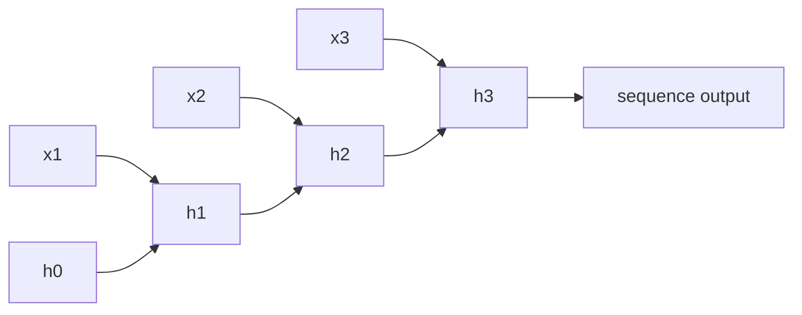

# 순환 신경망 (RNN / LSTM / GRU)

- Level: Intermediate
- Prerequisites: [AI/Deep-Learning/MLP.md](MLP.md), [AI/Deep-Learning/Backpropagation.md](Backpropagation.md)
- Status: Draft
- Reviewed-by: -
- Depth: Deep-dive (자기완결)

---

## 개념 (Concept)

RNN(recurrent neural network)은 sequence를 한 step씩 처리하면서 hidden state에 과거 정보를 누적하는 신경망이다. 같은 가중치를 모든 time step에 공유한다. LSTM과 GRU는 gate 구조로 장기 의존성과 gradient 문제를 완화한 변형이다.

## 직관 (Intuition)

문장이나 시계열처럼 순서가 의미를 갖는 데이터는 입력 길이가 가변적이고, 앞의 정보가 뒤를 해석하는 데 필요하다. RNN은 "지금까지 본 것"을 hidden state라는 요약본으로 들고 다음 입력과 함께 갱신한다. 하지만 단순 RNN은 먼 과거의 신호가 곱셈을 거치며 사라지거나 폭발한다. gate는 어떤 정보를 유지하고 버릴지를 학습으로 조절해 이 문제를 줄인다.

## 이론 (Theory)

단순 RNN의 갱신은

$$h_t = \tanh(W_{hh} h_{t-1} + W_{xh} x_t + b), \qquad y_t = W_{hy} h_t$$

학습은 시간을 펼친 계산 그래프에 역전파하는 BPTT(backpropagation through time)로 한다. $\partial h_t / \partial h_{t-k}$가 $W_{hh}$의 곱으로 누적되어 spectral radius가 1보다 작으면 vanishing, 크면 exploding gradient가 난다.

LSTM은 cell state $c_t$와 세 gate로 정보 흐름을 제어한다.

$$f_t=\sigma(W_f[h_{t-1},x_t]),\quad i_t=\sigma(W_i[\cdot]),\quad o_t=\sigma(W_o[\cdot])$$
$$c_t = f_t \odot c_{t-1} + i_t \odot \tanh(W_c[\cdot]),\qquad h_t = o_t \odot \tanh(c_t)$$

forget gate $f_t$가 1에 가까우면 cell state가 거의 그대로 흘러 gradient가 보존된다. GRU는 gate를 둘(update, reset)로 줄이고 cell state를 없애 파라미터가 적지만 비슷한 성능을 낸다.



### Gradient가 사라지고 폭발하는 이유

BPTT에서는 같은 recurrent matrix가 시간축으로 반복해서 곱해진다. 단순화하면 먼 과거의 gradient는 $W_{hh}^k$와 비슷한 항을 포함한다. 고윳값 크기가 1보다 작으면 반복 곱으로 신호가 작아지고, 1보다 크면 커진다. LSTM의 cell state는 덧셈 경로와 forget gate를 통해 이 곱셈 경로를 완화한다.

| 문제 | 증상 | 대표 처방 |
| --- | --- | --- |
| Vanishing gradient | 먼 과거 정보 반영 실패 | LSTM/GRU, residual, attention |
| Exploding gradient | loss가 갑자기 NaN 또는 발산 | gradient clipping, 작은 learning rate |
| Long sequence memory | GPU memory 증가 | truncated BPTT, checkpointing |
| 느린 학습 | time step 병렬화 어려움 | Transformer나 convolutional sequence model 고려 |

### 출력 형태 선택

sequence classification은 마지막 hidden state나 pooled hidden states를 사용한다. sequence labeling은 각 time step의 $h_t$마다 출력을 만든다. encoder-decoder 구조에서는 encoder의 마지막 state를 decoder 초기 상태로 넘기거나 attention으로 전체 encoder state를 참조한다. 과제의 label granularity가 sequence 단위인지 token 단위인지 먼저 정해야 loss shape가 명확해진다.

## 구현 (Implementation)

```python
def rnn_step(x_t, h_prev, W_xh, W_hh, b):
    return tanh(W_xh @ x_t + W_hh @ h_prev + b)

def run_rnn(xs, h0, params):
    h = h0
    outputs = []
    for x_t in xs:            # 시간 순서대로 한 step씩
        h = rnn_step(x_t, h, *params)
        outputs.append(h)
    return outputs            # 각 step의 hidden state
```

```python
def clip_global_norm(grads, max_norm, eps=1e-12):
    total = sum((g * g).sum() for g in grads) ** 0.5
    scale = min(1.0, max_norm / (total + eps))
    return [g * scale for g in grads]
```

## 복잡도 (Complexity)

길이 $n$, hidden size $d$에서 시간은 `O(n d^2)`, 메모리는 BPTT를 위해 모든 step의 activation을 들고 있어야 하므로 `O(n d)`다. 핵심 한계는 step이 순차적이라 길이 방향 병렬화가 어렵다는 점이며, 이는 Transformer가 등장한 주요 동기다.

## 응용 (Applications)

- 음성 인식, 시계열 예측, 이상 탐지
- 과거 NLP 주류(번역, 언어 모델, 태깅) — 현재는 상당 부분 Transformer로 대체
- 센서·제어 신호 같은 실시간 스트림 처리
- 작은 모델이 필요한 on-device sequence 처리

## 흔한 오해 (Common Misunderstandings)

- LSTM이 vanishing gradient를 "완전히" 없애지는 않는다. 크게 완화할 뿐이다.
- gate 값이 0/1의 이진 스위치가 아니라 `(0,1)`의 연속 값이다.
- hidden state 크기를 키운다고 장기 의존성이 자동으로 좋아지지 않는다.
- GRU가 항상 LSTM보다 나쁜 것은 아니다. 과제에 따라 비슷하거나 더 낫다.

## TMI

- LSTM은 1997년(Hochreiter & Schmidhuber)에 나왔지만, 대규모 데이터·GPU가 갖춰진 2010년대에야 주류가 됐다.
- "gradient clipping"은 exploding gradient를 막는 표준 처방으로, RNN 학습에서 거의 항상 쓰인다.
- truncated BPTT는 긴 sequence를 일정 길이로 잘라 역전파해 메모리를 줄이는 실전 기법이다.

## 연습 / 확인 문제 (Exercises)

- 단순 RNN에서 $W_{hh}$의 최대 고윳값 크기가 vanishing/exploding과 어떻게 연결되는지 설명하라.
- LSTM의 forget gate를 항상 1로 고정하면 cell state는 어떻게 동작하는가.
- GRU와 LSTM의 파라미터 수를 같은 hidden size에서 비교하라.

## 이어서 읽기 (Reading Path)

- 이전: [역전파](Backpropagation.md)
- 다음: [어텐션](Attention.md), [Transformer](Transformer.md)

## 참조 (References)

- [AI/Deep-Learning/Backpropagation.md](Backpropagation.md)
- [AI/Deep-Learning/Transformer.md](Transformer.md)
- [Reference/Papers.md](../../Reference/Papers.md)
- [Reference/Books.md](../../Reference/Books.md)
