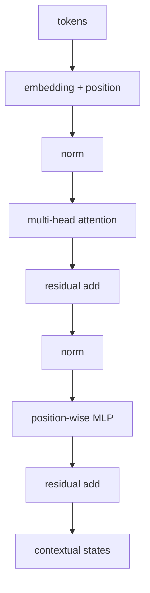

# Transformer

- Level: Intermediate
- Prerequisites: [AI/Deep-Learning/Attention.md](Attention.md), [AI/Deep-Learning/Normalization-Layers.md](Normalization-Layers.md)
- Status: Draft
- Reviewed-by: -
- Depth: Deep-dive (자기완결)

---

## 개념 (Concept)

Transformer는 attention, position information, feed-forward network, residual connection, normalization을 쌓아 sequence를 처리하는 아키텍처다. recurrence 없이 token 간 관계를 병렬 계산하며 encoder, decoder, encoder-decoder 형태로 쓰인다.

## 직관 (Intuition)

각 token이 attention으로 필요한 다른 token을 읽고, MLP로 각 위치의 표현을 가공한다. 이 과정을 여러 층 반복하면 문맥에 따라 같은 단어도 다른 표현을 갖는다.



## 이론 (Theory)

전형적 block은

$$H'=H+\operatorname{Attention}(\operatorname{Norm}(H)),\qquad
H''=H'+\operatorname{MLP}(\operatorname{Norm}(H'))$$

처럼 residual path를 둔다. attention 자체는 순서를 모르므로 positional encoding 또는 learned/relative position 표현을 더한다.

encoder는 전체 입력을 양방향으로 읽고, autoregressive decoder는 causal mask로 미래를 가린다. language model은 다음 token의 조건부 확률을 곱해 sequence 확률을 모델링한다.

### shape trace

배치 크기 `B`, 길이 `n`, hidden size `d`, head 수 `h`라면 입력은 `(B,n,d)`다. Q/K/V projection 뒤에는 보통 `(B,h,n,d/h)`가 되고, attention score는 `(B,h,n,n)`이다. 이 `n x n` score 때문에 긴 sequence에서 메모리가 빠르게 커진다.

## 구현 (Implementation)

```python
def transformer_block(x, attention_fn, mlp_fn, norm_fn):
    x = x + attention_fn(norm_fn(x))
    x = x + mlp_fn(norm_fn(x))
    return x
```

이는 구조를 보여 주는 pseudocode이며 실제 구현은 multi-head projection, mask, dropout과 shape 처리가 필요하다.

causal mask의 핵심은 미래 위치를 `-inf`로 가려 softmax 확률을 0으로 만드는 것이다.

```python
def causal_mask(n):
    return [[0 if j <= i else float("-inf") for j in range(n)] for i in range(n)]
```

길이 4에서는 0번 토큰이 0번만 보고, 3번 토큰은 0~3번을 모두 본다. 그래서 생성 중 미래 token을 몰래 보는 누수가 없다.

## 복잡도 (Complexity)

길이 $n$, hidden size $d$에서 attention은 `O(n^2d)`, MLP는 보통 `O(nd^2)`다. 학습 activation과 attention score가 큰 메모리를 사용하며, autoregressive 생성은 KV cache로 과거 재계산을 줄인다.

워크드 예제: `n=2048`에서 attention score는 head마다 약 4.2M개다. `n`을 4096으로 늘리면 score는 약 16.8M개로 4배가 된다. context 길이를 두 배로 늘릴 때 attention 메모리가 네 배가 되는 이유다.

## 응용 (Applications)

- language model, 번역, 요약, 검색
- vision·audio·multimodal model
- protein·time-series·code modeling
- representation learning과 transfer learning

## 흔한 오해 (Common Misunderstandings)

- Transformer가 attention만으로 구성된 것은 아니다. MLP·residual·normalization도 핵심이다.
- 긴 context window가 모든 위치를 똑같이 잘 활용한다는 뜻은 아니다.
- causal decoder와 bidirectional encoder의 mask·학습 목적은 다르다.
- 생성 결과의 유창함이 사실 정확성을 보장하지 않는다.

## TMI

- 원 논문의 "Attention Is All You Need"는 recurrence와 convolution 없이 sequence transduction을 수행한다는 뜻에 가깝다.
- pre-norm은 매우 깊은 모델의 gradient 흐름에 유리해 현대 모델에서 흔하다.
- mixture-of-experts는 token마다 일부 MLP expert만 활성화해 파라미터 수와 계산량을 분리한다.

## 연습 / 확인 문제 (Exercises)

- encoder와 causal decoder의 attention mask를 비교하라.
- 한 block에서 residual connection이 끊기면 gradient 흐름이 어떻게 달라질지 설명하라.
- $n$이 두 배일 때 attention score 메모리가 몇 배가 되는지 계산하라.

## 이어서 읽기 (Reading Path)

- 이전: [어텐션](Attention.md)
- 다음: [전이 학습](Transfer-Learning.md), [NLP Transformer 응용](../NLP/Transformer-NLP.md)
- 관련: [고급 Transformer](../LLMs/Transformer-Advanced.md), [효율적 Attention](../LLMs/Efficient-Attention.md)

## 참조 (References)

- [AI/Deep-Learning/Attention.md](Attention.md)
- [AI/Deep-Learning/Normalization-Layers.md](Normalization-Layers.md)
- [Reference/Papers.md](../../Reference/Papers.md)
- [Reference/Books.md](../../Reference/Books.md)
