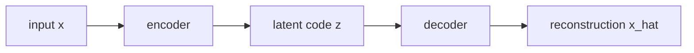

# 오토인코더 (Autoencoders: AE, DAE, Sparse AE)

- Level: Intermediate
- Prerequisites: [AI/Deep-Learning/MLP.md](../Deep-Learning/MLP.md), [AI/Deep-Learning/Backpropagation.md](../Deep-Learning/Backpropagation.md)
- Status: Draft
- Reviewed-by: -
- Depth: Deep-dive (자기완결)

---

## 개념 (Concept)

autoencoder는 입력을 저차원 표현(latent code)으로 압축하는 encoder와 그것을 다시 복원하는 decoder로 이루어진 신경망이다. 입력 자신을 목표로 학습하는 self-supervised 모델로, 표현 학습·차원 축소·이상 탐지에 쓰인다.

## 직관 (Intuition)

입력을 좁은 병목(bottleneck)을 통과시켜 그대로 복원하게 하면, 모델은 데이터의 핵심 구조만 남기고 군더더기를 버려야 한다. 즉 "잘 복원하려면 잘 요약해야 한다"는 압박이 유용한 표현을 만든다. 변형들은 이 병목 대신 잡음·희소성 같은 다른 제약으로 같은 효과를 노린다.

## 이론 (Theory)

encoder $z=f_\theta(x)$, decoder $\hat{x}=g_\phi(z)$에 대해 재구성 손실을 최소화한다.

$$\min_{\theta,\phi}\ \mathbb{E}_x\big[\lVert x - g_\phi(f_\theta(x))\rVert^2\big]$$

- **기본 AE**: 병목 차원을 줄여 압축을 강제. 선형·평균제곱이면 PCA와 밀접하다.
- **denoising AE(DAE)**: 입력에 잡음 $\tilde{x}$를 주고 깨끗한 $x$를 복원하게 해, 잡음에 강인한 표현을 얻는다.
- **sparse AE**: latent 활성에 희소성 패널티(예: KL 또는 $L_1$)를 더해, 큰 차원에서도 소수만 활성화.
- **contractive AE**: 입력 변화에 표현이 둔감하도록 Jacobian 패널티를 둔다.

오토인코더는 일반적으로 latent 공간이 매끄러운 생성 분포를 이루지 않는다. 이를 확률적으로 정식화해 샘플링 가능하게 만든 것이 VAE다.



### 병목의 의미

undercomplete AE는 latent 차원을 줄여 압축을 강제하고, sparse/denoising/contractive AE는 차원이 충분히 커도 제약을 통해 유용한 표현을 만들려 한다. 병목이 없거나 decoder가 너무 강하면 입력을 거의 복사하는 항등 함수가 되어 representation learning 효과가 약해질 수 있다.

### 이상 탐지에서의 주의점

정상 데이터만으로 학습한 AE는 정상 패턴을 잘 복원하고 비정상을 못 복원한다는 가정으로 anomaly score를 만든다. 하지만 비정상도 단순하거나 정상과 비슷하면 잘 복원될 수 있고, 정상 데이터의 rare mode를 이상으로 오탐할 수 있다. threshold는 validation anomaly 또는 운영 비용 기준으로 정해야 한다.

### Latent 공간 진단

재구성 오차만 보지 말고 latent interpolation, nearest neighbor, downstream linear probe, cluster structure를 함께 확인한다. 좋은 재구성이 곧 좋은 semantic representation을 뜻하지 않는다.

## 구현 (Implementation)

```python
def autoencoder_loss(x, encoder, decoder, noise=None):
    x_in = x + noise if noise is not None else x   # DAE면 잡음 주입
    z = encoder(x_in)
    x_hat = decoder(z)
    return mse(x_hat, x)                            # 깨끗한 x로 복원
```

```python
def anomaly_score(x, encoder, decoder):
    z = encoder(x)
    x_hat = decoder(z)
    return mse(x_hat, x)
```

## 복잡도 (Complexity)

학습·추론 비용은 encoder/decoder 구조에 따르며 일반 신경망과 같다. latent 차원이 표현 압축률과 복원 품질의 트레이드오프를 정한다. 너무 크면 항등 함수에 가까워져 의미 있는 표현을 얻지 못하고, 너무 작으면 복원이 나빠진다.

## 응용 (Applications)

- 차원 축소·시각화(비선형 PCA 대체)
- 이상 탐지(재구성 오차가 큰 샘플을 이상으로)
- 디노이징·압축
- 사전학습 표현, VAE·diffusion 등 생성 모델의 토대

## 흔한 오해 (Common Misunderstandings)

- 기본 AE는 생성 모델이 아니다. latent를 무작위 샘플링해도 그럴듯한 출력이 나오지 않는다.
- 병목만 좁히면 좋은 표현이 나오는 것은 아니다. 과제·정규화 설계가 중요하다.
- 재구성이 완벽하다고 표현이 유용하다는 뜻은 아니다(항등 함수 위험).
- AE와 VAE는 목적이 다르다. VAE는 확률적 잠재 분포를 학습한다.

## TMI

- denoising autoencoder의 "손상 후 복원" 아이디어는 이후 masked modeling, diffusion의 사상적 선조 격이다.
- 선형 AE의 최적해가 PCA 부분공간과 일치한다는 사실은 표현 학습의 고전적 연결고리다.
- 이상 탐지에서 AE는 정상 데이터만으로 학습해 재구성 오차로 비정상을 가려내는 비지도 기법으로 흔히 쓰인다.

## 연습 / 확인 문제 (Exercises)

- 선형 활성·MSE 오토인코더가 PCA와 어떻게 연결되는지 설명하라.
- denoising AE가 잡음에 강인한 표현을 학습하는 이유를 직관적으로 논하라.
- latent 차원을 입력 차원과 같게 두면 어떤 문제가 생기는지 설명하라.

## 이어서 읽기 (Reading Path)

- 이전: [AI/Deep-Learning/Backpropagation.md](../Deep-Learning/Backpropagation.md)
- 다음: [변분 오토인코더 (VAE)](VAE.md), [β-VAE](Beta-VAE.md)

## 참조 (References)

- [AI/Generative-Models/VAE.md](VAE.md)
- [Math/Linear-Algebra/PCA.md](../../Math/Linear-Algebra/PCA.md)
- [Reference/Papers.md](../../Reference/Papers.md)
