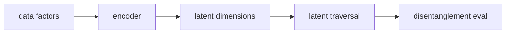

# β-VAE와 분리 표현 학습 (Beta-VAE and Disentanglement)

- Level: Advanced
- Prerequisites: [AI/Generative-Models/VAE.md](VAE.md), [Math/Probability-Statistics/Information-Theory.md](../../Math/Probability-Statistics/Information-Theory.md)
- Status: Draft
- Reviewed-by: -
- Depth: Deep-dive (자기완결)

---

## 개념 (Concept)

β-VAE는 VAE의 KL 항에 가중치 β를 곱해 latent representation의 압축과 독립성을 더 강하게 유도하는 모델이다. 목표는 생성뿐 아니라 factor가 분리된 해석 가능한 latent space를 얻는 것이다.

## 직관 (Intuition)

일반 VAE가 입력을 잘 재구성하면서 잠재공간을 정리한다면, β-VAE는 잠재공간을 더 빡빡하게 정리한다. 그 결과 어떤 차원은 색, 다른 차원은 회전, 또 다른 차원은 크기처럼 factor를 나눠 담기를 기대한다.

## 이론 (Theory)

목적 함수는 보통 다음처럼 쓴다.

$$E_{q(z|x)}[\log p(x|z)]-\beta D_{KL}(q(z|x)\|p(z))$$

β가 1보다 크면 reconstruction보다 prior matching과 정보 병목이 강해진다. 이 압력은 disentanglement를 도울 수 있지만 재구성 품질을 낮출 수 있다. Factor가 정말 분리되는지는 data generating factor, inductive bias, metric에 크게 의존한다.



### Capacity 관점

β를 키우면 latent가 담을 수 있는 정보량을 제한하는 효과가 있다. capacity를 너무 낮게 잡으면 재구성이 무너지고, 너무 높으면 factor가 섞일 수 있다. 그래서 β를 고정하기보다 목표 KL capacity를 점진적으로 늘리는 전략을 쓰기도 한다.

### Disentanglement 평가의 한계

MIG, SAP, DCI 같은 metric은 ground-truth factor가 있는 synthetic data에서 유용하지만 실제 데이터에는 factor 정의 자체가 불명확하다. 사람에게 해석 가능한 traversal이 나와도 downstream 제어 가능성과 항상 일치하지 않는다.

### 식별 불가능성

비지도 disentanglement는 추가 inductive bias나 supervision 없이 일반적으로 보장되지 않는다. 데이터의 factor가 독립적이라는 가정이 깨지면 latent 차원을 "하나의 의미"로 분리하기 어렵다.

## 구현 (Implementation)

```python
def beta_vae_loss(reconstruction_loss, kl_divergence, beta):
    return reconstruction_loss + beta * kl_divergence
```

β schedule을 점진적으로 올리면 초반 학습 붕괴를 줄일 수 있다.

```python
def linear_anneal(step, start, end, total_steps):
    ratio = min(step / total_steps, 1.0)
    return start + ratio * (end - start)
```

## 복잡도 (Complexity)

기본 계산 비용은 VAE와 거의 같다. 추가 비용은 β sweep, disentanglement metric, latent traversal 평가에서 생긴다.

## 응용 (Applications)

- 해석 가능한 latent representation
- controllable generation
- factorized simulation data 분석
- representation learning 연구

## 흔한 오해 (Common Misunderstandings)

- β를 키우면 항상 더 잘 분리되는 것은 아니다.
- Disentanglement metric 하나가 해석 가능성을 완전히 보장하지 않는다.
- 실제 데이터의 factor가 독립적이지 않으면 분리 표현이 모호해진다.
- 재구성 품질과 분리성은 자주 tradeoff를 이룬다.

## TMI

- Latent traversal은 한 차원씩 움직이며 생성 결과 변화를 보는 기본 진단이다.
- Annealing과 capacity control은 posterior collapse를 줄이는 데 도움을 준다.
- Supervision 없이 factor를 완벽히 식별하는 것은 일반적으로 어렵다.

## 연습 / 확인 문제 (Exercises)

- β가 커질 때 reconstruction과 KL 항이 어떻게 변하는지 설명하라.
- Latent traversal 실험 계획을 작성하라.
- 분리 표현이 필요한 응용과 필요 없는 응용을 구분하라.

## 이어서 읽기 (Reading Path)

- 이전: [VAE](VAE.md)
- 다음: [GAN 기초](GAN-Basics.md), [Normalizing Flows](Normalizing-Flows.md)

## 참조 (References)

- [AI/Generative-Models/VAE.md](VAE.md)
- [Reference/Papers.md](../../Reference/Papers.md)
