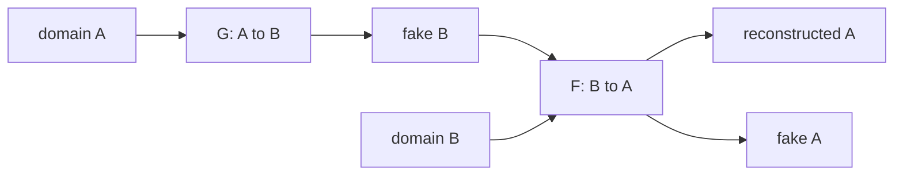

# CycleGAN

- Level: Advanced
- Prerequisites: [AI/Generative-Models/Conditional-GAN.md](Conditional-GAN.md), [AI/Computer-Vision/Image-Generation.md](../Computer-Vision/Image-Generation.md)
- Status: Draft
- Reviewed-by: -
- Depth: Deep-dive (자기완결)

---

## 개념 (Concept)

CycleGAN은 paired data 없이 두 domain 사이의 image translation을 학습하는 GAN이다. 예를 들어 말↔얼룩말, 여름↔겨울처럼 domain A와 B의 샘플만 있고 일대일 정답 pair가 없을 때 사용한다.

## 직관 (Intuition)

"말 사진을 얼룩말처럼 바꿔라"는 정답 이미지를 매번 준비하기 어렵다. CycleGAN은 A→B로 바꾼 뒤 다시 B→A로 되돌렸을 때 원본이 보존되어야 한다는 순환 일관성을 사용한다.

## 이론 (Theory)

두 generator $G:A\to B$, $F:B\to A$와 두 discriminator를 둔다. Adversarial loss는 각 domain의 스타일을 맞추고, cycle consistency loss는 $F(G(x))\approx x$, $G(F(y))\approx y$를 강제한다.

Identity loss를 추가하면 색상이나 구조 보존을 도울 수 있다. 그러나 cycle consistency만으로 의미 보존이 완전히 보장되지는 않는다.



### Cycle consistency의 한계

cycle loss는 원본으로 되돌릴 수 있음을 강제하지만, 변환 중 사람이 중요하게 보는 의미가 보존된다는 보장은 아니다. 모델이 눈에 보이지 않는 고주파 신호에 정보를 숨겨 되돌리는 steganography식 실패도 가능하다.

### Domain coverage

두 domain의 데이터 다양성이 다르면 translation이 한쪽 mode로 치우칠 수 있다. 여름↔겨울처럼 구조가 비슷한 domain은 잘 맞지만, 고양이↔자동차처럼 구조가 크게 다른 domain은 왜곡이 심해질 수 있다.

### 안전한 사용처

의료영상, 결함검사, 원격탐사처럼 생성된 이미지가 downstream 판단에 쓰이는 경우에는 hallucination과 label 보존을 강하게 검증해야 한다. style transfer처럼 시각 효과가 목적일 때와 data augmentation이 목적일 때의 기준은 다르다.

## 구현 (Implementation)

```python
loss_cycle = distance(F(G(x_a)), x_a) + distance(G(F(x_b)), x_b)
loss_total = loss_gan_a + loss_gan_b + lambda_cycle * loss_cycle
```

Translation 품질은 domain coverage와 구조 차이에 크게 좌우된다.

```python
def cycle_loss(x, reconstructed, distance):
    return distance(reconstructed, x)
```

## 복잡도 (Complexity)

두 generator와 두 discriminator를 학습하므로 일반 GAN보다 계산과 튜닝 비용이 크다. 고해상도 이미지는 memory와 안정성 문제가 더 커진다.

## 응용 (Applications)

- style transfer와 domain translation
- synthetic-to-real 변환
- 계절·날씨 변환
- 의료·위성 영상 domain adaptation 연구

## 흔한 오해 (Common Misunderstandings)

- Unpaired translation이 의미를 항상 보존한다는 뜻은 아니다.
- Cycle loss가 있으면 숨겨진 정보 steganography가 생길 수도 있다.
- Domain 간 구조가 너무 다르면 translation이 왜곡된다.
- 그럴듯한 변환 이미지가 downstream label을 보존한다는 보장은 없다.

## TMI

- PatchGAN discriminator는 local texture realism을 평가하는 데 자주 쓰인다.
- Paired data가 있으면 pix2pix 같은 supervised translation이 더 직접적이다.
- 의료 영상 변환에서는 hallucination 위험 때문에 매우 조심해야 한다.

## 연습 / 확인 문제 (Exercises)

- Paired와 unpaired image translation의 데이터 요구를 비교하라.
- Cycle consistency가 막지 못하는 실패 사례를 설명하라.
- Synthetic-to-real 변환의 label 보존 검증 절차를 설계하라.

## 이어서 읽기 (Reading Path)

- 이전: [Conditional GAN](Conditional-GAN.md)
- 다음: [Normalizing Flows](Normalizing-Flows.md)

## 참조 (References)

- [AI/Generative-Models/GAN-Basics.md](GAN-Basics.md)
- [Reference/Papers.md](../../Reference/Papers.md)
