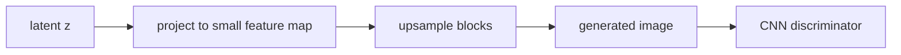

# DCGAN

- Level: Advanced
- Prerequisites: [AI/Generative-Models/GAN-Basics.md](GAN-Basics.md), [AI/Deep-Learning/CNN.md](../Deep-Learning/CNN.md)
- Status: Draft
- Reviewed-by: -
- Depth: Deep-dive (자기완결)

---

## 개념 (Concept)

DCGAN은 convolutional architecture를 사용해 이미지를 생성하는 GAN 계열의 기본 구조다. Generator는 latent vector를 feature map으로 키우고, discriminator는 이미지를 convolution으로 판별한다.

## 직관 (Intuition)

Generator는 작은 씨앗 벡터를 점점 큰 이미지로 펼치고, discriminator는 이미지를 점점 압축하며 진짜/가짜 단서를 찾는다. CNN의 공간 구조가 이미지 생성에 맞는 inductive bias를 제공한다.

## 이론 (Theory)

DCGAN류 설계는 strided convolution, transposed convolution, normalization, 적절한 activation을 사용해 안정적인 이미지 GAN 학습을 만든다. Generator는 공간 해상도를 키우며 channel을 줄이고, discriminator는 해상도를 줄이며 channel을 늘린다.

Checkerboard artifact는 upsampling 방식과 kernel/stride 조합에서 생길 수 있다. Batch normalization은 안정화에 도움을 주지만 discriminator 마지막 층이나 generator 출력층에는 조심스럽게 사용한다.



### Generator/Discriminator 균형

generator와 discriminator의 capacity가 크게 불균형하면 학습이 흔들린다. discriminator가 너무 빨리 real/fake를 완벽히 구분하면 generator가 유용한 gradient를 받기 어렵고, 반대로 discriminator가 약하면 품질 신호가 부정확하다.

### Upsampling artifact

transposed convolution의 kernel/stride 조합이 출력 픽셀에 불균일하게 기여하면 checkerboard artifact가 생길 수 있다. nearest/bilinear upsampling 뒤 convolution을 적용하거나 kernel/stride를 신중히 맞추면 완화된다.

### 이미지 정규화

DCGAN 구현은 이미지 값을 `[-1, 1]`로 정규화하고 generator 출력에 `tanh`를 쓰는 경우가 많다. 데이터 전처리와 출력 activation 범위가 맞지 않으면 discriminator가 쉬운 단서를 학습한다.

## 구현 (Implementation)

```python
generator_shape = [
    "z -> 4x4x512",
    "8x8x256",
    "16x16x128",
    "32x32x3",
]
```

실제 모델은 latent sampling, generator/discriminator update ratio, image normalization을 함께 고정한다.

```python
def normalize_to_tanh_range(pixel):
    return pixel / 127.5 - 1.0
```

## 복잡도 (Complexity)

비용은 생성·판별 CNN의 해상도, channel 수, layer 수에 비례한다. 고해상도 생성은 memory와 안정성 문제가 빠르게 커진다.

## 응용 (Applications)

- 작은 해상도 이미지 생성 baseline
- GAN architecture 학습
- latent interpolation 실험
- representation probing

## 흔한 오해 (Common Misunderstandings)

- Transposed convolution이 항상 좋은 upsampling은 아니다.
- GAN loss가 낮다고 이미지 품질이 좋아졌다고 단정할 수 없다.
- Batch size와 normalization 선택은 생성 품질에 큰 영향을 준다.
- DCGAN은 현대 고해상도 생성의 끝이 아니라 출발점에 가깝다.

## TMI

- Latent interpolation이 부드럽다면 generator가 어느 정도 연속적인 공간을 배웠다는 신호다.
- Nearest-neighbor upsampling 뒤 convolution을 쓰면 checkerboard artifact를 줄일 수 있다.
- DCGAN discriminator feature는 unsupervised representation으로도 실험되었다.

## 연습 / 확인 문제 (Exercises)

- Generator와 discriminator의 해상도 변화 방향을 비교하라.
- Checkerboard artifact의 원인을 설명하라.
- Latent interpolation 실험을 설계하라.

## 이어서 읽기 (Reading Path)

- 이전: [GAN 기초](GAN-Basics.md)
- 다음: [Conditional GAN](Conditional-GAN.md), [StyleGAN](StyleGAN.md)

## 참조 (References)

- [AI/Deep-Learning/CNN.md](../Deep-Learning/CNN.md)
- [Reference/Papers.md](../../Reference/Papers.md)
