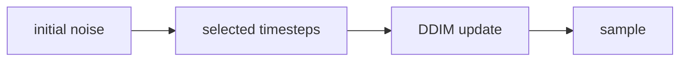

# DDIM

- Level: Advanced
- Prerequisites: [AI/Generative-Models/DDPM.md](DDPM.md), [Math/Probability-Statistics/Distributions.md](../../Math/Probability-Statistics/Distributions.md)
- Status: Draft
- Reviewed-by: -
- Depth: Deep-dive (자기완결)

---

## 개념 (Concept)

DDIM은 DDPM의 학습된 denoising model을 사용하면서 더 적은 step과 deterministic sampling을 가능하게 하는 diffusion sampler 계열이다.

## 직관 (Intuition)

DDPM이 아주 촘촘한 계단을 하나씩 내려오며 이미지를 만든다면, DDIM은 같은 방향 정보를 이용해 더 큰 보폭으로 내려온다. 그래서 샘플링 속도를 크게 줄일 수 있다.

## 이론 (Theory)

DDIM은 같은 training objective를 유지하면서 reverse process를 non-Markovian하게 재해석한다. Noise를 얼마나 다시 주입할지 조절하는 parameter로 deterministic 또는 stochastic sampling을 선택할 수 있다.

Step 수를 줄이면 속도는 빨라지지만 품질과 다양성에 영향이 생길 수 있다. Classifier-free guidance와 schedule 선택도 결과에 큰 영향을 준다.



### Deterministic 경로

`eta=0`인 DDIM은 같은 initial noise와 condition에서 같은 샘플을 만들기 쉬워 inversion, interpolation, editing에 유용하다. 하지만 stochasticity가 줄면 다양성이 줄 수 있으므로 생성 목적에 따라 eta와 step 수를 조정한다.

### Sampler 비교 방법

sampler를 비교할 때는 model checkpoint, resolution, prompt/condition, guidance scale, seed, step schedule을 고정해야 한다. 그렇지 않으면 sampler 효과와 다른 설정 효과가 섞인다.

### 빠른 샘플링의 실패

step을 너무 줄이면 구조가 깨지거나 texture artifact가 늘 수 있다. 빠른 sampler는 latency 요구가 강한 서비스에 유리하지만, 고품질 오프라인 생성에는 더 많은 step이 여전히 유리할 수 있다.

## 구현 (Implementation)

```python
sampler = {
    "training_steps": 1000,
    "sampling_steps": 50,
    "eta": 0.0,  # 0이면 deterministic DDIM sampling
}
```

실제 sampler는 timestep subset, prediction parameterization, guidance scale을 함께 설정한다.

```python
def speedup(training_steps, sampling_steps):
    return training_steps / sampling_steps
```

## 복잡도 (Complexity)

Sampling 비용은 network forward 횟수에 거의 비례한다. DDIM은 1000 step DDPM sampling을 수십 step으로 줄일 수 있지만, 너무 적은 step은 artifact를 만들 수 있다.

## 응용 (Applications)

- 빠른 diffusion image generation
- latent interpolation
- image editing trajectory 제어
- deterministic reconstruction 실험

## 흔한 오해 (Common Misunderstandings)

- DDIM은 새로운 training model이라기보다 sampler 관점에 가깝다.
- Step 수를 줄여도 항상 같은 품질이 유지되지는 않는다.
- Deterministic sampling이 diversity를 자동으로 보장하지 않는다.
- Scheduler 비교는 model, guidance, resolution을 고정해야 의미가 있다.

## TMI

- 같은 initial noise와 deterministic sampler를 쓰면 재현 가능한 샘플을 얻기 쉽다.
- Fast sampler 계열은 diffusion 실용화에서 매우 중요한 연구 축이다.
- Sampler 선택은 "모델 성능"처럼 보이는 결과를 크게 바꿀 수 있다.

## 연습 / 확인 문제 (Exercises)

- DDPM과 DDIM sampling의 step 수 차이를 설명하라.
- Deterministic sampling의 장단점을 정리하라.
- Guidance scale과 sampling step을 함께 sweep하는 실험을 설계하라.

## 이어서 읽기 (Reading Path)

- 이전: [DDPM](DDPM.md)
- 다음: [Score-based 생성 모델](Score-Based.md), [Latent Diffusion](Latent-Diffusion.md)

## 참조 (References)

- [AI/Generative-Models/DDPM.md](DDPM.md)
- [Reference/Papers.md](../../Reference/Papers.md)
