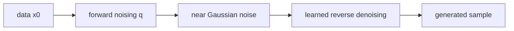

# DDPM (Denoising Diffusion Probabilistic Models)

- Level: Advanced
- Prerequisites: [Math/Probability-Statistics/Distributions.md](../../Math/Probability-Statistics/Distributions.md), [AI/Deep-Learning/Loss-Functions.md](../Deep-Learning/Loss-Functions.md)
- Status: Draft
- Reviewed-by: -
- Depth: Deep-dive (자기완결)

---

## 개념 (Concept)

DDPM은 데이터에 여러 단계 Gaussian noise를 더하는 forward process와 noise를 제거하는 reverse process를 학습하는 생성 모델이다. 생성은 noise에서 시작해 반복적으로 denoise한다.

## 직관 (Intuition)

사진을 조금씩 흐려 완전한 잡음으로 만드는 과정은 쉽다. 모델은 각 단계에서 어떤 noise가 더해졌는지 맞히는 연습을 하고, 생성 때 그 방향을 거꾸로 따라간다.

## 이론 (Theory)

forward process는

$$q(x_t\mid x_{t-1})=N(\sqrt{1-\beta_t}x_{t-1},\beta_tI)$$

이고 누적계수 $\bar\alpha_t$로

$$x_t=\sqrt{\bar\alpha_t}x_0+\sqrt{1-\bar\alpha_t}\epsilon$$

를 한 번에 sampling할 수 있다. Network $\epsilon_\theta(x_t,t)$는 noise를 예측하며 단순화된 MSE objective를 자주 사용한다. Sampling은 timestep을 역순으로 반복해 비싸다.



### Parameterization 선택

모델은 noise $\epsilon$, clean sample $x_0$, velocity $v$ 중 무엇을 예측하도록 학습할 수 있다. parameterization은 training stability, guidance behavior, sampler와 맞물린다. 같은 diffusion이라도 prediction target이 다르면 loss scale과 샘플 품질이 달라질 수 있다.

### Noise schedule

β schedule은 각 timestep의 신호대잡음비를 결정한다. 너무 빠르게 noise를 넣으면 중간 단계 학습이 어렵고, 너무 느리면 step 수가 많아진다. cosine schedule 등은 timestep별 학습 난이도를 더 고르게 만들려는 시도다.

### Guidance tradeoff

classifier-free guidance는 조건을 더 따르게 하지만 scale이 너무 크면 saturation, 반복 패턴, 다양성 감소가 생긴다. guidance scale은 품질·다양성·조건 준수의 knob로 보고 task별로 sweep한다.

## 구현 (Implementation)

```python
import numpy as np


def add_noise(x0, alpha_bar, rng):
    noise = rng.normal(size=x0.shape)
    xt = np.sqrt(alpha_bar) * x0 + np.sqrt(1 - alpha_bar) * noise
    return xt, noise
```

```python
def guided_prediction(uncond, cond, scale):
    return uncond + scale * (cond - uncond)
```

## 복잡도 (Complexity)

훈련 표본 하나는 임의 timestep 하나에서 network를 평가할 수 있지만, 기본 sampling은 timestep 수 $T$번 network forward가 필요하다. Latent diffusion은 저차원 latent에서 계산해 비용을 줄인다.

## 응용 (Applications)

- image·audio·video generation
- inpainting·super-resolution
- conditional generation
- inverse problem과 data synthesis 연구

## 흔한 오해 (Common Misunderstandings)

- forward noise를 실제로 $T$번 순차 계산해야 학습 가능한 것은 아니다.
- diffusion output의 품질이 training data 권리·bias 문제를 제거하지 않는다.
- guidance를 강하게 하면 prompt 일치는 늘어도 다양성·artifact가 악화될 수 있다.
- noise prediction, score prediction, velocity prediction은 서로 관련되지만 parameterization이 다르다.

## TMI

- classifier-free guidance는 conditional·unconditional 예측을 결합한다.
- DDIM 등 sampler는 더 적은 step으로 생성 속도를 높인다.
- score-based model은 noisy distribution의 log-density gradient를 학습하는 관점을 제공한다.

## 연습 / 확인 문제 (Exercises)

- $\bar\alpha_t$가 작아질 때 $x_t$가 어떻게 변하는지 설명하라.
- training step과 sampling step 수가 다른 이유를 설명하라.
- guidance scale과 diversity의 tradeoff를 정리하라.

## 이어서 읽기 (Reading Path)

- 이전: [VAE](VAE.md), [GAN 기초](GAN-Basics.md)
- 다음: [DDIM](DDIM.md), [Score-based 모델](Score-Based.md), [Latent Diffusion](Latent-Diffusion.md)

## 참조 (References)

- [Math/Probability-Statistics/Distributions.md](../../Math/Probability-Statistics/Distributions.md)
- [Reference/Papers.md](../../Reference/Papers.md)
- [Reference/Books.md](../../Reference/Books.md)
