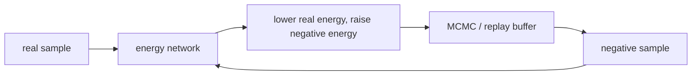

# 에너지 기반 모델 (Energy-Based Models)

- Level: Advanced
- Prerequisites: [Math/Probability-Statistics/Distributions.md](../../Math/Probability-Statistics/Distributions.md), [Math/Optimization/SGD.md](../../Math/Optimization/SGD.md)
- Status: Draft
- Reviewed-by: -
- Depth: Deep-dive (자기완결)

---

## 개념 (Concept)

에너지 기반 모델(EBM)은 데이터 $x$에 energy $E_\theta(x)$를 부여하고, 낮은 energy가 더 그럴듯한 샘플이 되도록 학습하는 모델이다. 확률은 보통 $p_\theta(x)\propto \exp(-E_\theta(x))$ 형태로 정의된다.

## 직관 (Intuition)

모델이 직접 이미지를 그리는 대신 "좋은 샘플은 낮은 점수, 이상한 샘플은 높은 점수"라는 지형을 만든다. 샘플링은 그 지형에서 낮은 골짜기를 찾아 내려가는 과정이다.

## 이론 (Theory)

정규화 상수 partition function은 대부분 계산하기 어렵다. 그래서 maximum likelihood gradient에는 데이터 샘플의 energy를 낮추고 모델 샘플의 energy를 높이는 contrastive 구조가 나타난다. Negative sample은 MCMC, Langevin dynamics, replay buffer 등으로 얻는다.

EBM은 명시적 generator 없이 flexible한 scoring function을 쓸 수 있지만, sampling과 학습 안정성이 어렵다.



### Partition function 문제

확률 $p_\theta(x)=\exp(-E_\theta(x))/Z_\theta$에서 $Z_\theta$는 모든 가능한 $x$에 대해 적분해야 하므로 고차원에서는 계산이 어렵다. 학습 gradient는 이 정규화 상수 때문에 모델 분포에서 뽑은 negative sample을 필요로 한다.

### Negative sampling 품질

negative sample이 너무 쉬우면 모델은 데이터 주변의 미묘한 에너지 지형을 배우지 못한다. 너무 오래 sampling하면 비용이 커진다. replay buffer는 이전 negative sample을 저장해 더 어려운 negative에서 시작하게 해 주지만 stale sample 문제가 있다.

### EBM과 anomaly detection

energy가 낮으면 모델이 그럴듯하다고 보는 샘플이다. anomaly detection에서는 energy나 reconstruction/score를 threshold로 쓸 수 있지만, density model이 low-level 통계에 민감할 수 있어 validation anomaly와 segment별 calibration이 필요하다.

## 구현 (Implementation)

```python
def ebm_loss(energy_real, energy_negative):
    return energy_real.mean() - energy_negative.mean()
```

실제 학습은 regularization, negative sampling, step size, replay buffer가 성능을 크게 좌우한다.

```python
def energy_score(energy):
    return -energy
```

## 복잡도 (Complexity)

Training step마다 negative sample을 만들기 위한 iterative sampling이 필요할 수 있다. 샘플링 step 수가 늘수록 품질은 좋아질 수 있지만 비용도 커진다.

## 응용 (Applications)

- density modeling
- anomaly detection
- structured prediction
- generative modeling 연구

## 흔한 오해 (Common Misunderstandings)

- Energy는 정규화된 확률이 아니라 상대적 점수다.
- 낮은 training loss가 좋은 sampling을 보장하지 않는다.
- Negative sample 품질이 낮으면 학습 신호가 약해진다.
- EBM은 GAN discriminator와 비슷해 보이지만 확률 모델 관점이 다르다.

## TMI

- Boltzmann machine과 Hopfield network도 에너지 관점으로 볼 수 있다.
- Score-based model과 EBM은 energy gradient 관점에서 연결해 생각할 수 있다.
- Replay buffer는 이전 negative sample을 재사용해 sampling 비용을 줄인다.

## 연습 / 확인 문제 (Exercises)

- Partition function이 어려운 이유를 설명하라.
- Contrastive learning과 EBM negative sampling의 유사점을 정리하라.
- EBM을 anomaly detection에 사용할 때의 기준을 설계하라.

## 이어서 읽기 (Reading Path)

- 이전: [Normalizing Flows](Normalizing-Flows.md), [Score-based 생성 모델](Score-Based.md)
- 다음: [AI Safety](../AI-Safety/Alignment-Overview.md)

## 참조 (References)

- [Math/Probability-Statistics/Distributions.md](../../Math/Probability-Statistics/Distributions.md)
- [Reference/Papers.md](../../Reference/Papers.md)
