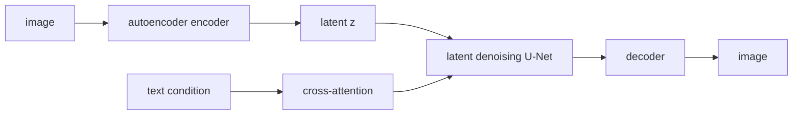

# Latent Diffusion

- Level: Advanced
- Prerequisites: [AI/Generative-Models/DDPM.md](DDPM.md), [AI/Generative-Models/Autoencoders.md](Autoencoders.md), [AI/Computer-Vision/Image-Generation.md](../Computer-Vision/Image-Generation.md)
- Status: Draft
- Reviewed-by: -
- Depth: Deep-dive (자기완결)

---

## 개념 (Concept)

Latent Diffusion은 pixel space 대신 autoencoder가 만든 압축 latent space에서 diffusion을 수행하는 생성 모델이다. 고해상도 이미지 생성의 계산 비용을 줄이면서 조건부 생성을 결합하기 쉽다.

## 직관 (Intuition)

큰 캔버스의 모든 픽셀을 직접 지우고 그리는 대신, 이미지를 압축한 설계도 위에서 denoising을 하고 마지막에 decoder로 그림을 펼친다. 계산할 공간이 작아져 훨씬 효율적이다.

## 이론 (Theory)

먼저 encoder $E$와 decoder $D$가 이미지를 latent $z=E(x)$로 압축·복원하도록 학습된다. Diffusion model은 $z$ 공간에서 noise prediction을 학습하고, 생성된 latent를 decoder로 이미지화한다.

Text conditioning은 text encoder embedding을 cross-attention으로 denoising network에 주입하는 방식이 흔하다. Latent compression이 너무 강하면 세부 정보가 사라지고, 너무 약하면 비용 이점이 줄어든다.



### Autoencoder 병목

latent diffusion의 품질은 diffusion model뿐 아니라 autoencoder의 reconstruction 품질에 묶인다. decoder가 texture를 흐리게 만들거나 색을 바꾸면 diffusion이 잘 작동해도 최종 이미지에 artifact가 남는다. 따라서 autoencoder reconstruction metric과 생성 metric을 분리해 본다.

### Conditioning과 guidance

text encoder, tokenizer, cross-attention layer는 prompt alignment를 결정한다. classifier-free guidance는 조건 준수를 높이지만 과도하면 oversaturation과 diversity 감소를 만든다. negative prompt는 unconditional 방향을 조정하는 사용자 인터페이스로 볼 수 있지만 만능 제어 장치는 아니다.

### Editing pipeline

image-to-image와 inpainting은 원본 이미지를 latent로 encode한 뒤 noise 강도와 mask를 조정한다. noise strength가 낮으면 원본 보존이 강하고, 높으면 변경 자유도가 커진다. mask 경계에서는 decoder artifact와 denoising artifact를 구분해야 한다.

## 구현 (Implementation)

```python
latent = encoder(image)
noisy_latent, noise = add_noise(latent, alpha_bar, rng)
predicted_noise = denoiser(noisy_latent, text_condition)
image_sample = decoder(denoised_latent)
```

실제 pipeline은 tokenizer, text encoder, denoiser, scheduler, decoder, safety filter 같은 구성요소를 분리해 관리한다.

```python
def latent_shape(height, width, downsample=8, channels=4):
    return (channels, height // downsample, width // downsample)
```

## 복잡도 (Complexity)

Latent 해상도가 pixel 해상도보다 작아 denoising 비용이 크게 줄어든다. 다만 encoder/decoder 비용과 text conditioning 비용이 추가된다.

## 응용 (Applications)

- text-to-image generation
- image-to-image translation
- inpainting·outpainting
- controlled generation

## 흔한 오해 (Common Misunderstandings)

- Latent에서 계산한다고 저작권·개인정보·bias 문제가 사라지지 않는다.
- Prompt를 잘 따른다는 것이 공간 관계를 완벽히 이해한다는 뜻은 아니다.
- Decoder artifact와 denoising artifact는 구분해서 진단해야 한다.
- Guidance scale을 높이면 항상 더 좋은 이미지를 만드는 것은 아니다.

## TMI

- Negative prompt는 guidance 방향을 조절하는 실무적 인터페이스로 볼 수 있다.
- Control signal을 추가하면 edge, depth, pose 같은 조건으로 생성을 제어할 수 있다.
- Latent tiling은 매우 큰 이미지를 생성할 때 seam 문제를 만들 수 있다.

## 연습 / 확인 문제 (Exercises)

- Pixel diffusion과 latent diffusion의 비용 차이를 설명하라.
- Text conditioning을 cross-attention으로 넣는 이유를 말하라.
- Inpainting pipeline에서 mask가 어떤 역할을 하는지 정리하라.

## 이어서 읽기 (Reading Path)

- 이전: [DDPM](DDPM.md), [DDIM](DDIM.md)
- 다음: [이미지 생성](../Computer-Vision/Image-Generation.md), [Vision-Language Model](../Computer-Vision/Vision-Language.md)

## 참조 (References)

- [AI/Generative-Models/DDPM.md](DDPM.md)
- [AI/Generative-Models/Autoencoders.md](Autoencoders.md)
- [Reference/Papers.md](../../Reference/Papers.md)
