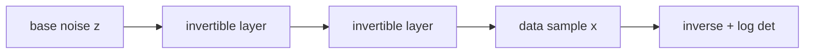

# Normalizing Flows

- Level: Advanced
- Prerequisites: [Math/Linear-Algebra/Determinant.md](../../Math/Linear-Algebra/Determinant.md), [Math/Probability-Statistics/Distributions.md](../../Math/Probability-Statistics/Distributions.md)
- Status: Draft
- Reviewed-by: -
- Depth: Deep-dive (자기완결)

---

## 개념 (Concept)

Normalizing Flow는 단순한 base distribution을 invertible transformation들의 합성으로 복잡한 데이터 분포로 바꾸는 생성 모델이다. 정확한 likelihood 계산이 가능하다는 점이 큰 특징이다.

## 직관 (Intuition)

동그란 고무공 같은 단순 분포를 여러 번 비틀고 늘려 데이터 모양에 맞춘다. 중요한 조건은 그 변환을 거꾸로 되돌릴 수 있고, 부피가 얼마나 변했는지 계산할 수 있어야 한다는 것이다.

## 이론 (Theory)

변수변환 공식은 다음과 같다.

$$\log p_X(x)=\log p_Z(f^{-1}(x))+\log\left|\det \frac{\partial f^{-1}}{\partial x}\right|$$

따라서 flow layer는 invertible해야 하며 Jacobian determinant를 효율적으로 계산할 수 있어야 한다. Coupling layer, autoregressive flow, invertible convolution 등이 대표 설계다.



### Flow layer의 세 조건

좋은 flow layer는 forward sampling, inverse density evaluation, log-determinant 계산이 모두 가능해야 한다. 일반 neural network는 표현력이 높아도 inverse나 determinant가 어려워 flow layer로 바로 쓸 수 없다.

| 요구 | 이유 |
| --- | --- |
| Invertibility | $x$와 $z$를 서로 변환 |
| Efficient log-det | likelihood 계산 |
| Expressivity | 복잡한 분포 표현 |
| Stable numerics | scale 폭주 방지 |

### Exact likelihood의 함정

flow는 exact likelihood를 계산할 수 있지만, likelihood가 사람이 보는 sample quality와 항상 일치하지 않는다. 이미지에서는 배경 texture나 low-level 통계가 likelihood를 지배할 수 있고, anomaly detection에서도 이상 샘플이 높은 likelihood를 받을 수 있다.

### Dequantization

이미지 pixel은 discrete 값인데 flow는 continuous density를 모델링한다. 그래서 uniform 또는 variational dequantization으로 pixel 값을 연속 공간에 올려야 한다. 이 과정을 빼면 likelihood 해석이 왜곡된다.

## 구현 (Implementation)

```python
def flow_log_prob(x, inverse_layers, base_log_prob):
    z = x
    log_det = 0.0
    for layer in inverse_layers:
        z, ld = layer.inverse(z)
        log_det += ld
    return base_log_prob(z) + log_det
```

학습은 negative log likelihood를 최소화한다.

```python
def negative_log_likelihood(log_prob):
    return -log_prob
```

## 복잡도 (Complexity)

일반 Jacobian determinant는 차원에 대해 비싸므로 구조적 layer가 필요하다. Flow는 likelihood는 좋지만 고차원 이미지에서 inductive bias와 memory가 문제가 될 수 있다.

## 응용 (Applications)

- exact likelihood generative modeling
- density estimation
- anomaly detection
- variational inference posterior flow

## 흔한 오해 (Common Misunderstandings)

- Likelihood가 높다고 perceptual sample quality가 항상 좋은 것은 아니다.
- 모든 neural network를 flow layer로 쓸 수는 없다. Invertibility가 필요하다.
- 차원 보존 구조 때문에 압축 표현 학습과는 제약이 다르다.
- Determinant 계산이 쉬운 구조가 모델 표현력을 제한할 수 있다.

## TMI

- Coupling layer는 일부 차원을 고정하고 나머지를 변환해 determinant 계산을 쉽게 한다.
- Dequantization은 discrete image pixel을 continuous density model에 맞추는 데 필요하다.
- Flow는 VAE의 approximate posterior를 더 유연하게 만드는 데도 쓰인다.

## 연습 / 확인 문제 (Exercises)

- 변수변환 공식에서 Jacobian determinant의 의미를 설명하라.
- Flow layer가 invertible해야 하는 이유를 말하라.
- Flow와 VAE/GAN의 likelihood 계산 차이를 비교하라.

## 이어서 읽기 (Reading Path)

- 이전: [VAE](VAE.md)
- 다음: [RealNVP](Real-NVP.md), [에너지 기반 모델](EBM.md)

## 참조 (References)

- [Math/Linear-Algebra/Determinant.md](../../Math/Linear-Algebra/Determinant.md)
- [Reference/Papers.md](../../Reference/Papers.md)
