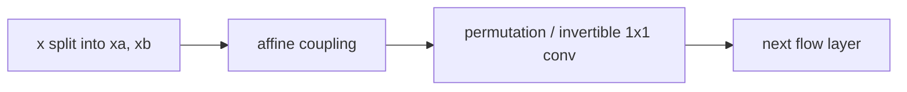

# RealNVP와 Glow (RealNVP and Glow)

- Level: Advanced
- Prerequisites: [AI/Generative-Models/Normalizing-Flows.md](Normalizing-Flows.md), [AI/Deep-Learning/CNN.md](../Deep-Learning/CNN.md)
- Status: Draft
- Reviewed-by: -
- Depth: Deep-dive (자기완결)

---

## 개념 (Concept)

RealNVP와 Glow는 이미지용 normalizing flow 계열 모델이다. Affine coupling layer와 invertible transformation을 쌓아 exact likelihood와 sampling을 모두 가능하게 한다.

## 직관 (Intuition)

이미지의 일부 channel이나 위치를 기준으로 다른 부분을 scale·shift한다. 일부를 고정해 두기 때문에 거꾸로 되돌리기 쉽고, 부피 변화량도 빠르게 계산할 수 있다.

## 이론 (Theory)

Affine coupling은 입력을 $(x_a, x_b)$로 나누고

$$y_a=x_a,\quad y_b=x_b\odot \exp(s(x_a))+t(x_a)$$

처럼 변환한다. Jacobian이 triangular이므로 log determinant는 $s(x_a)$의 합으로 계산된다. Glow는 invertible 1×1 convolution 등으로 channel mixing을 강화한다.



### Coupling layer의 장단점

한 coupling layer는 일부 차원을 그대로 둔다. 이것은 inverse와 determinant를 쉽게 만들지만 표현력을 제한한다. 여러 layer 사이에 mask, permutation, invertible 1x1 convolution을 넣어 모든 차원이 충분히 변환되도록 한다.

### Scale 안정성

affine coupling의 $\exp(s)$는 scale을 크게 키울 수 있어 numerical instability가 생길 수 있다. clamp, bounded activation, actnorm, careful initialization으로 log-det와 inverse 계산을 안정화한다.

### Multi-scale 구조

이미지 flow는 squeeze로 공간 해상도를 channel로 옮기고, 일부 latent를 중간에 factor-out하는 multi-scale 구조를 쓴다. 이는 메모리와 계산을 줄이면서 local/global 정보를 단계적으로 모델링한다.

## 구현 (Implementation)

```python
def affine_coupling(x_b, scale, shift):
    y_b = x_b * exp(scale) + shift
    log_det = sum(scale)
    return y_b, log_det
```

Mask나 channel split을 바꿔 여러 layer가 전체 차원을 점진적으로 변환하게 한다.

```python
def inverse_affine_coupling(y_b, scale, shift):
    return (y_b - shift) * exp(-scale)
```

## 복잡도 (Complexity)

Coupling network는 CNN 비용을 갖고, layer 수와 해상도에 따라 memory가 증가한다. Exact inverse와 likelihood를 위해 activation 저장과 invertible 구조 관리가 필요하다.

## 응용 (Applications)

- 이미지 density estimation
- latent interpolation과 sampling
- likelihood 기반 anomaly score 연구
- invertible representation

## 흔한 오해 (Common Misunderstandings)

- RealNVP의 일부 차원 고정은 한 layer만 보면 제한적이지만 여러 layer를 섞으면 표현력이 커진다.
- Likelihood가 높은 이미지가 사람이 보기 좋은 이미지라는 뜻은 아니다.
- Flow는 GAN처럼 discriminator를 두지 않는다.
- Invertible 1×1 convolution도 determinant 계산 비용을 고려해야 한다.

## TMI

- Squeeze operation은 공간 해상도를 줄이고 channel을 늘려 multi-scale flow를 만든다.
- ActNorm은 batch statistics 대신 data-dependent initialization을 사용하는 정규화다.
- Glow는 고품질 샘플보다 flow 구조의 실용성을 크게 알린 모델로 자주 언급된다.

## 연습 / 확인 문제 (Exercises)

- Affine coupling의 inverse를 직접 써 보라.
- Coupling layer의 Jacobian이 triangular인 이유를 설명하라.
- RealNVP와 Glow의 구조적 차이를 정리하라.

## 이어서 읽기 (Reading Path)

- 이전: [Normalizing Flows](Normalizing-Flows.md)
- 다음: [DDPM](DDPM.md), [에너지 기반 모델](EBM.md)

## 참조 (References)

- [AI/Generative-Models/Normalizing-Flows.md](Normalizing-Flows.md)
- [Reference/Papers.md](../../Reference/Papers.md)
