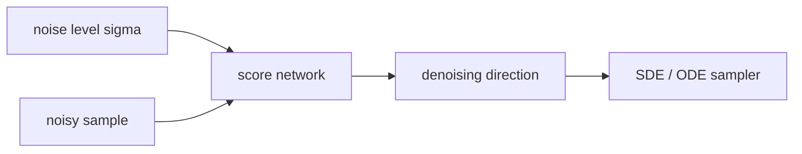

# Score-based 생성 모델 (Score-based Generative Models)

- Level: Advanced
- Prerequisites: [AI/Generative-Models/DDPM.md](DDPM.md), [Math/Probability-Statistics/Distributions.md](../../Math/Probability-Statistics/Distributions.md)
- Status: Draft
- Reviewed-by: -
- Depth: Deep-dive (자기완결)

---

## 개념 (Concept)

Score-based 생성 모델은 데이터 분포의 score, 즉 $\nabla_x \log p(x)$를 학습해 샘플을 생성하는 모델이다. Diffusion 모델과 깊게 연결되는 연속시간 관점을 제공한다.

## 직관 (Intuition)

확률 밀도가 높은 곳으로 향하는 지형의 경사 방향을 배운다고 볼 수 있다. 잡음 속 샘플이 어디로 움직이면 더 그럴듯한 데이터가 되는지를 단계적으로 알려 준다.

## 이론 (Theory)

Denoising score matching은 noise가 섞인 데이터에서 score를 추정한다. Noise level별 score를 학습하면 Langevin dynamics나 SDE/ODE sampler로 noise에서 data로 이동할 수 있다.

DDPM의 noise prediction은 특정 parameterization에서 score 추정과 연결된다. 연속시간 formulation은 sampler, likelihood 추정, controllable generation을 분석하는 데 유용하다.



### Score의 의미

score는 log-density가 가장 빨리 증가하는 방향이다. 정규화 상수를 몰라도 gradient 방향은 알 수 있으므로 sampling에 쓸 수 있다. noise level별 score를 학습하는 이유는 원 데이터 분포가 복잡해도 잡음을 많이 섞으면 더 매끄러운 분포가 되기 때문이다.

### SDE와 ODE sampler

stochastic reverse SDE는 noise를 포함해 다양한 샘플을 만들고, probability flow ODE는 deterministic 경로로 sampling과 likelihood 추정에 유리하다. solver 선택은 step 수, stability, quality를 바꾼다.

### Inverse problem

score prior는 super-resolution, deblurring, inpainting처럼 관측 제약이 있는 문제에서 prior gradient로 쓰일 수 있다. 이때 measurement consistency와 generative prior 사이 균형이 중요하다.

## 구현 (Implementation)

```python
def langevin_step(x, score, step_size, noise):
    return x + step_size * score(x) + (2 * step_size) ** 0.5 * noise
```

Noise schedule과 step size가 sampling 품질에 큰 영향을 준다.

```python
def euler_step(x, drift, dt):
    return x + dt * drift(x)
```

## 복잡도 (Complexity)

여러 noise level에서 network를 평가하므로 sampling 비용이 크다. Predictor-corrector sampler나 probability flow ODE solver는 비용과 품질을 조절한다.

## 응용 (Applications)

- diffusion 모델 이론 분석
- inverse problem 복원
- conditional generation
- likelihood와 sampling 연구

## 흔한 오해 (Common Misunderstandings)

- Score는 scalar probability가 아니라 log-density의 gradient다.
- Score만 알면 normalization constant 없이도 sampling할 수 있다.
- 연속시간 관점이 항상 구현을 단순하게 만드는 것은 아니다.
- 좋은 sampler 없이는 좋은 score model도 느리거나 불안정할 수 있다.

## TMI

- Probability flow ODE는 stochastic sampling과 연결된 deterministic 경로를 제공한다.
- Tweedie's formula는 denoising과 score 추정의 관계를 설명하는 데 자주 등장한다.
- Classifier guidance도 score를 조건 방향으로 수정하는 관점으로 볼 수 있다.

## 연습 / 확인 문제 (Exercises)

- $\nabla_x \log p(x)$가 가리키는 방향을 설명하라.
- Langevin dynamics가 noise를 포함하는 이유를 말하라.
- DDPM noise prediction과 score prediction의 관계를 정리하라.

## 이어서 읽기 (Reading Path)

- 이전: [DDPM](DDPM.md), [DDIM](DDIM.md)
- 다음: [Latent Diffusion](Latent-Diffusion.md)

## 참조 (References)

- [AI/Generative-Models/DDPM.md](DDPM.md)
- [Reference/Papers.md](../../Reference/Papers.md)
