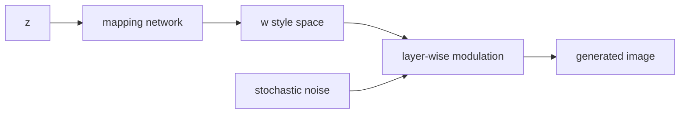

# StyleGAN

- Level: Advanced
- Prerequisites: [AI/Generative-Models/DCGAN.md](DCGAN.md), [AI/Generative-Models/Conditional-GAN.md](Conditional-GAN.md)
- Status: Draft
- Reviewed-by: -
- Depth: Deep-dive (자기완결)

---

## 개념 (Concept)

StyleGAN은 latent vector를 intermediate style space로 변환하고 각 layer의 feature 통계에 주입해 고품질 이미지를 생성하는 GAN 계열이다. Style, noise, progressive resolution 제어가 핵심 아이디어다.

## 직관 (Intuition)

한 번에 이미지를 그리는 대신, 낮은 해상도 layer에는 얼굴 형태 같은 큰 구조를, 높은 해상도 layer에는 머리카락·피부 결 같은 세부 스타일을 주입한다. 그래서 latent 조작과 style mixing이 자연스럽다.

## 이론 (Theory)

Mapping network는 $z$를 $w$ space로 바꿔 disentanglement에 유리한 표현을 만든다. Style modulation은 layer별 feature channel의 scale을 조절한다. Stochastic noise는 주근깨, 머리카락 같은 미세 확률 변동을 넣는다.

Path length regularization, adaptive discriminator augmentation 등은 학습 안정성과 품질을 개선하는 데 쓰인다.



### Layer별 제어

낮은 resolution layer는 pose, layout, 얼굴형 같은 coarse structure에 더 강하게 관여하고, 높은 resolution layer는 texture, color, 미세 디테일에 더 관여한다. style mixing은 이 가정을 실험적으로 확인하고 latent editing 가능성을 탐색하는 방법이다.

### Truncation trick

latent를 평균 $w$에 가깝게 당기면 고품질·전형적 샘플이 늘지만 다양성이 줄어든다. 데이터셋의 minority mode나 특이한 샘플은 truncation에서 사라지기 쉽다. 품질 데모와 데이터 생성 목적의 설정은 다를 수 있다.

### Inversion과 편집

실제 이미지를 latent로 되돌리는 inversion은 편집의 시작점이다. inversion 오차가 크면 원본 identity나 세부 정보가 바뀐다. 편집 방향이 semantic하게 깨끗한지, 원치 않는 속성도 함께 변하는지 확인해야 한다.

## 구현 (Implementation)

```python
style_layers = {
    "coarse": "pose_and_shape",
    "middle": "parts_and_layout",
    "fine": "texture_and_color",
}
```

Style mixing은 서로 다른 latent의 style을 layer 범위별로 섞어 제어성을 관찰한다.

```python
def truncation(w, w_avg, psi):
    return w_avg + psi * (w - w_avg)
```

## 복잡도 (Complexity)

고해상도 generator와 discriminator 모두 비용이 크다. Layer별 modulation과 noise 주입은 구조를 복잡하게 만들고, 품질 평가는 많은 샘플을 요구한다.

## 응용 (Applications)

- 고품질 얼굴·객체 생성
- latent editing
- synthetic data 연구
- image inversion과 editing

## 흔한 오해 (Common Misunderstandings)

- StyleGAN의 latent 조작이 항상 의미적으로 깨끗하게 분리되는 것은 아니다.
- 고품질 샘플은 데이터 편향과 memorization 위험을 없애지 않는다.
- Inversion이 완벽하지 않으면 편집 결과가 원본과 어긋날 수 있다.
- 얼굴 생성 성능이 모든 도메인 생성 성능을 의미하지 않는다.

## TMI

- Truncation trick은 평균 latent에 가까운 샘플을 뽑아 품질을 높이는 대신 다양성을 줄인다.
- Style mixing은 layer가 담당하는 시각 정보의 scale을 보여 주는 실험으로 유명하다.
- GAN inversion은 실제 이미지를 latent code로 되돌리는 문제다.

## 연습 / 확인 문제 (Exercises)

- $z$ space와 $w$ space의 차이를 설명하라.
- Truncation trick의 품질·다양성 tradeoff를 설명하라.
- Style mixing 실험에서 coarse/fine layer를 바꿨을 때 결과를 예측하라.

## 이어서 읽기 (Reading Path)

- 이전: [DCGAN](DCGAN.md), [Conditional GAN](Conditional-GAN.md)
- 다음: [CycleGAN](CycleGAN.md), [Latent Diffusion](Latent-Diffusion.md)

## 참조 (References)

- [AI/Generative-Models/GAN-Basics.md](GAN-Basics.md)
- [Reference/Papers.md](../../Reference/Papers.md)
