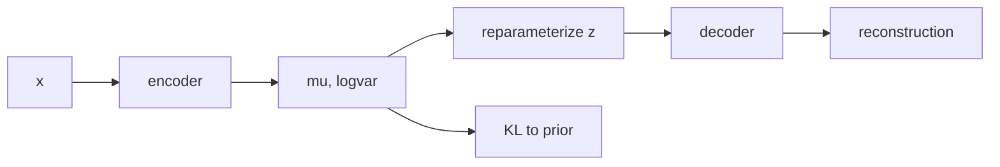

# 변분 오토인코더 (Variational Autoencoder)

- Level: Advanced
- Prerequisites: [Math/Probability-Statistics/Bayes-Theorem.md](../../Math/Probability-Statistics/Bayes-Theorem.md), [AI/Deep-Learning/Backpropagation.md](../Deep-Learning/Backpropagation.md)
- Status: Draft
- Reviewed-by: -
- Depth: Deep-dive (자기완결)

---

## 개념 (Concept)

VAE는 encoder가 입력의 잠재분포 $q_\phi(z\mid x)$를 추정하고 decoder가 $p_\theta(x\mid z)$를 모델링하는 latent variable generative model이다. 재구성과 잠재분포 규제를 함께 학습한다.

## 직관 (Intuition)

각 입력을 잠재공간의 한 점이 아니라 작은 확률 구름으로 인코딩한다. 구름들이 연속적으로 정돈되므로 prior에서 새 $z$를 뽑아 decoder에 넣어 새로운 샘플을 만들 수 있다.

## 이론 (Theory)

log likelihood의 하한 ELBO는

$$\log p(x)\ge E_{q_\phi(z\mid x)}[\log p_\theta(x\mid z)]-
D_{KL}(q_\phi(z\mid x)\|p(z))$$

다. Gaussian encoder는 $z=\mu+\sigma\odot\epsilon$, $\epsilon\sim N(0,I)$의 reparameterization trick으로 sampling을 통과해 gradient를 전달한다.



### ELBO 두 항의 균형

재구성 항은 입력을 잘 설명하도록 하고, KL 항은 posterior가 prior와 너무 멀어지지 않게 한다. KL이 너무 강하면 latent가 정보를 담지 못하고, 너무 약하면 prior에서 샘플링했을 때 decoder가 본 적 없는 영역을 만나 품질이 나빠진다.

### Posterior collapse

강한 autoregressive decoder는 latent $z$를 무시하고도 $x$를 잘 모델링할 수 있다. 이때 KL이 0에 가까워지고 latent가 쓸모없어지는 posterior collapse가 생긴다. KL annealing, free bits, decoder 약화, skip connection 제한 등이 대응책이다.

### Likelihood 선택

binary image에는 Bernoulli likelihood, continuous image에는 Gaussian 또는 discretized logistic likelihood를 쓰는 식으로 reconstruction loss는 데이터 분포 가정이다. MSE를 쓰면 blur가 생기기 쉬운 이유도 평균적 예측을 선호하는 likelihood와 연결된다.

## 구현 (Implementation)

```python
import numpy as np


def reparameterize(mean, log_variance, rng):
    std = np.exp(0.5 * log_variance)
    return mean + std * rng.normal(size=mean.shape)
```

전체 loss는 reconstruction loss와 KL term의 합이며 데이터 likelihood 선택에 맞춰야 한다.

```python
def gaussian_kl(mean, log_variance):
    return 0.5 * np.sum(np.exp(log_variance) + mean ** 2 - 1.0 - log_variance)
```

## 복잡도 (Complexity)

한 batch 비용은 encoder·decoder forward/backward 비용과 잠재차원 선형 KL 계산이다. 생성은 prior sampling과 decoder forward 한 번이다.

## 응용 (Applications)

- representation learning·generation
- anomaly detection
- conditional generation
- disentanglement 연구

## 흔한 오해 (Common Misunderstandings)

- VAE는 단순 autoencoder에 noise만 넣은 것이 아니다.
- reconstruction 항의 분포 가정이 출력 품질에 영향을 준다.
- ELBO 최대화가 exact likelihood 최대화와 항상 같지는 않다.
- 강한 decoder에서는 posterior collapse가 생길 수 있다.

## TMI

- KL annealing은 posterior collapse 완화에 쓰인다.
- β-VAE는 KL 가중치를 바꿔 disentanglement를 유도한다.
- VAE의 결과가 blur해 보이는 현상은 likelihood와 decoder 가정에 관련된다.

## 연습 / 확인 문제 (Exercises)

- reparameterization이 왜 필요한지 설명하라.
- ELBO 두 항의 역할을 비교하라.
- 잠재공간 두 점 사이 interpolation을 설계하라.

## 이어서 읽기 (Reading Path)

- 이전: [오토인코더](Autoencoders.md)
- 다음: [β-VAE](Beta-VAE.md), [GAN 기초](GAN-Basics.md), [DDPM](DDPM.md)

## 참조 (References)

- [Math/Probability-Statistics/Bayes-Theorem.md](../../Math/Probability-Statistics/Bayes-Theorem.md)
- [Reference/Papers.md](../../Reference/Papers.md)
- [Reference/Books.md](../../Reference/Books.md)
