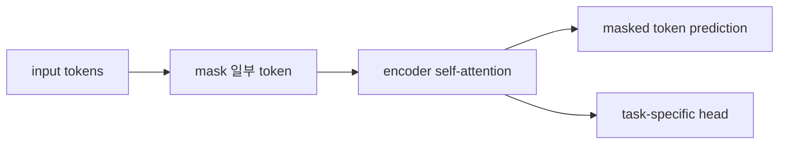

# BERT 계열 (BERT Family)

- Level: Advanced
- Prerequisites: [AI/LLMs/Pretraining.md](Pretraining.md), [AI/NLP/BERT.md](../NLP/BERT.md)
- Status: Draft
- Reviewed-by: -
- Depth: Deep-dive (자기완결)

---

## 개념 (Concept)

BERT 계열은 encoder-only Transformer를 masked language modeling으로 사전학습한 언어 모델 계열이다. 양방향 문맥 표현을 얻어 분류, 추출형 QA, NER, retrieval reranking 등에 강하다.

## 직관 (Intuition)

GPT가 왼쪽에서 오른쪽으로 이어 쓰는 모델이라면, BERT는 문장 중간의 빈칸을 양쪽 문맥을 보고 맞히는 모델이다. 그래서 생성보다는 입력 문장을 깊게 이해해 표현하는 데 적합하다.

## 이론 (Theory)

Masked LM은 일부 토큰을 `[MASK]`로 가리고 원래 토큰을 예측한다. Encoder self-attention은 모든 위치가 서로를 볼 수 있어 bidirectional context를 사용한다.

Sentence pair classification, token classification, span extraction 같은 downstream task는 `[CLS]` representation이나 token representation 위에 head를 얹어 fine-tuning한다.



### Task head 선택

| 과제 | 주로 쓰는 표현 | 출력 |
| --- | --- | --- |
| 문장 분류 | `[CLS]` 또는 pooled embedding | class logits |
| NER/POS | 각 token embedding | token별 tag |
| 추출형 QA | token embedding | start/end position |
| Reranking | query-document joint encoding | relevance score |

token classification에서는 subword tokenization 때문에 word-level label을 어떤 subword에 붙일지 정해야 한다. span QA에서는 답이 문서 안의 연속 구간이라는 가정이 있어 생성형 QA와 평가 방식이 다르다.

### Bi-encoder와 cross-encoder

BERT 계열은 검색에서 두 방식으로 자주 쓰인다. bi-encoder는 query와 document를 따로 embedding해 벡터 검색이 빠르지만 상호작용이 제한된다. cross-encoder는 query와 document를 한 입력으로 넣어 모든 token 상호작용을 보므로 정확하지만 후보마다 forward가 필요해 느리다. 실무에서는 bi-encoder로 후보를 넓게 가져오고 cross-encoder로 reranking하는 2단 구조가 흔하다.

### Pooling과 calibration

`[CLS]` embedding이 항상 좋은 sentence embedding은 아니다. mean pooling, contrastive sentence embedding fine-tuning, domain-specific calibration이 필요한 경우가 많다. 분류 head의 score도 곧 잘 보정된 확률은 아니므로 threshold 기반 의사결정에서는 calibration curve나 validation threshold를 확인한다.

## 구현 (Implementation)

```python
task_heads = {
    "classification": "use CLS embedding",
    "token_classification": "use each token embedding",
    "span_qa": "predict start and end positions",
}
```

Encoder-only 모델은 autoregressive generation에는 직접 맞지 않다.

## 복잡도 (Complexity)

Attention 비용은 sequence length의 제곱에 비례한다. Fine-tuning 비용은 decoder LLM보다 작을 수 있지만 task별 labeled data와 calibration이 중요하다.

## 응용 (Applications)

- 문서 분류·감성 분석
- NER·정보 추출
- 추출형 질문응답
- 검색 reranking과 embedding 모델의 기반

## 흔한 오해 (Common Misunderstandings)

- BERT는 GPT보다 낡았다기보다 목적이 다르다.
- `[MASK]` pretraining과 실제 입력 사이에는 mismatch가 있다.
- 문장 embedding은 pooling 방식에 따라 품질이 크게 달라진다.
- Encoder-only 모델이 긴 생성에 자연스럽게 맞는 것은 아니다.

## TMI

- RoBERTa류는 pretraining recipe가 모델 성능에 얼마나 중요한지 보여 준다.
- DistilBERT류는 encoder 모델 distillation의 대표 사례다.
- Cross-encoder reranker는 느리지만 query-document 상호작용을 세밀하게 본다.

## 연습 / 확인 문제 (Exercises)

- Causal LM과 masked LM의 attention mask 차이를 설명하라.
- BERT가 NER에 잘 맞는 이유를 말하라.
- Cross-encoder와 bi-encoder retrieval의 tradeoff를 비교하라.

## 이어서 읽기 (Reading Path)

- 이전: [BERT](../NLP/BERT.md), [사전학습](Pretraining.md)
- 다음: [Encoder-Decoder](Encoder-Decoder.md), [Distillation](Distillation.md)

## 참조 (References)

- [AI/NLP/BERT.md](../NLP/BERT.md)
- [Reference/Papers.md](../../Reference/Papers.md)
