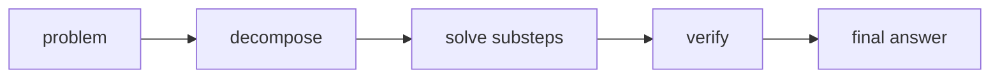

# Chain-of-Thought

- Level: Advanced
- Prerequisites: [AI/LLMs/In-Context-Learning.md](In-Context-Learning.md), [AI/LLMs/Prompt-Engineering.md](Prompt-Engineering.md)
- Status: Draft
- Reviewed-by: -
- Depth: Deep-dive (자기완결)

---

## 개념 (Concept)

Chain-of-Thought(CoT)는 모델이 최종 답 전에 중간 추론 단계를 생성하거나 내부적으로 활용하도록 유도하는 prompting·학습 패턴이다. 복잡한 산술, 논리, 다단계 문제에서 도움이 될 수 있다.

## 직관 (Intuition)

어려운 문제를 바로 답하라고 하면 실수하기 쉽다. 풀이 과정을 나눠 쓰게 하면 중간 상태가 생겨 모델이 다음 단계를 더 안정적으로 이어갈 수 있다.

## 이론 (Theory)

CoT는 few-shot 예시의 reasoning trace로 유도하거나, "단계별로 생각하라" 같은 지시로 유도할 수 있다. Self-consistency는 여러 reasoning path를 샘플링하고 답을 투표한다.

하지만 생성된 reasoning은 항상 충실한 내부 원인 설명이 아니다. 모델이 그럴듯한 사후 설명을 만들 수 있으므로, 외부 공개 답변에서는 필요한 수준의 요약 근거와 검증 가능한 계산을 분리해 다루는 것이 좋다.



### CoT 계열 기법

| 기법 | 아이디어 | 적합한 경우 |
| --- | --- | --- |
| Zero-shot CoT | 단계적 풀이를 지시 | 간단한 다단계 문제 |
| Few-shot CoT | 풀이 예시를 제공 | 형식과 추론 패턴이 중요한 문제 |
| Self-consistency | 여러 풀이를 샘플링해 답 투표 | 답은 짧고 경로가 다양한 문제 |
| Program-of-thought | 계산을 코드로 외부 실행 | 산술·표·정확 계산 |
| Generate-then-verify | 후보를 만들고 별도 검증 | 오류 비용이 큰 문제 |

### 공개 추론과 검증 가능한 근거

업무용 시스템에서는 긴 사고 과정을 그대로 노출하기보다 핵심 근거, 사용한 식, 중간 계산 결과, 최종 답을 분리하는 편이 안전하다. 사용자는 검증 가능한 정보를 얻고, 시스템은 불필요하게 장황하거나 불충실한 reasoning을 출력할 위험을 줄인다.

### 언제 피할 것인가

단순 분류, 정보 추출, 정책 준수처럼 정해진 schema가 중요한 작업에서는 긴 CoT가 형식 오류와 비용을 늘릴 수 있다. 사실 확인 문제에서는 CoT보다 출처 검색과 인용, 계산 문제에서는 CoT보다 도구 실행이 더 신뢰할 수 있다.

## 구현 (Implementation)

```text
문제: ...
풀이: 필요한 값을 정의하고, 식을 세우고, 계산을 확인하라.
최종 답: ...
```

업무용 prompt에서는 긴 사고 과정보다 검증 가능한 근거, 중간 결과, 최종 답 형식을 요구하는 편이 안전하다.

```text
응답 형식:
근거 요약: 입력에서 확인 가능한 사실만 2개 이하
검산: 필요한 계산만 표시
최종 답: ...
```

## 복잡도 (Complexity)

추론 token이 늘어나므로 비용과 latency가 증가한다. Self-consistency는 샘플 수만큼 비용이 곱해진다.

## 응용 (Applications)

- 수학·논리 문제
- 복잡한 지시 분해
- 계획 생성
- 답 검증과 critique

## 흔한 오해 (Common Misunderstandings)

- 긴 reasoning이 항상 정확한 답을 의미하지 않는다.
- CoT는 사실 검색 문제의 근거 대체물이 아니다.
- 모델이 쓴 설명이 실제 내부 계산 과정과 같다고 단정할 수 없다.
- 쉬운 문제에는 CoT가 오히려 비용만 늘릴 수 있다.

## TMI

- Scratchpad 학습은 중간 계산 공간을 모델 출력으로 제공하는 아이디어다.
- Program-of-thought는 계산을 자연어가 아니라 코드로 외부 실행하게 한다.
- Verification model과 결합하면 생성-검증 분리가 가능하다.

## 연습 / 확인 문제 (Exercises)

- CoT가 도움이 되는 문제와 불필요한 문제를 구분하라.
- Self-consistency의 비용·정확도 tradeoff를 설명하라.
- 최종 답과 검증 가능한 근거만 요구하는 prompt를 작성하라.

## 이어서 읽기 (Reading Path)

- 이전: [In-context Learning](In-Context-Learning.md)
- 다음: [LLM Agents](LLM-Agents.md), [RAG](RAG.md)

## 참조 (References)

- [AI/LLMs/In-Context-Learning.md](In-Context-Learning.md)
- [Reference/Papers.md](../../Reference/Papers.md)
