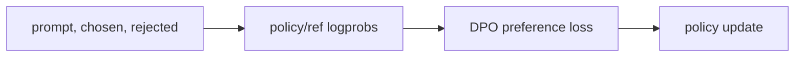

# DPO (Direct Preference Optimization)

- Level: Advanced
- Prerequisites: [AI/LLMs/RLHF.md](RLHF.md), [AI/LLMs/Instruction-Tuning.md](Instruction-Tuning.md)
- Status: Draft
- Reviewed-by: -
- Depth: Deep-dive (자기완결)

---

## 개념 (Concept)

DPO는 선호쌍 데이터에서 별도 reward model과 RL rollout 없이 정책을 직접 최적화하는 preference optimization 방법이다. 선택된 응답과 거부된 응답의 likelihood 차이를 reference model 대비 조정한다.

## 직관 (Intuition)

RLHF가 "채점자를 만들고 그 점수를 높이는 게임"이라면, DPO는 "좋다고 고른 답을 싫다고 고른 답보다 더 가능하게 만들자"는 비교 학습에 가깝다.

## 이론 (Theory)

데이터는 $(x, y^+, y^-)$ 형태의 prompt, chosen response, rejected response다. DPO는 reference policy 대비 chosen의 log probability를 rejected보다 더 높이는 방향으로 학습한다.

KL-constrained reward maximization 문제를 변형하면 reward model 없이도 preference loss로 policy를 업데이트할 수 있다. β는 reference policy에서 벗어나는 정도를 조절한다.



### 손실의 직관

DPO는 policy가 reference 대비 chosen을 rejected보다 더 선호하도록 만든다. 전형적인 형태는 chosen/rejected의 log probability 차이를 비교해 logistic loss를 적용한다.

$$
-\log\sigma\left(\beta\left[
\log\frac{\pi_\theta(y^+\mid x)}{\pi_{\text{ref}}(y^+\mid x)}
-
\log\frac{\pi_\theta(y^-\mid x)}{\pi_{\text{ref}}(y^-\mid x)}
\right]\right)
$$

여기서 reference model은 원래 SFT 모델의 행동 기준점이다. β가 크면 preference를 강하게 반영하지만 reference에서 더 멀어질 수 있다.

### Preference pair 품질

chosen이 명확히 좋고 rejected가 명확히 나쁜 쌍은 학습 신호가 강하지만, 너무 쉬운 쌍만 있으면 세밀한 품질 차이를 배우기 어렵다. 반대로 labeler 간 의견이 갈리는 쌍은 noise가 커진다. response 길이, 포맷, 안전 거절 여부 같은 표면 단서만으로 chosen을 맞힐 수 있으면 모델이 본질적 품질 대신 shortcut을 배울 수 있다.

### DPO와 SFT의 관계

DPO는 보통 좋은 SFT checkpoint 위에서 작동한다. SFT가 지시 형식과 기본 능력을 만들고, DPO가 선호 방향으로 경계를 조정한다. base model에 곧장 DPO를 적용하면 instruction-following 자체가 부족해 preference 신호를 안정적으로 흡수하기 어렵다.

## 구현 (Implementation)

```python
preference_pair = {
    "prompt": "질문",
    "chosen": "더 선호된 응답",
    "rejected": "덜 선호된 응답",
}
```

실제 학습은 policy와 reference model의 chosen/rejected logprob를 모두 계산한다.

```python
def preference_margin(policy_chosen, policy_rejected, ref_chosen, ref_rejected):
    return (policy_chosen - policy_rejected) - (ref_chosen - ref_rejected)
```

## 복잡도 (Complexity)

RLHF보다 단순하고 안정적인 경우가 많다. 그러나 response pair 품질, reference model 선택, β tuning이 중요하며 long response logprob 계산 비용이 든다.

## 응용 (Applications)

- assistant 응답 선호 정렬
- 스타일·안전 정책 선호 반영
- RLHF 대체 또는 후속 단계
- 도메인별 preference adaptation

## 흔한 오해 (Common Misunderstandings)

- DPO도 preference data 품질에 크게 의존한다.
- RL loop가 없다고 reward hacking 위험이 완전히 사라지는 것은 아니다.
- Chosen/rejected가 미묘하게만 다르면 학습 신호가 약할 수 있다.
- β를 잘못 잡으면 과소/과대 정렬이 생긴다.

## TMI

- DPO류 방법은 구현 단순성 때문에 preference tuning의 기본 baseline으로 자주 쓰인다.
- IPO, KTO 등 여러 변형은 preference 데이터 형태와 loss를 다르게 둔다.
- SFT checkpoint 품질이 낮으면 DPO만으로 행동을 완전히 고치기 어렵다.

## 연습 / 확인 문제 (Exercises)

- DPO와 RLHF의 파이프라인 차이를 설명하라.
- Reference model이 필요한 이유를 말하라.
- Preference pair 품질을 검수하는 기준을 설계하라.

## 이어서 읽기 (Reading Path)

- 이전: [RLHF](RLHF.md)
- 다음: [PEFT](PEFT.md), [LLM Agents](LLM-Agents.md)

## 참조 (References)

- [AI/LLMs/Instruction-Tuning.md](Instruction-Tuning.md)
- [Reference/Papers.md](../../Reference/Papers.md)
