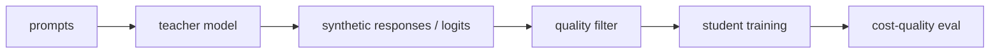

# 지식 증류 (Knowledge Distillation)

- Level: Advanced
- Prerequisites: [AI/Deep-Learning/Transfer-Learning.md](../Deep-Learning/Transfer-Learning.md), [AI/LLMs/Instruction-Tuning.md](Instruction-Tuning.md)
- Status: Draft
- Reviewed-by: -
- Depth: Deep-dive (자기완결)

---

## 개념 (Concept)

지식 증류는 큰 teacher model의 출력, 분포, reasoning pattern, preference behavior를 작은 student model이 모방하도록 학습하는 방법이다. 목표는 비용을 줄이면서 성능과 행동 양식을 보존하는 것이다.

## 직관 (Intuition)

큰 선생님이 직접 문제를 풀어 보여 주고, 작은 학생 모델이 그 답안 스타일과 판단 기준을 배운다. 정답 label만 보는 것보다 teacher의 확률 분포와 예시가 더 풍부한 신호를 준다.

## 이론 (Theory)

고전 distillation은 teacher soft target을 temperature로 부드럽게 만들어 student가 class 간 상대적 유사성을 학습하게 한다. LLM에서는 response distillation, chain distillation, preference distillation, logits distillation이 사용된다.

Teacher가 틀리거나 편향되면 student도 이를 배운다. 또한 teacher output을 training data로 사용할 때 license, privacy, contamination을 검토해야 한다.



### 증류 신호의 종류

| 방식 | 필요한 접근 | 장점 | 위험 |
| --- | --- | --- | --- |
| Response distillation | teacher 출력 텍스트 | 구현 쉬움 | teacher 오류 복사 |
| Logits distillation | teacher logits | 풍부한 분포 신호 | API/저장 비용 큼 |
| Reasoning distillation | 풀이 trace | 다단계 과제 도움 | 불충실한 추론 학습 가능 |
| Preference distillation | 선호쌍 또는 ranking | 행동 양식 이전 | 선호 편향 복사 |

고전 분류 증류에서는 teacher 확률 $p_T$와 student 확률 $p_S$ 사이의 KL divergence를 줄인다. 온도 $T$를 높이면 분포가 부드러워져 class 간 상대적 정보를 더 많이 전달한다.

### Synthetic data 품질 관리

teacher output은 생성 직후 그대로 학습하기보다 중복 제거, format validation, factuality check, safety filter, 난이도 균형을 거친다. 특히 teacher가 모르는 도메인에서 그럴듯한 오답을 대량 생성하면 student가 confidence 높은 오류를 배울 수 있다.

### Student 평가

student는 teacher와 같은 답을 내는가보다 배포 제약 안에서 충분히 좋은가가 핵심이다. latency, memory, 비용, benchmark 성능, long-tail 실패 사례를 teacher와 나란히 비교한다. teacher보다 작기 때문에 특정 능력은 압축 중 사라질 수 있다.

## 구현 (Implementation)

```python
distill_sample = {
    "prompt": "질문",
    "teacher_response": "고품질 응답",
    "student_target": "teacher_response",
}
```

Logits 접근이 가능하면 token distribution KL을, 없으면 generated response SFT를 사용할 수 있다.

```python
def distill_record(prompt, teacher_response, source):
    return {"prompt": prompt, "response": teacher_response, "teacher": source}
```

## 복잡도 (Complexity)

Teacher inference 비용이 데이터 생성 단계에 든다. Student training은 모델 크기에 따라 싸지만, teacher output 품질 필터링과 다양성 확보가 필요하다.

## 응용 (Applications)

- 작은 assistant 모델 학습
- 도메인 스타일 이전
- reasoning trace 학습
- serving 비용 절감

## 흔한 오해 (Common Misunderstandings)

- Teacher가 크면 항상 좋은 student가 나오는 것은 아니다.
- Distillation은 teacher의 오류와 bias도 복사할 수 있다.
- Synthetic data만으로 다양성이 충분하다고 가정하면 위험하다.
- Student가 teacher보다 특정 분포에서 더 좋아질 수도 있지만 보장되지는 않는다.

## TMI

- Self-distillation은 같은 계열 모델이나 이전 checkpoint를 teacher로 쓰는 방식이다.
- Rejection sampling은 teacher 후보 중 좋은 응답만 골라 SFT data로 만든다.
- Distillation은 quantization, PEFT와 함께 경량화 stack을 이룬다.

## 연습 / 확인 문제 (Exercises)

- Hard label과 soft target distillation의 차이를 설명하라.
- Teacher output data의 품질 필터를 설계하라.
- Distillation과 instruction tuning의 관계를 정리하라.

## 이어서 읽기 (Reading Path)

- 이전: [Instruction Tuning](Instruction-Tuning.md)
- 다음: [Quantization](Quantization.md), [Inference Optimization](Inference-Optimization.md)

## 참조 (References)

- [AI/Deep-Learning/Transfer-Learning.md](../Deep-Learning/Transfer-Learning.md)
- [Reference/Papers.md](../../Reference/Papers.md)
