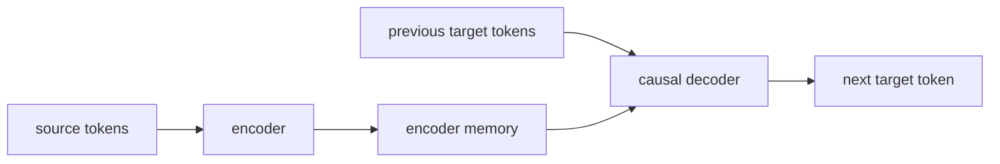

# T5와 Encoder-Decoder 모델 (Encoder-Decoder Models)

- Level: Advanced
- Prerequisites: [AI/NLP/Transformer-NLP.md](../NLP/Transformer-NLP.md), [AI/NLP/Machine-Translation.md](../NLP/Machine-Translation.md)
- Status: Draft
- Reviewed-by: -
- Depth: Deep-dive (자기완결)

---

## 개념 (Concept)

Encoder-decoder Transformer는 입력 sequence를 encoder가 양방향으로 읽고, decoder가 그 표현을 참조하며 출력 sequence를 autoregressive하게 생성하는 구조다. 번역, 요약, 변환형 NLP에 자연스럽다.

## 직관 (Intuition)

Encoder는 원문을 읽고 메모를 만들고, decoder는 그 메모를 보며 번역문이나 요약문을 한 단어씩 쓴다. 입력 이해와 출력 생성을 구조적으로 나눠 둔다.

## 이론 (Theory)

Encoder self-attention은 입력 전체를 bidirectional하게 본다. Decoder self-attention은 causal mask를 사용하고, cross-attention은 decoder token이 encoder output을 참조하게 한다.

T5류 모델은 다양한 과제를 text-to-text 형식으로 통일한다. Denoising pretraining은 손상된 입력을 원래 텍스트로 복원하는 목표를 사용한다.



### 세 종류의 attention

| 구성 | 보는 범위 | 목적 |
| --- | --- | --- |
| Encoder self-attention | 입력 전체 | source 이해 |
| Decoder self-attention | 과거 target token | autoregressive 생성 |
| Cross-attention | encoder output | 입력과 출력 정렬 |

이 분리는 입력이 길고 출력이 비교적 짧은 요약, 번역, 정보 추출형 생성에서 유리할 수 있다. 반대로 자유 대화나 긴 continuation은 decoder-only 구조가 serving과 캐시 측면에서 단순한 경우가 많다.

### Teacher forcing과 exposure bias

훈련 때 decoder는 보통 정답 이전 token을 입력으로 받는다(teacher forcing). 추론 때는 모델이 직접 생성한 token을 다음 step 입력으로 쓰므로, 초반 오류가 뒤로 전파될 수 있다. beam search, length penalty, scheduled sampling, sequence-level objective는 이 차이를 줄이거나 decoding 품질을 조정하는 방법이다.

### Text-to-text 포맷 설계

T5식 인터페이스에서는 task prefix, 입력 구분자, 출력 형식이 중요하다. 예를 들어 분류를 `"sentiment: ..."` 입력과 `"positive"` 출력으로 바꾸면 여러 과제를 같은 모델로 처리할 수 있지만, label verbalizer가 애매하면 평가가 흔들린다.

## 구현 (Implementation)

```python
def seq2seq_step(encoder_outputs, decoder_tokens):
    hidden = decoder_self_attention(decoder_tokens)
    hidden = cross_attention(hidden, encoder_outputs)
    return output_head(hidden)
```

입력 prefix로 task를 지정하면 여러 과제를 같은 text-to-text 인터페이스로 처리할 수 있다.

```python
def make_t5_example(task, source, target):
    return f"{task}: {source}", target
```

## 복잡도 (Complexity)

비용은 encoder 입력 길이, decoder 출력 길이, cross-attention 비용에 좌우된다. 입력이 길고 출력도 긴 작업에서는 decoder-only 모델과 다른 병목이 생긴다.

입력 길이를 $m$, 출력 길이를 $n$이라 하면 encoder self-attention은 `O(m^2)`, decoder self-attention은 `O(n^2)`, cross-attention은 `O(mn)`에 해당한다.

## 응용 (Applications)

- 기계 번역
- 문서 요약
- 질의응답과 text transformation
- structured text generation

## 흔한 오해 (Common Misunderstandings)

- Encoder-decoder가 항상 decoder-only보다 낫거나 나쁘다고 말할 수 없다.
- 입력 이해가 중요한 task에서는 encoder가 유리할 수 있다.
- Text-to-text 포맷은 강력하지만 task specification 품질에 민감하다.
- Cross-attention은 공짜가 아니며 긴 입력에서 비용이 커진다.

## TMI

- Seq2seq 구조는 Transformer 이전 RNN encoder-decoder 번역에서 이미 중요한 패턴이었다.
- Prefix로 task를 지정하는 방식은 instruction tuning의 원형적 느낌을 준다.
- Retrieval 결과를 encoder 입력으로 넣는 구조도 가능하다.

## 연습 / 확인 문제 (Exercises)

- Encoder self-attention과 decoder self-attention mask 차이를 설명하라.
- 번역 task에 encoder-decoder가 자연스러운 이유를 말하라.
- Text-to-text 포맷으로 분류 문제를 표현해 보라.

## 이어서 읽기 (Reading Path)

- 이전: [Transformer NLP](../NLP/Transformer-NLP.md)
- 다음: [Instruction Tuning](Instruction-Tuning.md), [RAG](RAG.md)

## 참조 (References)

- [AI/NLP/Machine-Translation.md](../NLP/Machine-Translation.md)
- [Reference/Papers.md](../../Reference/Papers.md)
