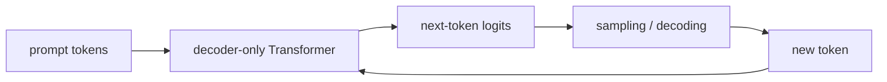

# GPT 계열 (GPT Family)

- Level: Advanced
- Prerequisites: [AI/LLMs/Pretraining.md](Pretraining.md), [AI/NLP/GPT.md](../NLP/GPT.md)
- Status: Draft
- Reviewed-by: -
- Depth: Deep-dive (자기완결)

---

## 개념 (Concept)

GPT 계열은 decoder-only Transformer를 causal language modeling 목표로 사전학습한 autoregressive 언어 모델 계열이다. 이전 토큰을 조건으로 다음 토큰을 예측하며, 생성·요약·코딩·대화 등으로 확장된다.

## 직관 (Intuition)

GPT는 문장을 왼쪽에서 오른쪽으로 이어 쓰는 거대한 자동완성기에서 출발한다. 하지만 충분한 규모와 데이터, 후속 튜닝을 거치면 단순 자동완성을 넘어 지시 수행과 추론처럼 보이는 행동을 보인다.

## 이론 (Theory)

핵심 목표는 다음 토큰 likelihood 최대화다.

$$\max_\theta \sum_t \log p_\theta(x_t\mid x_{<t})$$

Decoder-only 구조는 causal mask로 미래 토큰을 보지 못하게 한다. 규모가 커질수록 in-context learning, tool use, multi-step reasoning 같은 능력이 나타날 수 있지만, 이는 학습 목표·데이터·스케일·튜닝의 상호작용 결과다.

Instruction tuning과 preference optimization은 base GPT를 assistant-like model로 바꾼다.



### Base, instruction-tuned, aligned 모델

GPT 계열을 이해할 때는 같은 architecture라도 훈련 단계가 다르면 행동이 달라진다는 점이 중요하다.

| 단계 | 주된 목표 | 결과 행동 |
| --- | --- | --- |
| Pretraining | 다음 토큰 예측 | 문서 continuation과 일반 표현 학습 |
| SFT | 지시-응답 예시 모방 | assistant 형식과 task 수행 |
| Preference tuning | 선호되는 답변 쪽으로 최적화 | 거절, 안전, 스타일, 유용성 조정 |
| Tool/RAG 연결 | 외부 정보와 행동 사용 | 지식 갱신과 workflow 수행 |

base model은 "도움되는 assistant"로 훈련된 것이 아니라 텍스트 분포를 이어 쓰는 모델이다. 따라서 같은 prompt라도 base model에는 few-shot completion 형태가 잘 맞고, instruction-tuned model에는 명시적 지시가 잘 맞는다.

### Decoding이 품질을 바꾸는 방식

모델이 주는 것은 다음 토큰 분포이고, 최종 출력은 decoding 정책의 결과다.

| 설정 | 낮을 때 | 높을 때 |
| --- | --- | --- |
| Temperature | 보수적, 반복 가능 | 다양하지만 오류 위험 증가 |
| Top-p | 상위 후보에 집중 | 긴 꼬리 후보까지 허용 |
| Max tokens | 짧고 잘릴 수 있음 | 비용과 drift 증가 |
| Repetition penalty | 반복 억제 약함 | 문장이 부자연스러울 수 있음 |

정답성이 중요한 작업은 sampling 자유도를 낮추고, 창작이나 brainstorming은 다양성을 조금 열어 둔다. 하지만 decoding 조정은 사실성 자체를 보장하지 않으므로 retrieval, verification, tool call 같은 별도 장치가 필요하다.

### Context 활용의 한계

context window 안에 정보를 넣는 것과 모델이 그 정보를 정확히 쓰는 것은 다르다. 긴 prompt에서는 중간 정보가 덜 활용되는 위치 편향, 서로 충돌하는 지시, 오래된 대화의 stale state가 문제가 된다. 중요한 근거는 가까운 위치에 재제시하고, 답변 전에 필요한 정보를 구조화해 주는 편이 안정적이다.

## 구현 (Implementation)

```python
def causal_mask(seq_len):
    return [[j <= i for j in range(seq_len)] for i in range(seq_len)]
```

생성에서는 temperature, top-p, repetition penalty, stop sequence 같은 decoding 설정이 출력 품질을 크게 바꾼다.

```python
def greedy_next_token(logits):
    return max(range(len(logits)), key=lambda i: logits[i])
```

## 복잡도 (Complexity)

학습 비용은 모델 파라미터 수와 토큰 수에 비례해 커진다. 추론은 context 길이, batch, KV cache, decoding step 수에 좌우된다.

prefill 단계는 prompt 전체를 병렬 처리하지만 attention이 context 길이에 민감하고, decode 단계는 한 토큰씩 생성하므로 latency가 누적된다. serving에서는 TTFT(time to first token)와 tokens/sec를 분리해 측정한다.

## 응용 (Applications)

- 대화형 어시스턴트
- 코드 생성·리팩터링
- 문서 요약·질의응답
- agent와 tool-use 기반 workflow

## 흔한 오해 (Common Misunderstandings)

- GPT 계열이 항상 사실을 알고 말하는 것은 아니다. 다음 토큰 생성과 사실성은 다르다.
- 모델 크기만 키우면 모든 문제가 해결되지는 않는다. 데이터, 튜닝, 평가가 함께 중요하다.
- Base model과 instruction-tuned model은 행동 양식이 다르다.
- Context에 넣었다고 모든 정보를 균등하게 활용하는 것은 아니다.

## TMI

- Decoder-only 구조는 생성과 KV cache에 잘 맞아 LLM 추론에서 널리 쓰인다.
- System/developer/user 같은 역할 구분은 모델 자체 구조보다 사용 인터페이스의 대화 포맷에 가깝다.
- 같은 base model도 SFT와 preference tuning에 따라 성격이 크게 바뀐다.

## 연습 / 확인 문제 (Exercises)

- Causal mask가 필요한 이유를 설명하라.
- Base GPT와 instruction-tuned GPT의 차이를 정리하라.
- Temperature를 높이거나 낮출 때 출력이 어떻게 변하는지 예측하라.

## 이어서 읽기 (Reading Path)

- 이전: [사전학습](Pretraining.md), [GPT](../NLP/GPT.md)
- 다음: [인스트럭션 파인튜닝](Instruction-Tuning.md), [RLHF](RLHF.md)

## 참조 (References)

- [AI/LLMs/Pretraining.md](Pretraining.md)
- [AI/NLP/GPT.md](../NLP/GPT.md)
- [Reference/Papers.md](../../Reference/Papers.md)
