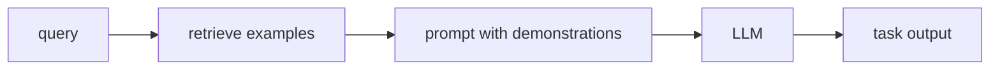

# In-context Learning과 Few-shot

- Level: Advanced
- Prerequisites: [AI/LLMs/Prompt-Engineering.md](Prompt-Engineering.md), [AI/LLMs/GPT-Family.md](GPT-Family.md)
- Status: Draft
- Reviewed-by: -
- Depth: Deep-dive (자기완결)

---

## 개념 (Concept)

In-context learning은 모델 파라미터를 업데이트하지 않고 prompt 안의 설명과 예시만으로 과제를 수행하는 능력이다. Few-shot prompting은 입력-출력 예시 몇 개를 context에 넣어 원하는 패턴을 유도한다.

## 직관 (Intuition)

모델에게 새 규칙을 외우게 다시 훈련시키는 대신, 시험지 맨 위에 예제를 몇 개 보여 주고 바로 풀게 하는 방식이다. 모델은 context 안의 패턴을 임시 작업 지시로 사용한다.

## 이론 (Theory)

Few-shot 예시는 task format, label mapping, reasoning style, output schema를 제공한다. 예시 순서, 다양성, label balance, separator가 결과에 영향을 줄 수 있다.

In-context learning의 원인은 완전히 하나로 설명되지 않는다. Pretraining 중 접한 패턴의 meta-learning, implicit Bayesian inference, induction head 등 여러 관점이 있다.



### 예시 선택 기준

few-shot 예시는 단순히 많을수록 좋은 것이 아니다. 좋은 예시는 target 입력과 유사하면서도 label과 형식의 다양성을 보여 주고, 모델이 따라야 할 판단 경계를 드러낸다.

| 기준 | 의미 |
| --- | --- |
| 유사성 | 현재 입력과 도메인·난이도가 비슷한가 |
| 다양성 | edge case와 label balance를 포함하는가 |
| 간결성 | context 예산을 낭비하지 않는가 |
| 형식 일관성 | 출력 schema와 구분자가 동일한가 |
| 정답 품질 | 예시 자체에 오류가 없는가 |

### Label bias와 verbalizer

분류 prompt에서는 label 이름이 결과를 바꿀 수 있다. 예를 들어 "positive/negative", "yes/no", "A/B"는 pretraining 빈도와 어감이 다르다. label 순서도 편향을 만들 수 있으므로 validation set에서 label verbalizer와 예시 순서를 바꿔 민감도를 확인한다.

### Dynamic few-shot

운영에서는 고정 예시보다 retrieval로 현재 입력과 가까운 예시를 골라 넣는 방식이 자주 쓰인다. 이때 retrieval 기준이 label을 누출하거나 너무 쉬운 near-duplicate만 가져오면 평가가 부풀 수 있다. 예시 저장소는 버전 관리하고, 어떤 예시가 prompt에 들어갔는지 로그로 남긴다.

## 구현 (Implementation)

```text
입력: 문장이 긍정인지 부정인지 분류하라.
예시:
문장: 음식이 훌륭했다. 답: 긍정
문장: 다시 가고 싶지 않다. 답: 부정
문장: 서비스가 친절했다. 답:
```

출력 형식이 중요하면 schema와 counterexample을 함께 넣는다.

```python
def format_few_shot(examples, query):
    body = "\n".join(f"입력: {x}\n답: {y}" for x, y in examples)
    return f"{body}\n입력: {query}\n답:"
```

## 복잡도 (Complexity)

Few-shot은 추가 학습 비용이 없지만 context token 비용이 늘어난다. 예시가 많을수록 추론 비용과 lost-in-context 위험이 커진다.

## 응용 (Applications)

- 빠른 task prototyping
- label이 적은 도메인 분류
- 출력 형식 유도
- 도메인 용어와 정책 예시 제공

## 흔한 오해 (Common Misunderstandings)

- Few-shot 예시는 지식 주입보다 패턴 유도에 가깝다.
- 예시가 많을수록 항상 좋아지지 않는다.
- 예시 순서와 label 단어가 결과를 바꿀 수 있다.
- In-context learning은 long-term memory가 아니다.

## TMI

- Zero-shot, one-shot, few-shot은 prompt 안 예시 수 기준이다.
- Retrieval로 유사 예시를 골라 넣는 dynamic few-shot이 자주 쓰인다.
- 잘못된 예시 하나가 전체 출력 형식을 망칠 수 있다.

## 연습 / 확인 문제 (Exercises)

- 같은 과제의 zero-shot, one-shot, few-shot prompt를 작성하라.
- 예시 순서가 결과에 영향을 줄 수 있는 이유를 설명하라.
- Dynamic few-shot retrieval 전략을 설계하라.

## 이어서 읽기 (Reading Path)

- 이전: [Prompt Engineering](Prompt-Engineering.md)
- 다음: [Chain-of-Thought](Chain-of-Thought.md), [RAG](RAG.md)

## 참조 (References)

- [AI/LLMs/Prompt-Engineering.md](Prompt-Engineering.md)
- [Reference/Papers.md](../../Reference/Papers.md)
