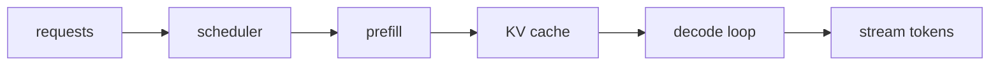

# LLM 추론 최적화 (Inference Optimization)

- Level: Advanced
- Prerequisites: [AI/LLMs/Transformer-Advanced.md](Transformer-Advanced.md), [AI/LLMs/Efficient-Attention.md](Efficient-Attention.md), [AI/MLOps/REST-Serving.md](../MLOps/REST-Serving.md)
- Status: Draft
- Reviewed-by: -
- Depth: Deep-dive (자기완결)

---

## 개념 (Concept)

LLM 추론 최적화는 latency, throughput, memory, cost를 줄이면서 품질을 유지하는 serving 기술 묶음이다. KV cache, batching, paged attention, quantization, speculative decoding, streaming, scheduling이 포함된다.

## 직관 (Intuition)

LLM 서빙은 한 번의 큰 계산이 아니라 사용자가 토큰을 기다리는 긴 조립 라인이다. prompt를 읽는 prefill 단계와 한 토큰씩 내는 decode 단계의 병목이 다르다.

## 이론 (Theory)

Prefill은 prompt 전체를 병렬 처리해 KV cache를 만든다. Decode는 새 토큰마다 이전 KV를 참조해 한 step씩 진행한다. Serving system은 여러 요청을 continuous batching으로 묶고, cache memory를 page처럼 관리해 fragmentation을 줄인다.

Speculative decoding은 작은 draft model이 후보 토큰을 제안하고 큰 model이 검증해 step 수를 줄인다. Quantization과 efficient attention은 memory bandwidth와 compute 병목을 줄인다.



### 핵심 지표

| 지표 | 의미 | 주된 병목 |
| --- | --- | --- |
| TTFT | 첫 토큰까지 시간 | prefill, queueing |
| TPOT | token당 decode 시간 | KV cache, memory bandwidth |
| Throughput | 초당 처리 token/request | batching, GPU utilization |
| Peak memory | 최대 동시 처리 한계 | weights, KV cache |
| Tail latency | p95/p99 지연 | scheduling, 긴 요청 |

사용자 경험은 평균 tokens/sec보다 TTFT와 tail latency에 더 민감한 경우가 많다. 반대로 offline batch generation은 총 throughput이 더 중요하다.

### Scheduling과 batching

continuous batching은 decode 중인 요청에 새 요청을 합류시켜 GPU 유휴 시간을 줄인다. 하지만 길이가 매우 다른 요청이 섞이면 짧은 요청이 긴 요청 뒤에서 지연될 수 있다. max batch tokens, max sequence length, priority queue, timeout 정책을 함께 조정해야 한다.

### Speculative decoding의 조건

draft model이 빠르고 target model과 충분히 비슷해야 이득이 난다. draft가 제안한 token이 자주 거절되면 검증 비용만 늘어난다. 따라서 acceptance rate, draft latency, target forward 절감량을 함께 측정한다.

## 구현 (Implementation)

```python
serving_metrics = {
    "time_to_first_token": "prefill latency",
    "tokens_per_second": "decode throughput",
    "max_concurrent_requests": "memory and scheduler limit",
}
```

최적화는 단일 요청 latency와 전체 throughput을 구분해 측정해야 한다.

```python
def kv_cache_capacity_bytes(layers, batch, length, kv_heads, head_dim, dtype_bytes):
    return 2 * layers * batch * length * kv_heads * head_dim * dtype_bytes
```

## 복잡도 (Complexity)

Memory는 model weights와 KV cache가 지배한다. KV cache는 batch, sequence length, layer, KV head 수에 비례한다. Decode는 batch가 커질수록 throughput은 늘지만 per-request latency가 증가할 수 있다.

## 응용 (Applications)

- 대화형 LLM API serving
- 긴 context 문서 QA
- agent workflow backend
- 비용 제한 환경의 batch generation

## 흔한 오해 (Common Misunderstandings)

- 최대 tokens/sec만 높다고 사용자 경험이 좋은 것은 아니다. TTFT도 중요하다.
- Batch를 키우면 throughput은 늘 수 있지만 latency가 나빠질 수 있다.
- Quantization은 memory를 줄이지만 모든 hardware에서 같은 속도 이득을 주지 않는다.
- 긴 context는 prompt 비용뿐 아니라 KV cache 비용도 늘린다.

## TMI

- Continuous batching은 decode 중인 요청 사이에 새 요청을 동적으로 끼워 넣는다.
- Prefix caching은 같은 system prompt나 문서 prefix를 재사용할 때 유리하다.
- Streaming 출력은 총 latency를 줄이지 않아도 체감 latency를 크게 낮춘다.

## 연습 / 확인 문제 (Exercises)

- Prefill과 decode 단계의 병목을 비교하라.
- KV cache 메모리가 context 길이에 따라 어떻게 증가하는지 계산하라.
- TTFT와 tokens/sec를 모두 포함한 serving benchmark를 설계하라.

## 이어서 읽기 (Reading Path)

- 이전: [Efficient Attention](Efficient-Attention.md), [Quantization](Quantization.md)
- 다음: [MLOps 모델 서빙](../MLOps/REST-Serving.md), [Model Monitoring](../MLOps/Model-Monitoring.md)

## 참조 (References)

- [AI/LLMs/Transformer-Advanced.md](Transformer-Advanced.md)
- [AI/MLOps/REST-Serving.md](../MLOps/REST-Serving.md)
- [Reference/Papers.md](../../Reference/Papers.md)
