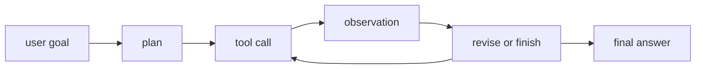

# LLM 에이전트와 Tool Use

- Level: Advanced
- Prerequisites: [AI/LLMs/RAG.md](RAG.md), [AI/LLMs/Chain-of-Thought.md](Chain-of-Thought.md), [AI/MLOps/Model-Monitoring.md](../MLOps/Model-Monitoring.md)
- Status: Draft
- Reviewed-by: -
- Depth: Deep-dive (자기완결)

---

## 개념 (Concept)

LLM agent는 언어 모델이 목표를 받아 계획하고, 도구를 호출하고, 관찰 결과를 반영해 다음 행동을 선택하는 시스템 패턴이다. Tool use는 검색, 코드 실행, DB 조회, API 호출 같은 외부 행동을 모델 출력과 연결한다.

## 직관 (Intuition)

LLM 혼자 머릿속으로 답하는 대신 계산기, 검색창, 파일 시스템, 업무 API를 쓸 수 있게 해 준다. 좋은 agent는 모든 일을 한 번에 맞히려 하지 않고 관찰과 수정의 루프를 돈다.

## 이론 (Theory)

Agent loop는 보통 plan → act → observe → revise 구조를 갖는다. Tool schema는 입력 타입, 권한, 실패 모드, side effect를 명확히 해야 한다. Memory는 conversation context, retrieved knowledge, long-term state로 나눌 수 있다.

위험은 hallucinated tool call, 권한 오남용, prompt injection, 무한 루프, 비용 폭증, 잘못된 외부 쓰기다. 따라서 sandbox, confirmation, budget, audit log, deterministic validator가 필요하다.



### Tool 위험 등급

| 도구 유형 | 예 | 기본 통제 |
| --- | --- | --- |
| Read-only | 검색, 문서 조회 | 출처 기록, prompt injection 필터 |
| Deterministic compute | 계산기, 코드 formatter | 입력 검증, timeout |
| External write | DB 수정, 이메일 발송 | 사용자 확인, idempotency, rollback |
| Payment/permission | 결제, 권한 변경 | 강한 인증, 승인 workflow |

agent 설계에서는 모델의 "판단"과 시스템의 "권한"을 분리해야 한다. 모델이 도구 호출을 제안하더라도 실제 실행은 schema validation, policy check, rate limit을 통과해야 한다.

### State와 memory

대화 context는 단기 상태이고, vector store나 profile DB는 장기 memory다. 장기 memory는 유용하지만 개인정보, stale preference, 잘못 저장된 사실을 계속 재사용할 수 있다. 저장 전 동의와 scope, 만료, 삭제 경로를 설계해야 한다.

### Agent 평가

agent는 최종 답만 채점하면 부족하다. 올바른 도구를 호출했는지, 불필요한 호출을 줄였는지, 비용 budget을 지켰는지, 실패 후 복구했는지, write action 전에 확인했는지를 함께 평가한다. 테스트에는 정상 경로뿐 아니라 tool failure, 느린 API, 악성 문서, 부분 성공 사례를 포함한다.

## 구현 (Implementation)

```python
tool = {
    "name": "search_docs",
    "input_schema": {"query": "string"},
    "side_effect": "read_only",
}
```

쓰기 작업은 가능한 한 명시적 확인과 rollback 전략을 둔다.

```python
def can_execute(tool, user_confirmed):
    if tool["side_effect"] == "read_only":
        return True
    return user_confirmed
```

## 복잡도 (Complexity)

Agent 비용은 LLM 호출 수, tool latency, retry, context size에 따라 커진다. 긴 task는 state 관리와 오류 누적이 병목이 된다.

## 응용 (Applications)

- 코드 수정·테스트 자동화
- 리서치와 문서 질의응답
- 데이터 분석 workflow
- 업무 API orchestration

## 흔한 오해 (Common Misunderstandings)

- Agent가 곧 자율성을 무제한 부여한다는 뜻은 아니다.
- Tool을 많이 주면 항상 성능이 좋아지지 않는다.
- Read-only tool과 write tool의 위험도는 완전히 다르다.
- Memory가 있으면 개인정보와 stale state 관리가 필요하다.

## TMI

- ReAct 패턴은 reasoning과 action을 번갈아 사용하는 대표적 agent prompting이다.
- Function calling은 tool input을 구조화해 parsing 오류를 줄인다.
- Agent 평가는 최종 답뿐 아니라 중간 행동의 안전성과 비용도 봐야 한다.

## 연습 / 확인 문제 (Exercises)

- Read-only 검색 agent와 결제 실행 agent의 안전 요구를 비교하라.
- Tool schema에 포함해야 할 필드를 설계하라.
- Prompt injection이 tool use agent에서 위험한 이유를 설명하라.

## 이어서 읽기 (Reading Path)

- 이전: [RAG](RAG.md), [Chain-of-Thought](Chain-of-Thought.md)
- 다음: [Inference Optimization](Inference-Optimization.md), [AI Safety](../AI-Safety/Alignment-Overview.md)

## 참조 (References)

- [AI/LLMs/RAG.md](RAG.md)
- [AI/MLOps/Model-Monitoring.md](../MLOps/Model-Monitoring.md)
- [Reference/Papers.md](../../Reference/Papers.md)
