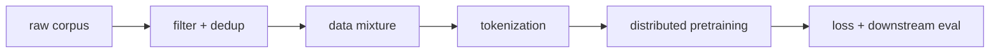

# 사전학습 (Pretraining)

- Level: Advanced
- Prerequisites: [AI/NLP/Transformer-NLP.md](../NLP/Transformer-NLP.md), [AI/NLP/Language-Model-Basics.md](../NLP/Language-Model-Basics.md)
- Status: Draft
- Reviewed-by: -
- Depth: Deep-dive (자기완결)

---

## 개념 (Concept)

pretraining은 라벨 없는 대규모 텍스트에서 self-supervised 목표로 언어 모델을 미리 학습하는 단계다. 다음 토큰 예측 같은 단순한 목표만으로 광범위한 언어·지식 표현을 얻고, 이후 fine-tuning이나 prompting으로 다양한 과제에 적응시킨다.

## 직관 (Intuition)

"다음 단어 맞히기"를 충분히 잘하려면 문법, 사실, 추론의 단서까지 어느 정도 알아야 한다. 그래서 거대한 코퍼스에서 이 게임을 반복하면, 명시적 라벨 없이도 쓸모 있는 일반 표현이 생긴다. 사전학습은 "한 번 비싸게 학습해 두고 여러 과제에 싸게 재사용"하는 전략이다.

## 이론 (Theory)

대표 self-supervised 목표:

- **causal LM(다음 토큰 예측)**: $\max_\theta \sum_t \log p_\theta(x_t \mid x_{<t})$ — GPT 계열.
- **masked LM**: 일부 토큰을 가리고 복원 — BERT 계열, 양방향 문맥.
- **span/denoising**: 구간을 가리거나 손상시켜 복원 — T5 계열.

성능은 모델 크기 $N$, 데이터 $D$, 계산 $C$에 대해 매끄럽게 개선되는 경향이 있고, 이를 **scaling law**라 부른다. 대략 손실 $L$이 $N, D$의 거듭제곱 꼴로 줄어들며, 주어진 계산 예산에서 $N$과 $D$를 함께 키우는 것이 효율적이라는 결과(compute-optimal)가 알려져 있다. 데이터 품질·중복 제거·혼합 비율도 최종 성능에 크게 작용한다.



### 데이터가 모델을 만든다

pretraining 품질은 architecture 못지않게 데이터 파이프라인에 좌우된다. 웹 텍스트, 코드, 논문, 대화, 다국어 데이터의 혼합 비율은 모델의 능력과 편향을 결정한다. deduplication은 memorization과 benchmark contamination을 줄이고, quality filtering은 토큰 예산을 더 유익한 샘플에 쓰게 한다.

| 데이터 이슈 | 위험 | 확인 방법 |
| --- | --- | --- |
| 중복 | 암기와 평가 과대 | near-duplicate 제거 |
| 벤치마크 오염 | 실제 일반화 착시 | test set overlap audit |
| 도메인 편중 | 특정 스타일만 강함 | mixture별 eval |
| PII/저작권/유해물 | 안전·법적 리스크 | 필터링과 정책 검토 |

### 안정적 대규모 학습

LLM pretraining은 긴 시간 동안 작은 불안정성이 누적된다. loss spike, gradient overflow, 데이터 shard 오류, tokenizer mismatch, checkpoint 손상이 모두 큰 비용으로 이어진다. 그래서 학습 전 작은 scale에서 loss curve와 throughput을 재현하고, 학습 중에는 gradient norm, learning rate, token throughput, validation loss, sample 품질을 함께 모니터링한다.

### 평가와 오염 통제

pretraining loss가 내려가는 것과 원하는 task 성능이 오르는 것은 관련 있지만 동일하지 않다. holdout corpus perplexity, downstream benchmark, human preference, safety eval을 분리해 보아야 한다. 특히 공개 benchmark가 학습 데이터에 섞이면 모델이 실제로 푼 것이 아니라 본 것을 재생할 수 있다.

## 구현 (Implementation)

```python
# causal LM 사전학습의 핵심 손실 (개념)
def lm_loss(model, token_ids):
    logits = model(token_ids[:, :-1])          # 입력: 마지막 직전까지
    targets = token_ids[:, 1:]                 # 정답: 한 칸 shift
    return cross_entropy(logits, targets)      # 다음 토큰 예측
```

## 복잡도 (Complexity)

사전학습 비용은 대략 `C ≈ 6 N D`(파라미터 수 × 토큰 수)로 추정되며, 현대 LLM에서 가장 비싼 단계다. 분산 학습(data/tensor/pipeline parallel), mixed precision, gradient checkpointing이 필수다. 반면 한 번 학습한 모델은 수많은 다운스트림에서 재사용되어 단위 과제당 비용은 낮다.

## 응용 (Applications)

- 범용 LLM의 기반(GPT, BERT, T5 등)
- 코드·다국어·멀티모달 사전학습
- 도메인 적응을 위한 continued pretraining
- 임베딩·검색 모델의 표현 학습

## 흔한 오해 (Common Misunderstandings)

- 사전학습이 끝난 모델이 곧바로 "지시를 잘 따르는" 것은 아니다. 그건 instruction tuning 단계의 몫이다.
- 데이터를 무작정 늘린다고 좋아지지 않는다. 품질·중복·오염(test 누출)이 결정적이다.
- scaling law는 경향적 예측이지 보장이 아니며, 도메인·목표가 바뀌면 달라진다.
- masked LM과 causal LM은 용도가 달라 우열로 단정할 수 없다.

## TMI

- "compute-optimal" 논쟁(이른바 Chinchilla 결과)은 같은 계산 예산이면 모델만 키우기보다 데이터도 함께 키워야 한다는 점을 부각했다.
- 학습 데이터 오염(benchmark 누출)은 평가 신뢰성을 해치는 실무의 큰 골칫거리다.
- 사전학습 손실 곡선은 종종 놀랄 만큼 매끄러운 거듭제곱 직선(log-log)으로 나타난다.

## 연습 / 확인 문제 (Exercises)

- causal LM과 masked LM 목표가 양방향 문맥 활용에서 어떻게 다른지 설명하라.
- $C \approx 6ND$ 추정으로 파라미터·토큰을 2배씩 늘릴 때 계산량 변화를 구하라.
- 데이터 중복 제거가 사전학습에 중요한 이유를 일반화 관점에서 논하라.

## 이어서 읽기 (Reading Path)

- 이전: [Transformer 심화](Transformer-Advanced.md)
- 다음: [GPT 계열](GPT-Family.md), [BERT 계열](BERT-Family.md), [Encoder-Decoder](Encoder-Decoder.md), [인스트럭션 파인튜닝](Instruction-Tuning.md)

## 참조 (References)

- [AI/NLP/Language-Model-Basics.md](../NLP/Language-Model-Basics.md)
- [AI/LLMs/Instruction-Tuning.md](Instruction-Tuning.md)
- [Reference/Papers.md](../../Reference/Papers.md)
