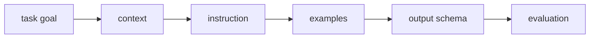

# 프롬프트 엔지니어링 (Prompt Engineering)

- Level: Intermediate
- Prerequisites: [AI/NLP/GPT.md](../NLP/GPT.md), [AI/NLP/Language-Model-Basics.md](../NLP/Language-Model-Basics.md)
- Status: Draft
- Reviewed-by: -
- Depth: Deep-dive (자기완결)

---

## 개념 (Concept)

prompt engineering은 모델 가중치를 바꾸지 않고, 입력 텍스트(prompt)의 구성만으로 LLM의 출력을 원하는 방향으로 유도하는 방법이다. 지시 방식, 예시 제공(few-shot), 추론 유도(chain-of-thought) 등이 포함된다.

## 직관 (Intuition)

사전학습·정렬된 LLM은 이미 많은 능력을 품고 있지만, 어떻게 묻느냐에 따라 그 능력이 발현되는 정도가 달라진다. 좋은 프롬프트는 모델에게 "맥락, 역할, 출력 형식, 풀이 과정"을 분명히 알려 주어 잠재된 능력을 끌어낸다. 학습이 필요 없어 가장 빠르고 싼 적응 수단이다.

## 이론 (Theory)

- **zero-shot**: 지시만 제공. $p_\theta(y \mid \text{instruction}, x)$.
- **few-shot / in-context learning**: 프롬프트에 입력–출력 예시 $k$개를 넣어 패턴을 보여 준다. 가중치 갱신 없이 문맥만으로 과제를 학습하는 것처럼 동작한다.
- **chain-of-thought(CoT)**: "단계별로 생각하자"처럼 중간 추론을 쓰게 유도하면, 다단계 추론 과제 정확도가 오른다.
- **구조화 기법**: 역할 지정, 출력 스키마(JSON) 강제, 구분자 사용, 자기검증(self-consistency: 여러 추론을 샘플링해 다수결).

이 방법들은 모델의 조건부 분포를 좋은 영역으로 옮기는 "조건화"로 볼 수 있다. 능력 자체를 늘리지는 못하지만, 같은 모델에서 더 나은 출력을 끌어낸다.



### Prompt의 구성 요소

| 요소 | 역할 | 실패 징후 |
| --- | --- | --- |
| 역할과 범위 | 모델의 관점과 책임 제한 | 과도한 추측, 스타일 불일치 |
| 입력 맥락 | 필요한 근거 제공 | hallucination, 오래된 정보 사용 |
| 지시 | 해야 할 작업 정의 | 요구사항 누락 |
| 예시 | 형식과 판단 기준 제시 | 예시 편향, label mapping 혼동 |
| 출력 스키마 | 후처리 가능성 확보 | JSON 깨짐, 필드 누락 |
| 금지 조건 | 하지 말아야 할 행동 지정 | 정책 위반, 보안 취약점 |

좋은 prompt는 길기만 한 prompt가 아니라, 모델이 다음 행동을 결정하는 데 필요한 정보를 충돌 없이 제공하는 prompt다. 서로 다른 우선순위의 지시가 섞이면 모델은 표면적으로 가까운 문장을 따르거나 평균적인 답을 내기 쉽다.

### 평가 가능한 prompt 만들기

프롬프트는 코드처럼 회귀 테스트가 필요하다. 대표 입력 세트, 기대 출력 조건, 실패 유형을 정해 두고 모델 버전·temperature·retrieval 결과가 바뀔 때 비교한다. "좋아 보인다"는 감각 평가만으로는 작은 문구 변경이 정확도나 안전성을 얼마나 바꿨는지 알기 어렵다.

### Prompt injection 방어

외부 문서, 웹페이지, 사용자 업로드 파일을 prompt에 넣는 순간 그 텍스트가 지시처럼 작동할 수 있다. 방어의 기본은 외부 텍스트를 명확히 데이터로 구분하고, 시스템 지시·도구 권한·비밀 값을 모델 출력으로 노출하지 않으며, 도구 실행 전 검증 단계를 두는 것이다.

## 구현 (Implementation)

```text
역할: 너는 꼼꼼한 수학 조교다.
지시: 다음 문제를 단계별로 풀고, 마지막 줄에 "정답:" 뒤에 답만 적어라.

[예시]
문제: 3 + 4 × 2 = ?
풀이: 곱셈 먼저 → 4 × 2 = 8 → 3 + 8 = 11
정답: 11

[실제]
문제: (5 + 1) × 3 = ?
풀이:
```

```text
출력은 JSON만 허용한다.
필수 필드: "label", "confidence", "evidence".
입력에 없는 사실은 evidence에 쓰지 말라.
```

## 복잡도 (Complexity)

추가 학습 비용이 없다는 것이 최대 장점이다. 비용은 추론 시 토큰 수에 비례하며, few-shot 예시와 CoT는 프롬프트·출력 길이를 늘려 지연·비용을 키운다. self-consistency처럼 여러 번 샘플링하는 기법은 호출 수만큼 비용이 곱해진다.

## 응용 (Applications)

- 빠른 프로토타이핑과 과제 적응(학습 불필요)
- 데이터·추출·분류·요약의 형식 제어
- 복잡 추론(수학·코딩)의 정확도 향상
- 도구 호출·에이전트 워크플로의 행동 지시

## 흔한 오해 (Common Misunderstandings)

- 프롬프트가 모델의 지식·능력 한계를 넘게 해 주지는 않는다. 발현을 도울 뿐이다.
- CoT가 항상 도움이 되지는 않으며, 작은 모델·단순 과제에선 효과가 작거나 역효과일 수 있다.
- few-shot 예시는 형식뿐 아니라 순서·분포에도 민감하다.
- 프롬프트는 모델·버전이 바뀌면 깨지기 쉬워, 안정 운영에는 평가가 필요하다.

## TMI

- "Let's think step by step" 한 줄이 추론 정확도를 끌어올린다는 보고가 CoT 연구를 촉발했다.
- few-shot은 가중치를 바꾸지 않는데도 "학습"처럼 보여 in-context learning이라 불리며, 그 메커니즘은 활발한 연구 주제다.
- prompt injection은 외부 입력이 시스템 지시를 덮어쓰는 보안 문제로, 에이전트 시대에 특히 중요하다.

## 연습 / 확인 문제 (Exercises)

- 같은 과제를 zero-shot과 few-shot으로 작성해 출력 차이를 비교하라.
- CoT가 도움이 되는 과제와 거의 도움이 안 되는 과제를 각각 들어라.
- 출력 형식을 JSON으로 강제하는 프롬프트를 설계하고 실패 사례를 예측하라.

## 이어서 읽기 (Reading Path)

- 이전: [인스트럭션 파인튜닝](Instruction-Tuning.md)
- 다음: [RAG](RAG.md), [In-context Learning](In-Context-Learning.md)

## 참조 (References)

- [AI/NLP/GPT.md](../NLP/GPT.md)
- [AI/LLMs/RAG.md](RAG.md)
- [Reference/Papers.md](../../Reference/Papers.md)
