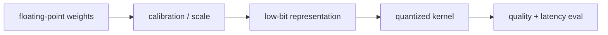

# 양자화 (Quantization)

- Level: Advanced
- Prerequisites: [AI/MLOps/Model-Optimization.md](../MLOps/Model-Optimization.md), [AI/LLMs/Transformer-Advanced.md](Transformer-Advanced.md)
- Status: Draft
- Reviewed-by: -
- Depth: Deep-dive (자기완결)

---

## 개념 (Concept)

양자화는 모델 가중치나 activation을 낮은 정밀도 숫자로 표현해 메모리 사용량과 연산 비용을 줄이는 최적화다. LLM에서는 weight-only quantization, activation quantization, KV cache quantization 등이 쓰인다.

## 직관 (Intuition)

모든 숫자를 아주 정밀한 자로 재지 않고 조금 거친 눈금으로 재면 저장 공간과 계산 비용이 줄어든다. 대신 너무 거칠면 모델 출력이 흔들린다.

## 이론 (Theory)

정수 양자화는 실수 $x$를 scale과 zero point로 discrete value에 매핑한다. Per-tensor보다 per-channel/group quantization이 품질을 더 잘 보존할 수 있다.

Post-training quantization은 학습 후 바로 적용하고, quantization-aware training은 양자화 오차를 학습 중 반영한다. LLM에서는 outlier channel과 activation range가 품질 저하의 주요 원인이다.



### 기본 매핑

대칭 양자화에서는 보통

$$q=\operatorname{clip}(\operatorname{round}(x/s), q_{\min}, q_{\max}),\qquad \hat x=sq$$

처럼 scale $s$로 실수를 정수 격자에 올리고, 계산 시 필요하면 dequantize한다. group-wise quantization은 일정 channel 묶음마다 scale을 따로 두어 outlier 영향을 줄인다.

### 무엇을 양자화하는가

| 대상 | 메모리 이득 | 위험 |
| --- | --- | --- |
| Weight-only | 크다 | activation 병목은 남음 |
| Weight + activation | 더 큼 | calibration과 kernel 난이도 증가 |
| KV cache | 긴 context에서 큼 | attention 품질 저하 가능 |
| Optimizer state | 학습 메모리 감소 | 훈련 안정성 영향 |

LLM serving에서는 weight memory보다 KV cache가 병목인 상황도 많다. 긴 context와 큰 batch에서는 KV cache quantization이 throughput을 좌우할 수 있다.

### 평가 프로토콜

양자화 후에는 perplexity만 보지 말고 downstream task, 장문 문맥, 수학·코딩, 안전 거절, format following을 함께 본다. 작은 수치 차이가 특정 도메인에서는 큰 품질 저하로 나타날 수 있고, calibration set이 배포 입력과 다르면 error가 커진다.

## 구현 (Implementation)

```python
def quantize_symmetric(x, scale):
    q = round(x / scale)
    return max(-127, min(127, q))
```

실제 구현은 calibration data, group size, clipping, dequantization kernel을 함께 관리한다.

```python
def weight_memory_gib(params, bits):
    return params * bits / 8 / (1024 ** 3)
```

## 복잡도 (Complexity)

가중치 메모리는 bit 수에 거의 비례해 줄어든다. 하지만 실제 latency 개선은 hardware kernel, batch size, memory bandwidth 병목 여부에 따라 달라진다.

## 응용 (Applications)

- 단일 GPU LLM serving
- edge/on-device inference
- KV cache 메모리 절감
- PEFT와 결합한 QLoRA

## 흔한 오해 (Common Misunderstandings)

- 모델을 4-bit로 줄이면 항상 4배 빨라지는 것은 아니다.
- Perplexity 변화가 모든 downstream 품질 변화를 설명하지 않는다.
- 작은 모델이 큰 모델보다 양자화에 더 민감할 수 있다.
- Quantization과 pruning, distillation은 서로 다른 최적화다.

## TMI

- Weight-only quantization은 activation을 고정밀로 둬 품질을 보존하는 경우가 많다.
- KV cache quantization은 긴 context serving에서 메모리 병목을 줄인다.
- Calibration set이 도메인을 대표하지 않으면 quantization error가 커질 수 있다.

## 연습 / 확인 문제 (Exercises)

- 16-bit와 4-bit 가중치의 메모리 차이를 계산하라.
- Per-channel quantization이 유리한 이유를 설명하라.
- Quantization 후 평가해야 할 metric을 설계하라.

## 이어서 읽기 (Reading Path)

- 이전: [모델 최적화](../MLOps/Model-Optimization.md)
- 다음: [Distillation](Distillation.md), [Inference Optimization](Inference-Optimization.md)

## 참조 (References)

- [AI/MLOps/Model-Optimization.md](../MLOps/Model-Optimization.md)
- [Reference/Papers.md](../../Reference/Papers.md)
