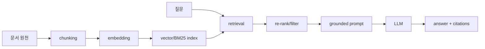

# 검색 증강 생성 (Retrieval-Augmented Generation)

- Level: Advanced
- Prerequisites: [AI/LLMs/Prompt-Engineering.md](Prompt-Engineering.md), [AI/NLP/Word-Embeddings.md](../NLP/Word-Embeddings.md)
- Status: Draft
- Reviewed-by: -
- Depth: Deep-dive (자기완결)

---

## 개념 (Concept)

RAG는 외부 지식베이스에서 관련 문서를 검색(retrieval)하고 그 정보를 조건으로 답을 생성하는 방법이다. 이 문서는 검색 결과를 LLM 프롬프트에 넣는 구성을 중심으로 설명한다. 검색 대상이 갱신되어 있다면 모델 파라미터를 바꾸지 않고도 최신·도메인 정보를 활용할 수 있다.

[Lewis et al.의 원 논문](https://arxiv.org/abs/2005.11401)은 dense retriever와 seq2seq 생성기를 결합해 미세조정하며, 생성 문장 전체에 같은 문서를 쓰는 방식과 토큰마다 다른 문서를 사용할 수 있는 방식을 비교한다. 아래의 프롬프트 조립 예제가 원 논문의 학습 절차까지 구현하는 것은 아니다.

## 직관 (Intuition)

LLM의 지식은 학습 시점에 고정되고, 모든 사실을 파라미터에 담기에는 한계가 있다. RAG는 "닫힌 책 시험"을 "열린 책 시험"으로 바꾼다. 질문이 오면 관련 자료를 찾아 같이 보여 주고, 모델은 그 자료를 읽고 답한다. 덕분에 재학습 없이 지식을 갱신하고, 출처를 제시할 수 있다.



## 이론 (Theory)

파이프라인은 보통 indexing → retrieval → generation이다.

1. **indexing**: 문서를 청크로 나눠 임베딩 $e(d)$로 바꾸고 vector store에 저장.
2. **retrieval**: 질의 $q$를 같은 공간으로 임베딩해 유사도가 큰 상위 $k$개 청크를 찾는다. 코사인 유사도

$$\operatorname{sim}(q,d)=\frac{e(q)\cdot e(d)}{\lVert e(q)\rVert\,\lVert e(d)\rVert}$$

밀집 검색(dense)과 희소 검색(BM25)을 합친 hybrid, 그리고 재정렬(re-ranking)을 흔히 쓴다.
3. **generation**: 검색된 청크를 context로 넣어 $p_\theta(y \mid q, \text{retrieved})$로 답을 생성한다.

핵심 트레이드오프는 검색 품질(정밀도/재현율), context 길이 한도, 근거 충실도(faithfulness)다.

### 실패 모드

RAG 실패는 보통 세 지점에서 갈린다.

| 단계 | 실패 | 증상 |
|---|---|---|
| indexing | 청크 경계가 잘못됨 | 답에 필요한 문맥이 둘로 찢김 |
| retrieval | 관련 문서를 못 찾음 | 모델이 일반 지식으로 추측 |
| generation | 근거를 무시하거나 과장 | 출처는 있어도 답이 근거와 어긋남 |

## 구현 (Implementation)

### 서비스 연결 골격

다음 코드는 구성 요소 사이의 흐름을 보여 주는 골격이다. `embed`, `store.search`, `llm.generate` 구현과 모델·인덱스 설정이 별도로 필요하므로 그대로 호출할 수 없다.

```python
def rag_answer(query, store, llm, k=5):
    q_emb = embed(query)
    chunks = store.search(q_emb, k=k)          # 상위 k개 근거 검색
    context = "\n\n".join(c.text for c in chunks)
    prompt = f"근거:\n{context}\n\n질문: {query}\n근거에 기반해 답하라."
    return llm.generate(prompt), chunks         # 답 + 출처
```

간단한 grounded prompt에는 "근거에 없으면 모른다고 말하라"와 "각 문장에 근거 id를 붙이라" 같은 제약을 넣는다. 이것이 환각을 없애지는 않지만, 평가와 디버깅을 쉬워지게 한다.

```text
규칙:
1. 아래 근거 안에서만 답한다.
2. 근거가 부족하면 "근거 부족"이라고 말한다.
3. 핵심 주장 뒤에 [source_id]를 붙인다.
```

### 외부 의존성 없는 근거 조합 실습

다음 Python 3 예제는 완결된 실행 단위다. 공백 단어의 겹침으로 문서를 정렬하고 출처 ID를 붙인다. 임베딩·BM25·LLM 생성은 구현하지 않으며, 검색과 출처 전달 경계를 확인하는 데 쓴다. 예제 문장은 설명용으로 직접 구성했다.

```python
DOCUMENTS = {
    "cache-ttl": "캐시 만료 시간은 TTL로 설정한다.",
    "cache-miss": "캐시 미스는 원본 저장소를 조회한다.",
    "batch": "배치 작업은 여러 항목을 묶어 처리한다.",
}


def retrieve(query, k=2):
    if k < 1:
        raise ValueError("k must be positive")
    query_terms = set(query.split())
    ranked = []
    for source_id, text in DOCUMENTS.items():
        score = len(query_terms & set(text.split()))
        if score > 0:
            ranked.append((score, source_id, text))
    ranked.sort(key=lambda item: (-item[0], item[1]))
    return ranked[:k]


def compose_context(query, k=2):
    hits = retrieve(query, k)
    if not hits:
        return "검색된 근거 없음"
    return "\n".join(f"[{source_id}] {text}" for _, source_id, text in hits)


assert [hit[1] for hit in retrieve("캐시 만료")] == ["cache-ttl", "cache-miss"]
assert len(retrieve("캐시 만료", k=1)) == 1
assert compose_context("암호화") == "검색된 근거 없음"
assert compose_context("") == "검색된 근거 없음"
print(compose_context("캐시 만료"))
print(compose_context("암호화"))
```

예상 출력:

```text
[cache-ttl] 캐시 만료 시간은 TTL로 설정한다.
[cache-miss] 캐시 미스는 원본 저장소를 조회한다.
검색된 근거 없음
```

첫 문서는 두 단어, 둘째 문서는 `캐시` 한 단어만 겹친다. 따라서 둘째 결과는 질의에 직접 답하지 않아도 검색된다. `캐시의 만료시간`처럼 조사·띄어쓰기가 달라져도 이 검색기는 실패한다. 또한 `암호화` 결과가 없다는 것은 검색 결과에 대한 관찰이지, 전체 지식에 답이 없다는 판정이 아니다. 실제 생성 실습을 붙일 때는 정답 문서가 top-k에 포함되는지와 답의 각 주장이 해당 문서에 의해 뒷받침되는지를 별도로 평가한다.

## 복잡도 (Complexity)

벡터 $N$개, 차원 $d$에 대한 전수 거리 계산은 질의당 $O(Nd)$다. [HNSW 원 논문](https://arxiv.org/abs/1603.09320)은 계층 그래프를 통한 로그형 탐색 규모 증가를 설명하지만, 모든 데이터와 recall 설정에 대해 질의 시간을 $O(\log N)$으로 보장한다고 해석해서는 안 된다. 인덱스 구축 비용도 임베딩 계산, 차원, 그래프 연결 수, 탐색 설정에 좌우된다. 실제 비교에서는 동일한 recall에서 지연과 메모리를 함께 측정한다.

위 실습은 매번 문서를 토큰화하고 전체 후보를 정렬한다. 문서 길이 상한을 $L$, 질의 길이를 $Q$라 하면 평균적인 해시 집합 연산을 가정할 때 $O(Q+NL+N\log N)$ 시간이다. 운영용 벡터 검색 성능을 대표하지 않는다. 서비스 지연에는 질의 임베딩, 검색, 필터·재정렬, 프롬프트 조립, 생성이 포함된다.

계산 예제: 입력과 출력을 합친 한도를 8,192토큰, 시스템 지시·질의를 1,000토큰, 출력 예약을 1,024토큰으로 가정하면 근거 예산은 $8192-1000-1024=6168$토큰이다. 각 청크가 출처 표기·구분자까지 384토큰이면 최대 16개($6144$토큰)가 들어간다. top-20을 검색해 모두 넣으면 $7680$토큰으로 예산을 넘는다. 재정렬 후 top-5만 넣으면 $1920$토큰이다. 이는 가상 예산 계산이며 특정 모델의 한도나 재정렬의 품질 향상을 보장하지 않는다. 실제 토크나이저로 길이를 계산하고, 제외된 청크에 정답 근거가 있는지도 확인해야 한다.

## 응용 (Applications)

- 사내 문서·매뉴얼 기반 질의응답 봇
- 최신 정보가 필요한 검색형 어시스턴트
- 출처·인용이 중요한 법률·의료·연구 보조
- 코드베이스 검색·도움말 시스템

## 흔한 오해 (Common Misunderstandings)

- RAG가 환각(hallucination)을 "없애지"는 않는다. 근거가 나빠도 그럴듯하게 지어낼 수 있어 줄일 뿐이다.
- 더 많은 문서를 넣는다고 좋아지지 않는다. 잡음 증가와 context 한도로 오히려 나빠질 수 있다.
- 임베딩 검색만으로 충분하지 않을 때가 많아 hybrid·re-ranking이 필요하다.
- 청크 크기·경계 설정이 성능에 크게 작용하는데 자주 간과된다.

## TMI

- RAG는 2020년 논문에서 비모수적(외부 검색) 지식과 모수적(모델 내부) 지식을 결합하자는 아이디어로 정식화됐다.
- "lost in the middle" 현상: [Liu et al.](https://arxiv.org/abs/2307.03172)은 다중 문서 질의응답과 key-value 검색 실험에서 관련 정보가 긴 입력의 중간에 있을 때 성능이 떨어지는 경우를 보고했다. 모든 모델에 고정된 법칙으로 적용하지 말고 사용할 모델·질의로 위치를 바꿔 비교한다.
- 검색·생성 사이 재정렬(cross-encoder re-ranker)은 후보별 추가 추론 비용을 만든다. 정밀도가 개선되는지는 해당 질의와 문서 집합에서 확인해야 한다.

## 연습 / 확인 문제 (Exercises)

- 청크 크기를 키우거나 줄일 때 retrieval 정밀도와 생성 품질에 어떤 영향이 있는지 논하라.
- dense 검색과 BM25를 결합하는 hybrid가 유리한 상황을 예로 들어라.
- RAG에서 환각이 여전히 발생할 수 있는 경로를 두 가지 제시하라.
- 근거 예산 6,168토큰에 384토큰 청크를 17개 넣으면 얼마나 초과하는가? 힌트: 출처 표기는 청크 길이에 이미 포함되어 있으며, 초과량은 360토큰이다.
- 실행 예제에서 `캐시의 만료시간` 질의가 실패하는 이유를 설명하고, 단어 정규화만으로 해결되지 않는 동의어 질의를 하나 만들어라.

## 이어서 읽기 (Reading Path)

- 이전: [프롬프트 엔지니어링](Prompt-Engineering.md)
- 다음: [LLM 에이전트와 Tool Use](LLM-Agents.md), [AI/NLP/Word-Embeddings.md](../NLP/Word-Embeddings.md)

## 참조 (References)

- [Lewis et al., Retrieval-Augmented Generation for Knowledge-Intensive NLP Tasks (2020)](https://arxiv.org/abs/2005.11401) — 개념 절의 모수적·비모수적 기억 결합 및 원 논문의 두 생성 방식. 확인 범위: 초록.
- [Liu et al., Lost in the Middle: How Language Models Use Long Contexts (2023)](https://arxiv.org/abs/2307.03172) — TMI 절의 근거 위치에 따른 성능 변화와 실험 과제. 확인 범위: 초록.
- [Malkov and Yashunin, Efficient and robust approximate nearest neighbor search using HNSW (2016)](https://arxiv.org/abs/1603.09320) — 복잡도 절의 계층 그래프와 로그형 규모 증가 설명. 확인 범위: 초록; 최악 시간 보장 증명은 확인하지 않음.
- [AI/NLP/Word-Embeddings.md](../NLP/Word-Embeddings.md)
- [AI/LLMs/Prompt-Engineering.md](Prompt-Engineering.md)
- [Reference/Papers.md](../../Reference/Papers.md)

## 재작성 메모 (Rewrite Notes)

- 재사용할 재료: 파이프라인 그림, 단계별 실패 표, 출처 ID를 보존하는 독립 실행 검색 예제, 토큰 예산 계산.
- 보충할 내용: 정답 근거가 표시된 질의 집합, 청크 경계·hybrid·재정렬 비교 결과, 사용할 모델의 실제 토크나이저와 생성 예제, 인용의 근거 충실도 평가. 위 검색 예제는 의미 검색이나 LLM의 답변 품질을 검증하지 않는다.
- 확인 상태: 2026-09-11에 위 원 논문 3개의 초록에 접근해 대응 주장을 확인. 독립 실행 예제의 assert와 예상 출력은 로컬 Python 3에서 확인; 서비스 연결 골격은 실행하지 않음. 사람 검토는 수행하지 않음.
