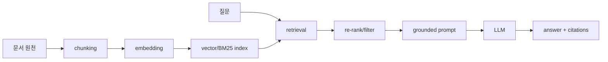

# 검색 증강 생성 (Retrieval-Augmented Generation)

- Level: Advanced
- Prerequisites: [AI/LLMs/Prompt-Engineering.md](Prompt-Engineering.md), [AI/NLP/Word-Embeddings.md](../NLP/Word-Embeddings.md)
- Status: Draft
- Reviewed-by: -
- Depth: Deep-dive (자기완결)

---

## 개념 (Concept)

RAG는 LLM이 답을 생성하기 전에 외부 지식베이스에서 관련 문서를 검색(retrieval)해 프롬프트에 넣고, 그 근거를 바탕으로 생성하는 방법이다. 모델 파라미터에 지식을 새기지 않고도 최신·도메인 정보를 활용한다.

## 직관 (Intuition)

LLM의 지식은 학습 시점에 고정되고, 모든 사실을 파라미터에 담기에는 한계가 있다. RAG는 "닫힌 책 시험"을 "열린 책 시험"으로 바꾼다. 질문이 오면 관련 자료를 찾아 같이 보여 주고, 모델은 그 자료를 읽고 답한다. 덕분에 재학습 없이 지식을 갱신하고, 출처를 제시할 수 있다.



## 이론 (Theory)

파이프라인은 보통 indexing → retrieval → generation이다.

1. **indexing**: 문서를 청크로 나눠 임베딩 $e(d)$로 바꾸고 vector store에 저장.
2. **retrieval**: 질의 $q$를 같은 공간으로 임베딩해 유사도가 큰 상위 $k$개 청크를 찾는다. 코사인 유사도

$$\operatorname{sim}(q,d)=\frac{e(q)\cdot e(d)}{\lVert e(q)\rVert\,\lVert e(d)\rVert}$$

밀집 검색(dense)과 희소 검색(BM25)을 합친 hybrid, 그리고 재정렬(re-ranking)을 흔히 쓴다.
3. **generation**: 검색된 청크를 context로 넣어 $p_\theta(y \mid q, \text{retrieved})$로 답을 생성한다.

핵심 트레이드오프는 검색 품질(정밀도/재현율), context 길이 한도, 근거 충실도(faithfulness)다.

### 실패 모드

RAG 실패는 보통 세 지점에서 갈린다.

| 단계 | 실패 | 증상 |
|---|---|---|
| indexing | 청크 경계가 잘못됨 | 답에 필요한 문맥이 둘로 찢김 |
| retrieval | 관련 문서를 못 찾음 | 모델이 일반 지식으로 추측 |
| generation | 근거를 무시하거나 과장 | 출처는 있어도 답이 근거와 어긋남 |

## 구현 (Implementation)

```python
def rag_answer(query, store, llm, k=5):
    q_emb = embed(query)
    chunks = store.search(q_emb, k=k)          # 상위 k개 근거 검색
    context = "\n\n".join(c.text for c in chunks)
    prompt = f"근거:\n{context}\n\n질문: {query}\n근거에 기반해 답하라."
    return llm.generate(prompt), chunks         # 답 + 출처
```

간단한 grounded prompt에는 "근거에 없으면 모른다고 말하라"와 "각 문장에 근거 id를 붙이라" 같은 제약을 넣는다. 이것이 환각을 없애지는 않지만, 평가와 디버깅을 쉬워지게 한다.

```text
규칙:
1. 아래 근거 안에서만 답한다.
2. 근거가 부족하면 "근거 부족"이라고 말한다.
3. 핵심 주장 뒤에 [source_id]를 붙인다.
```

## 복잡도 (Complexity)

retrieval은 vector index(예: HNSW)로 근사 최근접 탐색을 하면 질의당 대략 `O(log N)`~준선형에 가깝다. 인덱싱은 문서 수에 비례한다. 생성 비용은 검색된 context가 길어질수록 커지므로, 청크 크기·$k$·재정렬로 균형을 맞춘다. 전체 지연은 retrieval + generation의 합이다.

워크드 예제: 청크 100만 개에서 top-20을 검색하고, cross-encoder로 20개를 재정렬한 뒤 top-5만 프롬프트에 넣는다고 하자. 검색은 넓게(recall), 재정렬은 좁고 정확하게(precision), 생성은 context budget 안에서 수행한다. top-k를 무작정 50으로 늘리면 검색 누락은 줄 수 있지만 생성 비용과 잡음이 늘어난다.

## 응용 (Applications)

- 사내 문서·매뉴얼 기반 질의응답 봇
- 최신 정보가 필요한 검색형 어시스턴트
- 출처·인용이 중요한 법률·의료·연구 보조
- 코드베이스 검색·도움말 시스템

## 흔한 오해 (Common Misunderstandings)

- RAG가 환각(hallucination)을 "없애지"는 않는다. 근거가 나빠도 그럴듯하게 지어낼 수 있어 줄일 뿐이다.
- 더 많은 문서를 넣는다고 좋아지지 않는다. 잡음 증가와 context 한도로 오히려 나빠질 수 있다.
- 임베딩 검색만으로 충분하지 않을 때가 많아 hybrid·re-ranking이 필요하다.
- 청크 크기·경계 설정이 성능에 크게 작용하는데 자주 간과된다.

## TMI

- RAG는 2020년 논문에서 비모수적(외부 검색) 지식과 모수적(모델 내부) 지식을 결합하자는 아이디어로 정식화됐다.
- "lost in the middle" 현상: 긴 context에서 중간에 놓인 근거를 모델이 덜 활용하는 경향이 보고됐다.
- 검색·생성 사이 재정렬(cross-encoder re-ranker)은 느리지만 정밀도를 크게 올린다.

## 연습 / 확인 문제 (Exercises)

- 청크 크기를 키우거나 줄일 때 retrieval 정밀도와 생성 품질에 어떤 영향이 있는지 논하라.
- dense 검색과 BM25를 결합하는 hybrid가 유리한 상황을 예로 들어라.
- RAG에서 환각이 여전히 발생할 수 있는 경로를 두 가지 제시하라.

## 이어서 읽기 (Reading Path)

- 이전: [프롬프트 엔지니어링](Prompt-Engineering.md)
- 다음: [LLM 에이전트와 Tool Use](LLM-Agents.md), [AI/NLP/Word-Embeddings.md](../NLP/Word-Embeddings.md)

## 참조 (References)

- [AI/NLP/Word-Embeddings.md](../NLP/Word-Embeddings.md)
- [AI/LLMs/Prompt-Engineering.md](Prompt-Engineering.md)
- [Reference/Papers.md](../../Reference/Papers.md)
