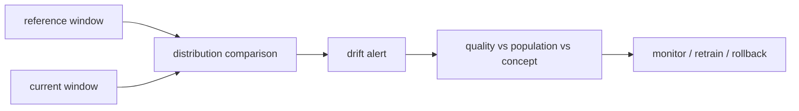

# 데이터 드리프트 (Data Drift)

- Level: Intermediate
- Prerequisites: [Math/Probability-Statistics/Distributions.md](../../Math/Probability-Statistics/Distributions.md), [AI/MLOps/Data-Versioning.md](Data-Versioning.md)
- Status: Draft
- Reviewed-by: -
- Depth: Deep-dive (자기완결)

---

## 개념 (Concept)

데이터 드리프트는 운영 입력의 분포가 학습·기준 데이터와 달라지는 현상이다. Covariate drift는 $P(X)$, label drift는 $P(Y)$, concept drift는 $P(Y\mid X)$의 변화를 가리킨다.

## 직관 (Intuition)

과거 고객으로 학습한 모델을 새로운 계절·지역·제품에 적용하면 입력과 관계가 달라질 수 있다. 모델이 고장 나지 않아도 세상이 바뀌어 성능이 떨어진다.

## 이론 (Theory)

연속 특징은 quantile·histogram·KS statistic, 범주 특징은 빈도·divergence, embedding은 distance·classifier 기반 two-sample test로 비교할 수 있다. 통계적 유의성과 실무 영향은 다르므로 effect size, sample size, segment와 downstream metric을 함께 본다.

Reference window와 current window의 시간 범위·seasonality를 맞추고 data quality 오류와 실제 population shift를 구분한다. Concept drift는 label이 늦게 도착하므로 proxy와 delayed evaluation이 필요하다.



### Drift 유형별 대응

| 유형 | 변한 것 | label 없이 탐지 | 대표 대응 |
| --- | --- | --- | --- |
| Covariate drift | 입력 $P(X)$ | 가능 | segment 분석, retraining 후보 |
| Label drift | label 비율 $P(Y)$ | 직접은 어려움 | delayed label, proxy |
| Concept drift | 관계 $P(Y \mid X)$ | 어려움 | 성능 모니터링, 재라벨링 |
| Prediction drift | 모델 출력 분포 | 가능 | behavior 변화 조사 |

input drift가 있어도 모델이 쓰지 않는 feature라면 영향이 작을 수 있고, input drift가 없어도 label rule이 바뀌면 concept drift가 생길 수 있다.

### 검정과 effect size

KS test, PSI, Jensen-Shannon divergence, Wasserstein distance, classifier two-sample test는 서로 민감한 변화가 다르다. 표본 수가 매우 크면 사소한 차이도 통계적으로 유의할 수 있으므로 effect size와 business metric을 함께 봐야 한다.

### Alert runbook

drift alert가 뜨면 먼저 schema break, missing spike, upstream 배포, 계절 이벤트를 확인한다. 그다음 segment별 prediction drift와 delayed label 성능을 본다. 자동 재학습은 마지막 단계이며, 새 데이터가 품질 검증과 평가 gate를 통과해야 한다.

## 구현 (Implementation)

```python
def population_stability_index(reference, current, eps=1e-8):
    return sum((c - r) * __import__("math").log((c + eps) / (r + eps))
               for r, c in zip(reference, current))


print(population_stability_index([0.5, 0.5], [0.7, 0.3]))
```

Bucket 정의는 reference에서 고정하고 missing·unknown을 별도 범주로 다룬다.

```python
def drift_alert(score, warn=0.1, block=0.25):
    if score >= block:
        return "investigate-immediately"
    if score >= warn:
        return "watch"
    return "ok"
```

## 복잡도 (Complexity)

표본 $n$, 특징 $d$의 histogram 기반 검사는 대략 `O(nd)`이고 metric series는 특징·segment·window 수에 비례한다. 무제한 segment 조합은 cardinality를 폭발시킨다.

## 응용 (Applications)

- model health monitoring
- retraining trigger 후보
- upstream schema·pipeline 이상 탐지
- 지역·고객 segment 성능 점검

## 흔한 오해 (Common Misunderstandings)

- input drift가 곧 성능 하락은 아니다.
- drift가 없다고 concept가 유지된다는 보장은 없다.
- threshold 하나를 모든 특징에 적용하면 안 된다.
- 자동 재학습은 drift alert 하나만으로 시작하면 위험하다.

## TMI

- 모델이 쓰지 않는 특징의 drift는 예측에 영향이 없을 수 있다.
- prediction drift는 label 없이 빠르게 보지만 model behavior 변화만 보여 준다.
- adversarial validation은 reference/current를 분류해 shift를 탐색한다.

## 연습 / 확인 문제 (Exercises)

- 세 drift 유형을 사례로 구분하라.
- 계절성이 있는 서비스의 reference window를 설계하라.
- drift alert 뒤 조사 runbook을 작성하라.

## 이어서 읽기 (Reading Path)

- 이전: [A/B 테스트](AB-Testing.md)
- 다음: [모델 모니터링](Model-Monitoring.md)

## 참조 (References)

- [Math/Probability-Statistics/Distributions.md](../../Math/Probability-Statistics/Distributions.md)
- [Reference/Books.md](../../Reference/Books.md)
